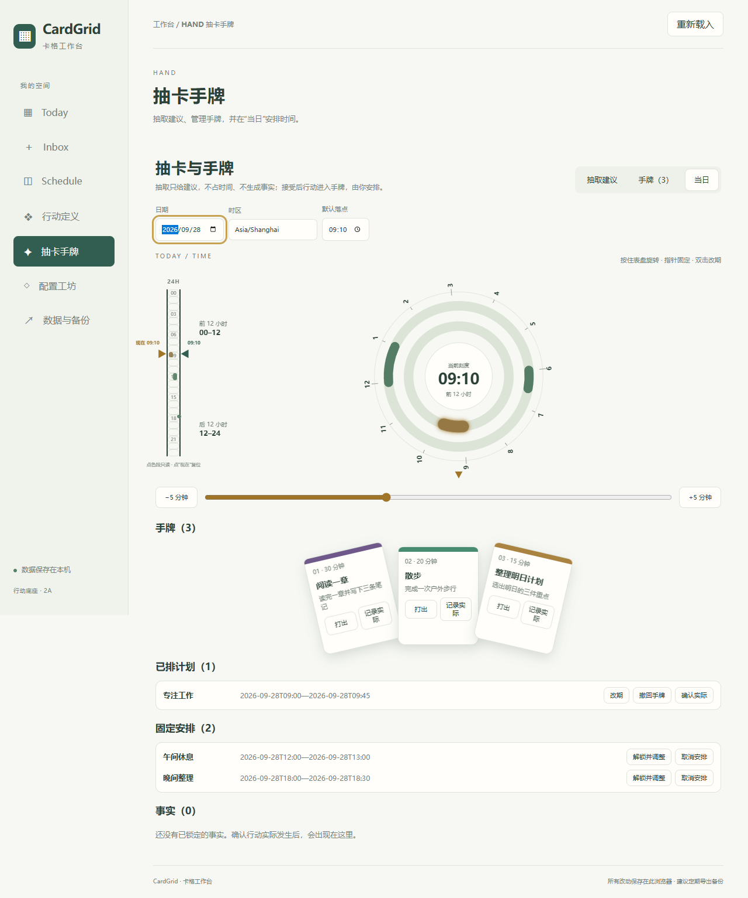

# CardGrid · 卡格工作台

本地优先的个人行动工作台：从空白开始，建立行动卡、选择并接受到手牌、安排进一天、确认实际发生并保留记录。



## 产品结构

- **工坊**：制作与管理。当前支持行动原卡和高级配置。
- **抽卡**：选择与接受。当前支持分类筛选、随机建议和接受到手牌。
- **日常**：安排与执行。当前支持手牌、正式双环、排期、实际确认、只读事实与批注。

当前正式产品采用上述模块边界。界面入口为 Today、Inbox、Schedule、行动定义、抽卡手牌、配置工坊和数据与备份。书目池、模板预留位、球面抽取与每日池副本属于后续开发。

## 开始使用

需要 Node.js 22.18+（22.x）或 24+。

```sh
npm ci
npm run dev
```

打开 <http://127.0.0.1:4173/>。Windows 可使用 [启动脚本](scripts/启动卡格工作台.bat)。首次打开没有个人预置数据。

数据保存在当前浏览器的 IndexedDB，定期从“数据与备份”导出完整备份。更换浏览器来源可能看到不同工作区，升级或迁移前先保留独立备份。详见[使用说明](docs/使用/使用说明.md)。

## 仓库导航

| 想了解什么 | 入口 |
| --- | --- |
| 产品实现 | [源码](src/)、[模块地图](docs/架构/README.md) |
| 测试与验证 | [测试](tests/)、[浏览器回归](tests/browser/README.md) |
| 设计与历史 | [文档入口](docs/README.md) |
| 开发与贡献 | [贡献指南](CONTRIBUTING.md) |
| 上传与分发 | [分发说明](docs/使用/分发说明.md) |

## 当前状态

产品版本 v0.2.0。模块化版本现为后续维护和开发使用的正式产品，延续已验收的 G3 功能；数据格式保持 Envelope v4/Data v2。结构整理没有增加业务功能，因此保留当前功能版本号。功能等价依据与未测范围见[交接记录](docs/开发/2026-10-03-模块重建与迁移.md)，仓库发布状态见[分发说明](docs/使用/分发说明.md)。

## License

[AGPL-3.0-or-later](LICENSE)。安全问题见 [SECURITY](SECURITY.md)。
