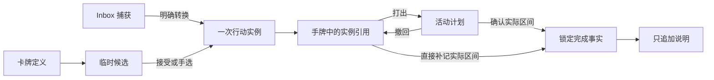

# 1A｜领域、时间与迁移合同草案

版本：1A-draft-1；日期：2026-09-24。状态：**1A 设计交付，供 1B 找反例；未冻结生产 schema，未通过 G1，未实施迁移**。

> 后续状态：1B 已审查，1C 已交付[合同收敛与原型接口](07-1C合同收敛与原型接口.md)。本文保留 1A 审查基线；当前执行合同为本文加 1C 修订，冲突处以 1C 为准。特别是 P03/P06 已由 D016/D017 决定：允许提前确认未来结束时间，日终自动显示并重算红色空时间，完成后仅实际区间占时。不得继续把本文原建议当作最新定案。

依据：[阶段任务计划](05-阶段0至3线性任务分配计划.md)、[0D 放行与保留限制](../测试记录/0D-2026-09-24-G0主线复核与放行.md)、[决策记录](03-项目决策与问题.md)、[DESIGN.md](../../DESIGN.md)。本文集中保存术语、状态、命令、时间与迁移候选方案，不把设计类型当成已有代码。

## 1. 范围与证据

1A 交付一张行动卡的领域合同，覆盖定义、候选、实例、手牌、计划、确认事实、批注，以及与固定日程、旧数据和备份的关系。首个闭环采用路线图中的“行动”领域；跨领域抽取、分段工作会话和最终视觉参数不在本轮冻结。

本轮只修改本文、决策记录和任务计划。现有 React、IndexedDB、快照加变更历史的架构继续作为基础；本文不指定新数据库版本号或最终模块路径。

| 当前代码证据 | 当前行为 | 对新合同的影响 |
| --- | --- | --- |
| `src/domain.ts` 的 `Card`、`validateConfig` | 卡片定义有 minutes/steps；分钟允许 1—1440 | 可继承定义信息，旧时长不能默默取整为 5 的倍数 |
| `src/planner.ts` 的 `Task`、`changeStatus` | done 可以恢复；无实际起止时间 | Task 状态不能作为锁定事实的唯一来源 |
| 同文件的 `Block`、`validatePlanner` | 时间为当天分钟 0—1440；同一 Task 可关联多个 Block；块 ID 只在各集合内唯一 | 新计划需跨日身份；迁移不能假设旧 Task 与 Block 一对一 |
| `ensureDay`、`bootstrap`、`src/main.tsx` 的 `reload` | 打开即生成 Day/History，可能生成例行实例；旧日期例行可标 missed | 被动打开会改变刚恢复或刚清空的数据，须与 D012/D013 对齐 |
| `src/planner-migration.ts` | Config 定义只导入一次；旧字段保留；旧 done 转成 Task.done | 新定义需要唯一写入来源；旧 done 不足以证明实际区间 |
| `src/domain.ts` 的 `readEnvelope`、`validateData` | 读取可补默认集合，缺 planner 时调用迁移 | 严格恢复不能混入隐式规范化/迁移 |
| `src/store.ts` 的 `commit` | 全量快照校验、revision 比对、恢复点同事务保存 | 可继承原子提交；新合同还需校验旧事实没有被修改或删除 |

## 2. 已确定规则与草案建议

### 已确定，后续任务不能重新解释

- D008/D011：完成须由用户确认实际开始和结束；有计划时仅预填计划区间；实际区间与确认时间分开。确认后原事实锁定，只追加说明。
- D012/D013：完整恢复整体替换，结果等于所选备份的 Data；清空使业务数据和本机恢复点都为空。两者均不保留当前事实到新状态，旧状态由用户保留的外部备份找回。
- D014：点牌只查看；打出占用完整预设时长，按 5 分钟移动；15/25 分钟分别占 3/5 单位。双十二小时都具备完整空位时显示两处落点。
- D015：确认实际区间与已有计划或事实重叠时，列出重叠内容，经用户再次确认后保存实际区间，不改写其他记录。
- D003/D004/D006/D007：Capture 先于行动；模板与某日快照分离；过去例行不改写、补做另建；Minimum Day 手动切换。项目 WIP=3 与 Top3 上限继续保留。
- DESIGN.md：日终空区间红色占位；固定容器扇形手牌；页面边缘阻尼；Fluent 的导航、层级与可访问操作原则。

### 推荐方案，1B 审查后由 1C/1F 收敛

以下英文名称只是概念名，不能据此直接修改生产类型。未由用户决定的产品取舍集中在第 10 节；它们不妨碍审查草案，但相关生产实现须等待收敛。

## 3. 术语、身份与唯一写入来源

| 概念 | 推荐身份与最小内容 | 变化规则 |
| --- | --- | --- |
| `ActionDefinition` 卡牌定义 | definitionId、版本、标题、完成标准、预设分钟、启用状态、分类/颜色关联、来源 | 可编辑/停用；修改只影响以后接受的新实例 |
| 候选建议 `Offer` | 所选 definitionId/版本及展示快照；候选为空时给明确空态 | UI 临时对象；抽取/重抽/查看不产生实例、计划或完成事实 |
| `ActionInstance` 一次行动意图 | instanceId、definitionId 可空、定义快照、来源、创建时间、可选目标日期、例行/补做来源 | 接受建议或手选时创建；排期、回手牌保持同一身份；同一定义可供多次行动使用 |
| 手牌 `Hand` | 有序 instanceId 集合 | 是待安排实例的容器，不另复制卡片业务数据；选中/抬高仅为 UI 状态 |
| `PlanPlacement` 一次安排 | planId、instanceId、完整计划区间、状态、修订；可选原计划来源 | 移动保留 planId；撤回保留记录，重新打出另建 planId；每实例最多一个活动安排 |
| `CompletionFact` 完成事实 | factId、唯一 instanceId、行为快照、实际区间、confirmedAt、可空 plannedSnapshot、来源 | 创建后字段不可改/删；plannedSnapshot 包含 planId、原计划区间和当时版本，不随定义/计划变化 |
| `FactAnnotation` 追加说明 | annotationId、factId、正文、createdAt | 只追加；说明写错再追加说明，不修改原事实或旧说明 |
| 固定安排 `FixedCommitment` | 独立 commitmentId、所属日快照/模板来源、区间、版本 | 默认防误拖；显式授权本次修改后才可改，且只影响指定日期；不自动产生完成事实 |
| `History` 变更历史 | eventId、命令、对象、操作时间、前后状态/引用 | 保存有意义的操作；不承担从零重放全部状态的职责，不把拖动每一帧写成事件 |

推荐保留 Planner 作为执行领域所有者并增量扩展；表单与高级 JSON 配置共同调用同一领域校验。旧 `Config.cards/schedules` 通过显式、可预览的兼容导入映射进入新定义，不维持可双向独立编辑的两套业务来源。偏好/分类可以继续复用现有 Config；确切存储位置与兼容编辑入口在 1C 确认。

定义快照保证“原卡改名”不会改写手牌含义或历史事实。事实的行为快照应包含标题、完成标准、当时预设时长和需要历史保真的分类/关联展示标签，另存稳定来源引用。捕获转换可建立一次性实例而不强制建立可重复定义；用户之后可显式保存为定义。实例缺少预设时长时可留在手牌，打出前必须补齐，不能从不可靠的旧关联猜测时长；无计划补记仍可提交完整实际区间。



实例的未完成生命周期建议为 `open/withdrawn`；“在手牌中/已安排/已确认”由活动计划与事实关系推导，避免同时维护两个可冲突的状态来源。一次性撤下手牌用 withdrawn 表达，不物理删除历史。确认事实后实例不可再打出、回收、编辑或撤下；再次做同样的事需新实例。

## 4. 状态与不变量

| 起点 | 操作 | 结果 | 保持不变或禁止行为 |
| --- | --- | --- | --- |
| 临时候选 | 重抽/关闭 | 换候选/关闭 | 无持久化实例，无占时 |
| 临时候选或手选定义 | 接受 | 新 open 实例进入手牌 | 不自动入 Top3、安排或完成 |
| 手牌 | 查看/抬高/拖动预览 | UI 选中/预览 | 其他手牌位置不变，Data 不变 |
| 手牌 | 在有效区间释放 | 新 active Plan，移出手牌 | instanceId 不变，只提交一个计划 |
| 活动计划 | 移动 | 同 planId 更新起止与历史 | 时长不自动压缩，不覆盖固定块/其他计划/事实 |
| 活动计划 | 撤回 | Plan 标记 retracted，原实例回手牌 | 不是删除事实；重新打出产生新 planId |
| 手牌或活动计划 | 确认实际 | 新 Fact；活动计划封存为 confirmed；退出手牌 | 原计划快照留存；不能 done→planned |
| 已有 Fact | 再次完成、移动、回收、改名/时间 | 拒绝；同一成功请求重试返回原结果 | 至多一个 Fact 对应同一 instanceId |
| 已有 Fact | 追加说明 | 新 Annotation | Fact 与已有 Annotation 字段完全不变 |
| 未确认计划 | 到达/错过计划时刻 | 保持未确认 | 不自动完成、失败、扣分或复制到次日 |

必须同时成立的约束：

1. 所有引用有效；定义/实例/计划/事实各自有稳定 ID，不能用标题匹配对象。定义改动不覆盖实例与事实快照。
2. open 实例若没有活动计划且没有事实，应只在手牌中出现一次；已安排或已确认实例不再作为可打出手牌。目标日期标签不等于占用时间。
3. 同一实例最多一个活动计划、最多一个完成事实。取消的计划保留历史但不占用时间。拆分显示不新增实例或事实。
4. 普通业务提交比较新旧快照，要求事实与旧批注集合只增不改；不能仅靠页面隐藏按钮。完整恢复/清空由独立受控入口执行生命周期操作，不给普通 UI 通用绕过开关。
5. 现实区间可以重叠（D015）；结构校验不得把“所有区间必须互斥”作为全局不变量。创建/移动计划的冲突检查与确认实际区间的二次提示是不同命令规则。
6. 固定安排的解锁仅授权明确对象/版本的本次修改；移动与取消均需授权。解锁不允许覆盖其他记录。模板应用只更新允许改动的日程对象，不能替换整天时顺带清除活动卡牌或事实。
7. 捕获、定义编辑、预览、页面滚动、扇形展开、时钟推进都不生成完成事实。手牌跨午夜不自动丢弃或另建副本。
8. 手动准备某日例行时，以 `(ruleId,date)` 保持唯一实例；补做以原 occurrenceId 保持既有唯一关联。只读今日投影可以展示待生成建议，不能把它伪装成已保存实例。Minimum Day 不删除原计划/Top3，模板改动不回写已存在的日快照。

## 5. 时间与可用区间

### 5.1 表示建议

- 一次性计划和实际区间采用半开区间 `[startAt, endAt)`，端点为明确 UTC 时间点，另存输入所用的 IANA 时区及当时本地起止/偏移快照。时间点负责排序和实际时长，本地快照用于准确回看当时输入；不得把两组值当成可分别编辑的来源。
- 创建时严格检查真实日历日期、时区、偏移与时间点一致，且 startAt < endAt；拒绝非法日期、缺省时区及非有限值。不能依赖 `Date.parse` 自动纠正无效输入。
- 工作区时区初次配置建议取设备时区，随后明确保存；换设备或旅行不自动重解释已有记录。更改显示时区不改写旧时间点或旧事实快照。
- 日型/例行保留当地“日期/星期/时刻”规则；生成某日实例时才解析成时间点。日期例外不回写模板。既有 Day 快照优先于已改动模板。
- 卡牌预设时长与新磁吸计划采用 5 分钟网格；推荐新定义范围 5—1440 分钟且为 5 的倍数。预览移动起点每次 5 分钟，结束点由预设实际分钟数计算，不能因空隙不足而缩短。实际起止建议允许精确到分钟，不强制 5 分钟取整；确认结束时间不得在确认时刻之后的建议见第 10 节。
- 计划区间、实际区间、confirmedAt 分别保存；本地时钟用于操作时间且可被用户修改，不承诺可信外部时间戳。

### 5.2 跨日、双十二小时与夏令时

跨午夜保留一个 planId/factId，以显示片段投影到各日、各十二小时环。例：23:50—次日 00:15 是 25 分钟、5 单位，前日片段 10 分钟，次日片段 15 分钟；11:50—12:10 是同一天跨两环的 20 分钟。显示片段携带 sourceId 与裁剪范围，不写入事实集合。

实际归属日期建议按实际开始在记录时区的日期；日视图可显示任何与该日相交的片段。按日统计分别计交集时长，完成次数只按唯一 factId 及开始日期计一次。计划目标日期与实际归属日期分别显示。

夏令时日可能不足或超过 24 个小时：不能用固定的 24 小时毫秒数计算下一当地零点。不存在的本地时间返回 `NONEXISTENT_LOCAL_TIME`；重复的本地时间返回两个带偏移的选择，用户明确选择后才得到时间点，不静默前移或择一。时间服务的依赖库选择留到 1F；接口必须能够给出这些结果。双环无法区分重复时刻时采用标注与等价时间列表，不能把两个真实时间点合为一个可落点。

### 5.3 可用区间的统一计算

查询输入：日期、显示时区、欲查看/移动的 instanceId 或 planId、预设时长、读取的 revision。输出：精确区间及 blocker 对象/类型、可放置的完整区间、不能放置的原因；显示组件不得自行重写冲突算法。

1. 查询跨越范围内所有固定安排、活动计划、已确认事实的实际区间；跨午夜时同时覆盖相邻日。无某日快照时可只读解析模板预览，不能为一次查询写入 Day/History；提交时与相同来源重新核对。若多模板匹配或时间解析失败，返回 `AMBIGUOUS_DAY_TEMPLATE`/时间错误，不能把未能解析的区间视为空闲。
2. 取它们的区间并集，再从查询范围中相减。取消计划、仅在手牌中的实例、说明和红色占位不成为 blocker。移动计划时只排除它自己，仍检查其他所有 blocker。
3. 交叠判定 `a.start < b.end && b.start < a.end`；相接端点可用。整段连续空闲才有效，不能把两个被占用区间隔开的空隙拼接成一个落点。
4. 以当地 5 分钟刻度生成候选，先解析成明确时间点，再加预设时长检查整段；每个候选包含唯一日期/时区/偏移/区间。前、后十二小时分别判断；两边都有效才都显示轮廓，不允许仅看起点是否空闲。
5. 事实确认后原计划区间保留为对照快照，推荐释放其计划占位，由实际区间参与占用计算；它不能被当成第二个完成记录。这个口径对日终红色范围的影响列入第 10 节待收敛。
6. 红色空时间推荐为日终视图中的上述占用并集的补集，使用独立样式标记；不储存成行动卡/完成事实，也不因为红色而阻挡合法计划调整。日终触发方式与持久化需求仍待 1C 确定。

由于 D015 允许事实重叠，“各次行动时长之和”和“一天实际覆盖时间”可能不同；后者按区间并集计，不能简单相加或为凑成 24 小时截短事实。

### 5.4 实际区间重叠的二次确认（D015）

确认预览列出与实际区间相交的固定安排、其他计划和事实：对象 ID、标题、类型、精确重叠区间。自身将封存的计划不算“与其他安排冲突”。固定安排作为受保护计划也纳入提示；不要求改写固定安排才能记录真实发生。

预览返回绑定 `workspaceEpoch + revision + 确认内容 + 冲突集合` 的确认凭据。没有冲突可直接确认；有冲突必须再次显式确认并携带该凭据。区间、内容或工作区修订变化后凭据失效，需重新展示。确认成功只新增事实并封存自身计划；不挪动、截短或取消冲突对象。新事实成为后续计划校验的 blocker，已有重叠计划可保留并由用户另行调整。

## 6. 命令、返回值与失败语义

### 公共提交协议（建议）

写命令输入为 `{commandId, expectedEpoch, expectedRevision, type, payload}`。clock 与 ID 生成器作为领域服务输入便于确定性校验，禁止 UI 用坐标或动画结束事件自行生成事实。工作区加载返回的 epoch/revision 是本地提交令牌，不属于用户备份的 Data。

成功返回 `{ok:true, resultRefs, epoch, revision, replayed}`，并在同一 IndexedDB 事务保存业务变化、有意义的历史和成功回执。只有事务完成后更新页面已保存状态。失败返回 `{ok:false, code, field?, conflicts?, retryAction}`，原工作区、恢复点和提交令牌均不变，用户草稿保留。

- 正常业务命令在 Data 中保存 commandId、命令类型/业务输入指纹和结果引用回执；相同请求重试复用结果，不重新分配事实 ID/confirmedAt。同 ID 不同业务内容返回 `COMMAND_ID_REUSED`。
- 重试回执只复用原操作结果引用，页面仍读取当前快照和提交令牌；不得用回执中的旧 revision/旧快照覆盖后来保存的工作区。
- 先验证 epoch；然后允许匹配的成功回执重试返回原引用；未见回执才校验 revision 并执行。两个不同请求同时确认同一实例，由事务内的唯一事实约束拦截第二个；窗口按钮禁用不能代替该约束。
- 恢复/清空成功后 revision 继续推进且 epoch 更新；旧窗口尚未发送或排队的动作返回 `WORKSPACE_REPLACED`。生命周期回执不追加到恢复后的 Data，避免破坏 D012 的相等结果；在本地 Envelope 元数据中同事务保留最小操作回执（commandId、业务指纹、原/新 epoch 与 revision，不含旧业务副本）。针对响应丢失后的同一生命周期请求，先核对该回执再判断旧 epoch，匹配才返回原成功结果，不能再次执行清空/恢复；其他旧 epoch 请求照常拒绝。
- 新旧快照关系、实际重叠二次确认和计划可用性都必须在最终提交前按最新状态核对；预览成功不等于已经预留时间。

| 命令/查询 | 业务输入 | 成功输出与变化 | 主要失败 |
| --- | --- | --- | --- |
| `SaveDefinition` / `ArchiveDefinition` | 定义字段、已有版本 | 定义 ID/版本；已有实例不变 | 输入非法、版本过期；不可因停用删除实例 |
| `OfferAction` / `RerollOffer`（只读） | 活跃定义过滤、可注入的选择结果 | 定义版本/展示快照或空候选；无 Data 写入 | `EMPTY_POOL`；不把无候选当系统损坏 |
| `AcceptOffer` / `ChooseAction` | 定义 ID/版本；可选目标日期 | 一个实例 ID、手牌顺序；接受时重新核对定义版本 | `DEFINITION_STALE`、定义停用 |
| `ResolveCaptureToAction` | captureId、标题/标准、可空时长 | 一次性实例与原文来源；Capture 标记已处理 | 已处理时同请求返回原结果，另请求不得再生成 |
| `UpdateOpenInstance` / `ReorderHand` | 实例编辑或完整手牌 ID 顺序 | 更新未确认实例/顺序 | 存在事实时 `FACT_LOCKED`；有活动计划时改时长须原子校验新区间；排序必须是当前手牌的完整无重复排列 |
| `WithdrawInstance` / `ReturnWithdrawnToHand` | 无活动计划/无事实的实例 ID | withdrawn 或原实例回手牌，保留历史 | 有活动计划须先撤回；有事实拒绝 |
| `PreviewPlacement`（只读） | 实例 ID、明确候选区间、revision | 落点、单位数、双十二小时候选、冲突详情 | `DURATION_REQUIRED`、`INVALID_GRID`、`NO_AVAILABLE_SLOT` |
| `PlaceAction` | 实例 ID、预览选定的明确开始点/时区 | planId、完整区间；移出手牌 | 已安排/已确认、过期修订、时长不足、`SLOT_OCCUPIED` |
| `MovePlan` / `RetractPlan` | planId/版本、新起点或撤回 | 同计划移动；或封存撤回并回手牌 | `FACT_LOCKED`、不可用区间、版本过期 |
| `EditFixedCommitment` / `ApplyDayTemplate` | 对象/日期/版本、变更、明确授权范围 | 指定日期例外及历史 | `FIXED_LOCKED`、计划/事实冲突；不能整日覆盖其他对象 |
| `PreviewConfirmation`（只读） | instanceId、实际区间、确认内容 | 计划对照、具体重叠集合、二次确认凭据 | 无实际区间、无效时间、事实已存在 |
| `ConfirmActual` | 同一确认草稿、可空重叠确认凭据 | factId、原计划快照、confirmedAt；实例完成 | `ACK_REQUIRED`、`ACK_STALE`、`ALREADY_CONFIRMED`、`FACT_LOCKED` |
| `AppendAnnotation` | factId、正文 | 新 annotationId/createdAt | 无事实、空说明、超长输入 |
| `PrepareDay` / `CreateMakeup` | 日期或原例行实例 ID | 显式准备当天/补做；规则与日期组合不重复 | 过去例行规则约束；不自动滚入下一日 |
| `PreviewRestore` / `RestoreWorkspace` | 已验证备份、预览版本令牌 | 精确替换，返回新提交令牌 | 未知格式、坏引用、版本不兼容、过期预览；不部分导入 |
| `ClearWorkspace` | 当前版本令牌及现有清空确认 | 空 Data；清空所有本机恢复点；新令牌 | 备份准备/事务失败时整体保持原状 |

纯查询错误不产生任何成功回执或历史。`VALIDATION_ERROR` 返回具体字段；`REVISION_CONFLICT` 要重载后重新预览，不自动重放有副作用的请求；`STORAGE_FAILED` 保留草稿和原数据，允许同一请求重试。

## 7. 恢复、清空与读取的合同

### 同版本精确恢复

先只读解析与校验备份，显示明确摘要；执行前导出当前完整备份，然后在一个事务里替换 Data、更新本地提交令牌和必要恢复元数据。恢复后的 Data 按 JSON 结构逐字段相等：数组顺序、ID、可选字段是否存在均保留；不要求文件空白/缩进或对象键排列字节一致。不在 Data 中追加“已恢复”事件、补默认集合、生成今日或合并较新事实。

导入器应先判定备份种类/版本，校验函数对受支持版本不擅自规范化。Config 导入仍与完整备份分开：只更新可编辑定义，不通过配置包改写事实或批注。

### 读取和初始化

`load`、打开页面、刷新、跨窗口通知后读取、导出和预览都应是只读。推荐将当前启动 Bootstrap 改成只读今日投影加显式 `PrepareDay`/首次业务操作的准备步骤；具体入口由 1C 定界。仅打开已恢复或已清空的工作区不能生成 Day、例行、History 或旧事实副本。

清空保留的是能运行应用的空结构及默认视觉偏好，不保留用户卡牌、计划、事实、批注、旧档案、业务回执或恢复点。空表盘可显示日期/现在指针，但它们是运行时显示，不是新增用户记录。刷新后仍应无业务记录和恢复点。恢复前、清空前下载的备份由用户自行保存；浏览器发起下载不等于已验证外部文件可恢复。

### 旧版本恢复与迁移候选

旧 Data 转成新 schema 必然发生结构变化，不能同时宣称“原 Data 逐字段相等”。优先方案：受支持旧版本先按原版本精确保存，以只读适配层查看；用户另行选择“升级数据”时才进入可预览迁移。未知版本拒绝并保留当前工作区，提供原文件/原始数据导出路径。若决定只支持先转换再使用，就必须单列为“转换导入”并给出语义差异，不能替代 D012 的精确恢复入口。

普通恢复可在工作区外维护操作前本机恢复点，但这不是跨恢复永久保留事实的承诺。清空则在同一事务中删除 `previous`、`pre-p1a` 及后续增加的任何本机业务恢复点。恢复/清空失败时不能只更新 epoch、清掉恢复点或写入半份 Data。

## 8. 旧模型迁移映射与候选路线

### 字段与身份映射

| P1A 来源 | 推荐去向 | 必须保留/需要人工消歧 |
| --- | --- | --- |
| Config.Card | 新定义及原始配置快照 | id/title/steps/minutes/kind/enabled/categoryId/parentId 全保留；旧 kind 不能直接发明抽取权重或新领域行为 |
| Planner.Task 未完成 | 一次行动实例 | 原任务 ID 可做显式来源映射；title/criteria/minimum/goals/projects/source/occurrence/makeupOf/date 均保留；date 不是完整计划区间 |
| 未安排 Task、Capture 转换 Task | 待安排实例/手牌入口 | 保留 target 引用；无时间则不自动占时；缺时长先提示补齐 |
| Task.done、Occurrence.completed、CardCompleted/CardReopened | 只读旧状态与事件档案 | 不新造实际区间或确认事实；原来只有 completedAt 也不能补出 startAt。用户明确重新确认时才新建带来源的新事实 |
| Day.Block | 固定安排或旧计划兼容项 | 来源键用“集合/日期 + blockId”，模板条目 ID 不当成跨天唯一 ID；日期/取消状态/task 引用保留 |
| 一个 Task 对应多个 Block | 多个旧关联原样保留并标待消歧 | 不任选一块，不自动拆成多次完成；人工确认一次/多次意图后才建立新实例关系 |
| Rule/Occurrence/补做 | 例行定义、当日实例与显式补做来源 | `(ruleId,date)` 唯一性、原日期状态不改写；保留旧 missed/skipped/cancelled |
| Config.Schedule 与 Planner.Template/Day | 领域模板与日快照，另留来源映射 | 已有 Day 不能被现行模板重算；同名模板不自动合并；只保留可证明的来源关系 |
| History、events、legacyArchives、旧顶层集合 | 原始档案与来源引用 | 不按近似内容去重或丢弃重复事件，不把旧事件重放当成全部事实 |
| Top3、项目/目标、Minimum Day、偏好/分类 | 按来源映射转换引用/保留值 | Top3=3、项目 WIP=3；无效引用列报告，禁止悄悄删项凑成合法结果 |

旧 7 分钟卡和非网格时间不修改原值。可以作为只读/待整理兼容项保留；首次用于新磁吸流程时要求用户明确选择合法预设时长，保留原时长与来源。旧计划不因这一要求被自动压缩、移动或删除。迁移报告必须列出所有不能无损直接映射的项，不能对仅因新约束而不合格的记录直接拒绝整个旧备份或静默丢失。

### 路线比较

| 候选 | 收益 | 成本/风险 | 草案结论 |
| --- | --- | --- | --- |
| A：在当前本地执行域增量扩展，旧原文留档，建立显式映射；表单/JSON 共用新定义入口 | 延续现有存储和页面；事实独立；迁移有证据 | 需要旧版只读适配和冲突报告 | 推荐，待 1C/1F 冻结 |
| B：在 Task.status/Block 上补字段，继续 Config↔Planner 双向同步 | 初始字段变动少 | 状态恢复、多个 Block、定义修改与事实锁定相互牵连；双写更难验证 | 不推荐 |
| C：重建存储/引入服务器，再搬迁全部页面 | 新边界完整 | 当前没有需求收益支撑，迁移与回退面扩大 | 本阶段不采用 |

推荐迁移步骤：独立备份并在隔离工作区验证恢复 → 只读解析原版本 → 生成确定性的映射/问题清单 → 用户处理必须消歧的项并审阅预览 → 一次原子提交新版本、源快照、映射版本与审计摘要 → 重新导出、刷新核对 → 旧文件始终保留在用户外部备份中。没有许可前不得执行真实数据迁移；失败保持原 schema/Data/恢复点。已经迁移的来源再次导入时按显式映射识别，不能再次生成实例。

## 9. 1B 反例与后续验收种子

以下是可执行用例的输入/预期合同，**不是已经通过的测试**。使用独立合成工作区，日期示例 2026-09-24、时区 Asia/Shanghai。

| ID | 合成输入/动作 | 必须观察到的结果 |
| --- | --- | --- |
| C01 | 15 分钟定义被接受，查看，再打出 09:00 | 一个实例/一个计划；09:00—09:15，3 单位；查看不写 Data |
| C02 | 25 分钟卡，空隙 09:00—09:20 与 09:30—09:35 | 不拼接两个空隙、不缩成 20 分钟；仍在手牌 |
| C03 | 09:00 和 21:00 都有至少 25 分钟空位；选择后者，向右调 5 分钟 | 两处轮廓；只写 21:05—21:30 的一个计划；上午不变 |
| C04 | 候选 09:00—09:15，固定块从 09:15 起；另一个 15 分钟候选从 09:10 起 | 接壤不冲突；实质交叠拒绝；解锁固定块不自动移动它 |
| C05 | Plan 撤回再打出；重新排期期间另一窗口占用了目标 | 原实例 ID 保持；旧计划记录保留；新落点提交失败，手牌与恢复点保持提交前状态 |
| C06 | 计划 09:00—09:30，实际 09:20—10:00，与其他计划/事实相交 | 无二次确认先返回 ACK_REQUIRED；再次确认后实际可保存，其他对象不变 |
| C07 | 看完 C06 警告后修改实际结束，或另一窗口移动冲突计划 | 旧凭据无效，重新提示冲突；不允许一个勾选永久免警告 |
| C08 | 同一完成请求双击/超时重试；两窗口不同请求同时完成同一实例 | 重试返回同一 factId；不同请求最多一个成功，绝无两个事实或半条计划状态 |
| C09 | 完成后改定义、改模板、直接提交修改事实的快照；随后追加两条说明 | 事实快照不变；直接改事实被领域/存储边界拒绝；两条说明各有时间且原文不变 |
| C10 | 23:50—次日 00:15；11:50—12:10 | 每项只一个源对象；跨两日/两环分片总时长分别为 25/20 分钟 |
| C11 | 新磁吸拖到非 5 分钟网格，实际填写 09:02—09:19 | 预览须先明确落到合法刻度；正式命令拒绝非网格；实际记录不被强行变成 5 分钟倍数（建议待 1C） |
| C12 | 旧卡 minutes=7；旧 Task 关联两个 Block；旧 done 无实际起止 | 预览显示原值和待消歧项；不取整、不任选、不新造事实；迁移失败原数据不变 |
| C13 | America/New_York：2026-03-08 02:30 不存在；2026-11-01 01:30 有两个偏移 | 前者拒绝；后者明确区分 -04:00/-05:00（相差 60 分钟）；双环不合并成同一个可提交目标 |
| C14 | 恢复不含今日的同版本备份，打开/刷新/导出；从旧窗口提交先前草稿 | Data 始终等于备份，不能新增 Day/History/事实；旧 epoch 写入被拒绝 |
| C15 | 清空含 previous/pre-p1a/事实的合成工作区，刷新再打开 | 用户集合与所有恢复点都为空；不生成空 Day/Bootstrap 历史；外部备份可独立恢复 |
| C16 | 损坏备份、未知版本、导入中止、事务中止 | 无部分替换，原 Data、恢复点和 epoch/revision 保留；草稿/源文件可重试 |
| C17 | 旧格式备份缺 planner，选择严格恢复与选择转换导入 | 严格恢复不通过补字段冒充相等；转换需要独立预览并说明差异 |
| C18 | 昨日 missed 例行今天补做；重复发起补做；日终显示红色空隙 | 原例行状态不变；补做不重复创建；红色只占位、不造完成事实 |
| C19 | 改手牌顺序/抬高/拖到无效区后取消；打开与关闭页面阻尼动画 | 仅明确排序命令可持久化顺序；选中和动画不改 Data；无效拖动不新增计划 |

1B 应检查各预期是否能同时成立，并补充最小反例。真实浏览器的存储/触摸/焦点和最终 Fluent 外观验收分别属于阶段 2/3，不能用这些文字代替。

## 10. 需要在 1C/1F 收敛的取舍

| 编号 | 草案推荐 | 需要决定的原因/替代方案 |
| --- | --- | --- |
| P01 定义来源与迁移 | 新业务定义唯一归执行域，简单表单与高级 JSON 继续共用校验；旧 Config 显式导入 | 对应 Q001，需确认旧配置包编辑的兼容方式，不能暗中取消已有使用路径 |
| P02 实例与会话 | 首版一个实例最多一个活动计划和一次事实；重复做创建新实例；旧多块任务保留待消歧 | 若要一张牌分几次完成，需要会话模型，会改变统计与完成标准，应先另议 |
| P03 新计划与实际时间精度 | 新定义/磁吸按 5 分钟；实际按分钟且结束不晚于确认；旧值原样保留 | D014 没有决定实际精度和未来输入规则；默认预填未来计划时要明确提示尚未发生 |
| P04 过去日期与例行 | 普通未确认计划允许调整并留历史；过去例行仍补做另建；迟到的实际补记可作为独立实例，关联来源但不改旧 missed | 迟确认原例行是否可以改状态涉及 D006；未经明确决定不能放宽原规则 |
| P05 严格恢复与初始化 | 同版本原样恢复、被动读取不写；旧版只读适配、升级作为另一步 | 需确定 PrepareDay 的显式入口或首次主动操作触发点，同时保留例行使用便利性 |
| P06 日终空时间口径 | 完成卡的实际区间占时，原计划只作对照；红色按占用补集派生 | 用户已决定红色，尚未决定日终按钮/自动展示、快照冻结及修改计划后是否重算 |
| P07 “对准自己”与视角 | 解释为个人时间盘当前面向用户的可选区间，不新增多用户所有权模型 | D014 文字不能替代几何命中定义；旋转/日期范围/前后十二小时的选取在 1D 验证 |
| P08 固定安排的完成入口 | 阶段 2 先把固定安排作为受保护计划阻挡，不自动生成事实 | 若需要直接确认固定日程，应先明确与行动实例的绑定/实际录入流程，不能隐式将所有固定块变成事实 |

1A 可交给 1B 检查；以上条目尚未使任何生产数据结构获得批准。1C 汇总反例及产品取舍，1F 才冻结模块、schema/备份版本和 G1。不得将本草案状态写成“架构已实现”。

## 11. 本轮验证与交接

- 任务：1A；执行者：当前 Codex 主线会话。未从运行工具核实具体模型/推理档位，不能声称已切换为计划指定档位。
- 起始 HEAD：`cfe2ae1bf1462f736d8835b77dcfcc0b0f1aaf1a`。G0 交接基线为 `511710d`，后续提交为 AGPL 许可证添加；不能把旧交接 HEAD 当成当前版本。
- 起始未提交内容：DESIGN.md、README.md、tests/r2-regression.test.ts 已修改；docs/ 与 tests/browser/ 未跟踪。保留原内容，不自动提交。
- 读取并对照了计划、0D 交接、产品总览/决策/架构、DESIGN.md 以及 domain/planner/migration/store 和页面提交入口。
- 实际执行了 Node 内存探查，未访问浏览器或 IndexedDB：`emptyData → importDefinitions → bootstrap(2026-09-24)` 得到 `dataEqual=false`、1 个 Day、`DayPrepared/BootstrapCompleted` 两条历史、`legacyImported=true`；旧定义 minutes=7 校验接受；同一个 Task 关联两块日程校验接受。结论仅证明现行语义缺口，不是新合同功能测试通过。
- 验证命令：`git status --short`、`git rev-parse HEAD`、`git log -3 --oneline`、PowerShell `Get-FileHash`；内存探查通过 PowerShell 单引号 here-string 传入 `node --experimental-strip-types --input-type=module`，见下方可重跑片段。
- 文档自查通过：3 份本轮文档、15 个本地链接、15 组表格、C01—C19 唯一性、代码围栏/编码/尾部空格检查；4 个受保护文件 SHA-256 与开工值一致。不是 1B 独立审查或 G1 放行。
- 用运行时 `Intl.DateTimeFormat` 核对 C13 的纽约时区样例：2026-03-08 06:30Z/07:30Z 分别为 01:30 GMT-5/03:30 GMT-4；2026-11-01 05:30Z/06:30Z 分别为 01:30 GMT-4/01:30 GMT-5。仅核对样例，不代表已实现夏令时解析服务。
- 本轮没有运行应用构建、全量单测或浏览器验收：交付为设计文档，未改源码；G0 旧测试结果不冒充本轮重跑。
- 已记录 D015 用户决定；其他待决项集中在第 10 节。下一项为 **1B 只读反例审查**，不是 2A 开发或 G1 放行。

在仓库根目录以 Node 的类型剥离模式执行以下片段，可重跑三个现状探查（仅内存数据）：

```js
import { emptyData, validateConfig } from './src/domain.ts';
import { bootstrap, newTask, validatePlanner } from './src/planner.ts';
import { importDefinitions } from './src/planner-migration.ts';
const before = emptyData(), after = structuredClone(before);
importDefinitions(after.planner, after);
after.planner = bootstrap(after.planner, '2026-09-24');
console.log(JSON.stringify(before) === JSON.stringify(after), after.planner);
const config = emptyData().config;
config.cards.push({ id: 'seven', title: '7分钟旧卡', kind: 'temporary', minutes: 7,
  categoryId: null, parentId: null, steps: '', enabled: true });
console.log(validateConfig(config).cards[0].minutes);
const p = emptyData().planner, t = newTask('一事项多安排', '2026-09-24');
p.tasks.push(t);
p.days.push({ date: '2026-09-24', template: '', name: '合成样例', minimum: false,
  top3: [], overrides: [], blocks: [
    { id: 'b1', title: t.title, start: 540, end: 570, kind: 'flexible', task: t.id, cancelled: false },
    { id: 'b2', title: t.title, start: 600, end: 630, kind: 'flexible', task: t.id, cancelled: false }
  ] });
console.log(validatePlanner(p).days[0].blocks.length);
```

受保护文件开工 SHA-256（交付前核对不得变化）：

| 文件 | SHA-256 |
| --- | --- |
| src/domain.ts | 33B83EB737C088E6736272AA0E101F3982C1DDB2620F1339425337701964C557 |
| src/planner.ts | 89EA2BE14946D7A859C9AB89AC419F2F67C7B1A9C4AFBB9AC1D0DB7E97E81453 |
| src/planner-migration.ts | 02E335497698C6BF25F2ADCC4CE66BACE827C60AD3CBAB553CAEE94E24BE31CE |
| src/store.ts | 87D864898D97CF4D041218218861273422F75A19D0360E52C0831A332484B731 |

1B 输入：本文版本 1A-draft-1、D008/D011—D015、阶段计划及 G0 限制。允许只读所有相关代码；只允许新建 `docs/测试记录/1B-2026-09-24-领域合同反例审查.md`，确需合成 fixture 时仅写明示的隔离资料，不改本合同结论或生产代码。输出须列用例 ID、输入/动作、冲突规则、预期、实际可执行验证/静态推演区别、严重程度与修订建议；由 1C 决定合同修订，禁止单独宣布 G1 通过。
