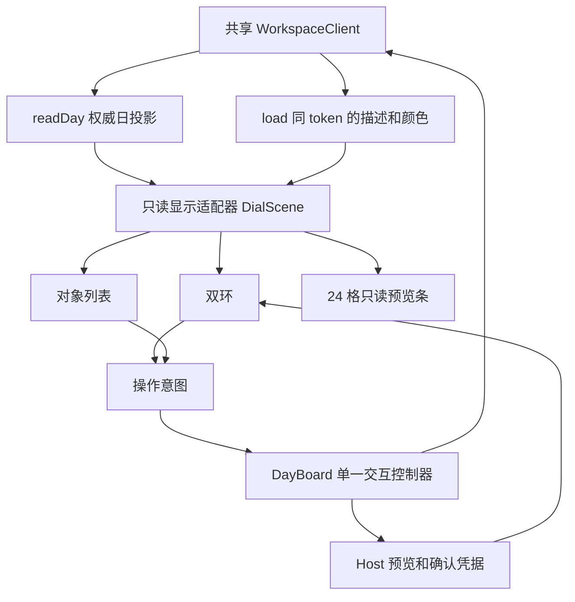

# 3A 正式投影、几何与手势合同

版本：**3A-dial-1**；日期：2026-10-01；主编：Codex。状态：**设计冻结，可交 3B 实现**；两项日界产品取舍已由用户决定。生产双环尚未实现，本文件不代表 G3 验收。

依据：[阶段计划](../归档/阶段0-3/产品设计/05-阶段0至3线性任务分配计划.md)、[1F-contract-1](./08-1F正式合同与阶段2边界.md)、[2C-host-1](./09-2C正式页面接口冻结.md)、[2F-component-1](./10-2F组件接口冻结.md)、[D018/D022](./03-项目决策与问题.md)、[G2 收尾](../归档/阶段0-3/测试记录/2G-2026-10-01-技术债收尾与最终验收.md)。生产类型以 src/action-contract.ts 为准。设计类型见 [3A-dial-contract.ts](./3A-dial-contract.ts)。

## 1. 结果与边界

用户得到同一日的双环、列表与 24 格预览条；点击只查看，拖动形成完整区间预览，明确确认才保存。内环固定为 00—12，外环固定为 12—24；不保留原型的交换两环开关。

3A 交付接口、状态转移、数值样例和接手边界。3B 实现显示；3C 接手势与提交；3D/3E 做统一与设备调整；3F/3G 分离验收。此次仅改设计资料，不改生产代码、schema、Host 方法、命令或事实规则，不复制原型内存 Host、测试数据或删除式撤回。

G2 的 15 个快照文件在本轮读取时 SHA256 全部一致。远端旧 HEAD 不能作为 3B 的实现基线。

## 2. 模块与唯一写入口

| 层 | 负责 | 不能承担 |
| --- | --- | --- |
| 正式 Host | 时间解释、完整区间、空闲/冲突、版本、解锁、提交、历史 | 无新增签名 |
| projection-adapter | 同 token 的来源关联、显示片段、身份、操作权限、描述/颜色 | 不计算第二套占用或空闲，不填 version=1 |
| geometry | 坐标变换、弧线、命中、半日与日界、旋转限位 | 不签发候选/确认/解锁凭据，不直接保存 |
| interaction/controller | 一次手势、预览生命周期、异步序号、意图到现有 Host 的调用 | 不改源数据，不把手势结束当新计划保存 |
| TimeDial/HandFan | 渲染、指针输入、按钮/键盘意图 | 不建立另一个 client/store |

DialScene 一次构建后供三种视图共享。分钟、日期、时区、片段身份不可在各组件重新拼出三套解释。布局大小改变只改坐标变换，不改时间和对象。按新投影/token构建一次来源索引，旋转/每帧拖动只读索引，不在每帧重新load全工作区或扫描全部历史。

## 3. 投影适配与来源身份

每份 scene 都保留 date、zone、now、dayRange、token、mode、occupancyKnown。元数据若来自 load，必须与 readDay 的 epoch/revision 完全一致；不同则重读，旧完整 scene 可继续带“正在更新”显示，不能混合两个版本的操作权限。颜色/描述缺失时用类型样式和“无说明”，不伪造领域字段。

| 正式输入 | 显示与身份 | 允许动作 |
| --- | --- | --- |
| plan 片段 + plans 中相同 planId | 来源键 plan/planId；读取 plan.version、instanceVersion；所有分片同源 | 查看、改期、撤回、确认实际 |
| fixed 片段 + fixed 中相同 commitmentId | 来源键 fixed/commitmentId；版本来自 FixedView | 查看；明确解锁后调整；明确取消另走旧入口 |
| fixed 片段但没有 FixedView | projected-readonly/sourceId，保留未保存模板标题 | 只读；可引导显式准备来源日期，不能解锁或自动准备 |
| fact 或 plan-reference + 相同 factId | 同一个 fact 来源；实际实线，原计划轮廓；后者不是活动计划 | 只读事实/追加批注；不能改期、撤回、再完成 |
| legacyItems 中 range 已知 | 完整 LegacyRef（sourceId + path），保留分钟精度 | 只读 |
| legacy range 未知/无占用 | 列表展示“占用无法判定”或“无时间区间”；不假造弧线 | 只读 |
| empty | 派生片段；没有业务实体，不作为事实或可编辑项 | 只读图例 |

不从 sourceId 的字符串前缀反推可写对象；必须关联当前投影里的实体。原计划对照片段的 sourceId 是 **factId**，不能当 planId。真实对象应有关联却缺失时返回 INCONSISTENT_PROJECTION，关闭该项编辑，保留诊断；未关联 fixed 片段保守只读。

来源键用 JSON 元组（例如 ["legacy",sourceId,path]）；片段键用 [sourceKey,role,原segmentId]，旧项用裁剪区间/偏移。相同 ID 的 plan/fixed/fact 不能碰撞；两个 DST 偏移片段和事实/原计划轮廓不能互相覆盖。详情按来源合并，实际与轮廓分开列时间，不把同一事实计成两次。

legacyItems 没有直接进入正式 segments：适配器允许调用既有 splitRangeForDay/segmentsFor 生成其**显示切片**，以完整 LegacyRef 包装；不得重新求占用补集。freeRanges 原样消费，日终红色只画 Host 已给出的 empty。occupancyKnown=false 时不显示“这里可用”、不生成红色空闲；已有真实片段仍可读，合法性交 Host 拒绝。

## 4. 钟面坐标与日界

### 4.1 坐标、方向与旋转

逻辑画布 400×400，中心 (200,200)，内环中心半径 94、外环 132；屏幕采用等比缩放加居中留白，输入必须逆变换到同一逻辑坐标。零尺寸返回 null，不以整页宽度替代表盘实际矩形。

北方为 0°、顺时针为正。半日内 m 分钟的角度 = m/720×360°。屏幕坐标：
x=200+r×sin(角度)，y=200-r×cos(角度)。

底部指针固定 180°。完整读数 f∈[0,1440]：
**rotation = 180 - f/720×360**。
盘、12 个数字、全部已保存片段整体旋转；连续滑块不拆成 144 根细条。

旋转手势用相邻角度的最短有符号差 [-180,180] 解开接缝：
**nextFocus = clamp(focus - angularDelta×2, 0,1440)**。
顺时针读更早，逆时针读更晚。存储完整读数，不对 focus 取模，不因指针穿越 ±180° 跳 12 小时。限位可有弹性视觉反馈，实际值始终有界。滚轮/按键均调用相同 rotate/focus 意图。

初次进入当前日期，读数从 ProductionDayView.now 在显示时区的当地分钟取得；不先取整。重置按钮显式回到当前日期与现在。手动查看日期保留读数；跨日自动行为见第 9 节。

### 4.2 落点、吸附与接缝

落点先确定半日和角度，再得绝对当地分钟。显示端不把 09:00 与 21:00 一起请求：同一时刻只有一个 PlacementQuery；重复偏移的多个 Candidate 只可能来自 Host。

操作起点按最近 5 分钟吸附，恰好 2.5 分钟向后；实际记录和只读旧项不取整。区间末端不能按弧线格数重建，必须使用 Candidate.range；presetMinutes 不变。

圆周的 0°/360° 同点不能单靠取模区分。命中保留手势开始的 half/minuteOfHalf 与累计角差，以区分半日起点与末端。新卡进入指针时使用当前完整读数作为接缝锚；径向改半日后用目标半日的当地分钟，明确展示新绝对时间。跨午间吸附到 12:00，候选规范为外环起点；跨日吸附到 24:00，按 D023 规范为次日 00:00。不暗改成 11:55/23:55。

**D023（本轮用户已决定）**：24:00 放牌直接 previewPlacement(date=nextDate(originDate),focusMinuteOfDay=0)。禁止传 1440，禁止改时长。预览会话保留 originView；成功取得次日投影后，暂时展示次日 scene 与 focus=0，明显提示“原日期 24:00 → 次日 00:00（未保存）”。不能把次日 Candidate.segments 画成原日内环。取消恢复原日期/读数；保存后留在保存日期。获取次日投影或预览失败时保留输入与原视图，不自动保存/PrepareDay。

### 4.3 弧线、命中与重叠

每个权威片段 [startMinuteOfHalf,endMinuteOfHalf) 对应连续圆弧，full-circle=720 分钟须拆成两个 SVG arc 命令。跨午间/午夜/DST 的分片已由正式时间服务给出，渲染不重新求源区间。命中所有覆盖片段；视觉扩大触区只辅助选择，不扩大真实占用或冲突。

默认几何参数：捕获半径 70—185；半日分界 113；已进入某半日时用 6 单位迟滞（内→外超过119，外→内小于107）。起步无旧半日时 radius<113 为内，其他为外。它们是可在 3E 调整的布局参数，不是领域阈值；调整后须重跑几何输入样例，不能改变已定方向/日界。

重叠不得限为三条、按数组序号丢项或只取第一个。同刻度的多个来源可共享叠色区域，点击先给全部对象选择；选中显示轮廓和完整说明。无限增加细圈不是必需：密集时使用数量提示 + 全对象列表，并保持类型纹理/标记。红色专用于日终空时间；冲突用明确标记和文字。

指针强调当前**绝对半日**的全部实际占用片段；区间半开，结束点不继续算占用。12:00 只属于外环起点；24:00 不命中本日 00:00。原计划轮廓可随其事实选中，但不能计入当前占用数量。DST 同刻度不同偏移均列出，不能以 first() 决定身份。

## 5. 夏令时、跨日与 24 格预览条

双环和 24 格条表示当地钟面，不是匀速的真实 24 小时。dayRange 可能 1380/1500 分钟。轴线用 dayRange 经正式 splitRangeForDay 切片生成；既有偏移切片是坐标的依据。

- 前进日缺失刻度画为“当地时间不存在”的断带，不标空闲、不涂日终红色；在该时间排期显示 NONEXISTENT_LOCAL_TIME。
- 回退日重复刻度按 offset 分支绘制/标记并保留所有身份。同一源区间可能两片在钟面相交；不把这种相交描述成两个事件冲突。选择某个 Candidate 必须选其 ID/偏移，不能默认第一个候选。
- 片段终点在偏移切换瞬间，使用该片段恒定偏移下的几何终点；不能单用 endAt 转成新偏移钟点。现有 segmentsFor 的“片段开始分钟 + 片段真实时长”在恒定偏移切片内正确。
- 23:30—次日00:30 两日片段同来源，前日 continuesAfter、次日 continuesBefore；开始日期使用 Host.startDate。显示日时区与记录时区不同，详情同时标记录时区和显示时区，不改原记录。
- 11:50—12:10 只切半日、不显示跨日；恰好 00:00 结束不显示“续次日”。
- 24 格条固定墙上钟点 00—23，不把 23/25 小时日压成等长真实小时。每格从同一 scene 取相交片段，重复偏移分支分别列出；点击概述全部来源/类型/完整起止/真实时长/说明，只读，不能在概述窗发改期命令。DayOverviewProps只接受scene/hour/onClose，没有写入回调；open-overview与普通对象详情意图分开。
- 列表标全日期、HH:mm、UTC 偏移；分钟精度实际区间如 09:02—09:19 仍是 17 分钟。读数、范围和持续时长都不靠“几个格”推导。

## 6. 手势状态与保存语义

手势使用 Pointer Events、pointer capture；只拥有起始命中的一个目标。HandFan以onDrag上报pointerId、客户端坐标和卡上缘点；控制器统一逆变换/命中后才产生preview意图，手牌组件不自行调用Host。页面滚动保持原生，仅实际拖动目标关闭选择和本区域默认手势；未命中手牌/盘/滑块的触摸交滚动。pointercancel、lost capture、离页与 Escape 都不会完成撤回或提交。

| 起始状态 / 动作 | 下一状态与反馈 | Host 效果 |
| --- | --- | --- |
| 手点击卡牌 | 单张转正/放大查看，其余叠牌不变 | 无 |
| 查看卡向上推 / 手牌拖到盘缘 | 首次外环预览，继续推进按径向切内环；标完整起止/时长 | 请求 previewPlacement |
| 拖牌松手，有有效预览 | 变为连续预览滑块，仍未保存 | 无 submit |
| 拖牌松手，无预览 | 回手牌；无时长卡提示补时长，仍可记录实际 | 无 |
| 预览滑块圆周/径向拖动 | 新落点请求；输入变化立即清选项/重叠确认 | 新预览 |
| 拖预览越外缘后松手 | 取消会话/恢复来源视图 | cancelPreview，无持久化 |
| 已保存计划越外缘后松手 | 执行一次撤回；原实例回手牌 | RetractPlan，保留历史 |
| 已保存计划双击 / 改期按钮 | 原对象保留，生成调整预览 | previewPlacement |
| 调整预览双击 / 取消按钮 | 关闭预览，原对象不变 | cancelPreview |
| 固定块双击 | 显示明确解锁动作；解锁成功才进入调整 | unlockFixed → previewPlacement |
| 事实 / 旧项 / 未保存模板拖拽 | 显示只读或准备来源日入口，不出现回手牌目标 | 无 |
| 按确认安排 | 提交当前选定候选和本次重叠确认 | CommitPlacement |

“先外环、继续推进切内环”采用来源手牌上缘/查看卡上缘的实际命中点；默认进入后上推不足75逻辑单位保持外环，继续推进后启用径向命中。进入意图的最小位移等识别参数在 3E 调整，不能变成点击即放置。两环切换不算外拉。

外拉成立须同时 radius≥190、currentRadius-startRadius≥45；必须松手且未取消才生效。外拉取消后返回盘内可继续预览；仅经过外缘不立刻写数据。命中固定块/事实不能发送 retract-plan。撤回失败保持原计划、输入与错误，不乐观删除。

每次手势记 pointerId、generation、起始 token、初始半日/读数/半径；组件卸载、日期/时区变更或外部工作区替换使 generation 失效。busy 时禁止第二次手势提交。双击需要区分单击查看与双击调整；没有双击能力的设备使用明确按钮。

## 7. 预览、并发、解锁和失败

只有 DayBoard 控制器拥有一个 placement session。TimeDial/HandFan 发意图；不能各自保存一个可提交预览。复用 2F 组件的事实/批注/解锁及表单路径，不给 PlacementDialog 增加“传旧 previewId 并复用”的暗接口。

3C 有两种实现选择，采用第一种作为默认：
1. 将现有 PlacementDialog 的预览生命周期提取到局部共享 use-placement-session.ts；旧 props 与回调保持 2F-component-1，不改 Host。表盘面板/原表单消费同一机制，任一时刻只有一个拥有者。
2. 若暂不提取，打开原排期弹层前取消盘面预览，再用相同 subject/date/minute 重新预览。原凭据不能沿用；界面明确重新检查，原重叠确认作废。不得让两个可提交会话同时活动。

异步预览串行处理并合并高频移动到最新落点；每次记录 requestSerial/generation。晚到结果不符合当前 session 或输入时，立即 cancelPreview(result.previewId)，不能恢复旧确认或改变新日期。preview pending 时隐藏旧可提交候选、禁用确认。可提交候选必须与当前 scene 的 token/date/zone 对齐，不能把旧预览叠在已更新的日投影上。布局动画用帧调度，Host 不必每像素调用；手势结束立即处理最终落点。

固定调整的顺序沿用 R02：重预览需要新 unlock，**先取新 unlock，再取消旧 preview，再请求新 preview**；取消旧预览会释放旧 unlock。预览失败仅有 unlock 时用既有 invalidateCapabilities 清理，注明共享影响；不能用 CancelFixed 当清理。fixed 提交失败若 Host要求重预览，必须重新解锁。

候选多个（DST）初始 selectedCandidateId=null，由用户按偏移选择；一个候选可自动选中。有冲突时 acknowledgement 精确绑定 previewId + candidateId；移动、换半日、选另一偏移或新 revision 都清除。不从几何命中推断 acknowledgementId。

提交前锁住相关操作；一个点击只生成一个 commandId。STORAGE_FAILED 且 retry=same-command：保留原完整命令重试；需要重新预览时清命令与确认，固定重新解锁。成功按 SubmitResult.resultRefs 重读，不伪造 PlanView（固定返回 fixed）。onCommitted 保持正式结果结构。

- 同窗口新 revision：重读并 adopt 权威快照，保留配置草稿。自己的提交成功通知按本次回执收尾；其他本地保存使活动预览重新检查，不当成“其他窗口”提示。
- external 新 revision：取消旧手势/预览能力，保留当地时间输入、日期、时区；重读后以新来源版本显式重新预览，要求新的确认。
- epoch 替换：同步关弹层，清旧选择/手势/预览/授权/草稿，按新工作区重建；不把旧输入自动提交到新工作区。
- readDay、resolveLocal 或 preview 的 Result.ok=false 必须显示正式错误；兼容现有 choices 与 preview.unresolved 两条分支。AMBIGUOUS_DAY_TEMPLATE 不能画成空白日。
- 切日期/时区、打开另一个写弹层或离页：结束当前预览，释放凭据；不关闭整个共享 client。读取/旋转不自动 PrepareDay。

## 8. 键盘、小屏与风格约束

每个拖拽动作都有同源按钮/表单：查看卡、安排到输入时间、±5分钟、前/后半日、回到现在、改期、撤回、解锁、取消、确认、记录实际。移动焦点不等于实际确认。按钮走同一 intent/controller，不再写一套计算。

单独双环不能阻断 320×568 使用：对象列表可展开并完整操作，24 格条可折叠。密集区域和半日标签不能只靠色彩辨识。手牌独立悬浮，无整块底部方框裁剪；触区可以透明扩展，不改变弧线占用。3E 可调整半径/阈值/动效，但必须保留落点、固定保护、同一日投影与表单等价。

沿用 D022 与 useFlowFocus：弹层打开进入、Tab留内、Escape取消、关闭回触发按钮；按钮消失回对应列表标题。盘/卡的键盘焦点可见；减少动态效果时取消旋转惯性/抖动/形变，保留静态预览、选中轮廓和反馈。真实触屏、阅读体验与风格取舍留 3E/3F，不冒称已测。

## 9. 产品决策与已记录缺口

| 编号 | 内容 | 状态 / 影响 |
| --- | --- | --- |
| D023 | 24:00 放牌直接次日00:00预览，明确次日日期 | 用户本轮已决定；第4节落实，无 Host 变更 |
| D024 / Q012 | 空闲的今日视图跨午夜自动切新日；手动浏览、拖拽或预览保留原日并提示 | 用户本轮已决定，Q012关闭；下方定义 follow-now 状态 |
| 3A-GAP-01 | 正式 segments 无独立 legacy kind，且未保存模板也标 fixed | 用只读显示适配与实体关联闭合；不改公共类型 |
| 3A-GAP-02 | Segment 没有全部描述/颜色，load/readDay 分别读取 | 同 token 元数据关联；错版本重读，不能混拼 |
| 3A-GAP-03 | 2F PlacementDialog 内部拥有预览，不能注入盘面凭据 | 3C局部提取生命周期或取消后重新预览；原组件props/Host维持冻结 |
| 3A-GAP-04 | 转换日缺失/重复钟点不能用普通空白与叠色解释 | 第5节轴线分支/断带；3B有合成样例，实测留3F |
| 3A-GAP-05（P2） | 当前PlacementDialog在action-flow.tsx:59—60自动选第一个候选，DST多偏移可未主动选择就确认 | 静态代码核实，未浏览器复现；既有1F已要求用户明确选择，非新增产品取舍。3C.1提取时改为多候选初始不选，并补浏览器检查；单候选行为保持 |

以上实现缺口已有明确适配方案；本轮没有需要调整存储结构或领域规则的阻断，也没有尚未回答的产品问题。

**D024 的执行规则**：首次进入今日/点击“回到现在”进入 follow-now；手动旋转、切日期/时区、查看卡/对象、拖拽或开预览进入 manual。按分钟及页面重新可见时读取 Host 的 now；follow-now 且没有手势、预览、弹层、提交或未保存输入时，日期变化后只读新日期并复位现在。manual 或操作中继续显示原日，提示“已进入新一天，当前仍在查看 DATE”，给“回到现在”按钮。结束/取消操作不会自动丢掉输入或马上切日；用户按重置才恢复 follow-now。跨午夜切换不发 PrepareDay、生成例行、完成事实或任何保存命令；读取失败留原日和错误。

## 10. 回归样例与验证分层

[3A-regression-vectors.json](./3A-regression-vectors.json) 保存数值期望；[3A-contract-check.test.ts](./3A-contract-check.test.ts) 校验正式时间投影与参考公式。几何参考函数仅存在于此设计检查，**不是 3B 生产实现**。3B 必须把同样向量接到实际 geometry/projection-adapter 导出；参考公式检查通过不能充当正式组件通过。

必含：0/09:00/09:30/12:00/21:00/24:00旋转；±180°接缝；15/25分钟；分钟精度17；午间/午夜/整圈；23/25小时；非存在刻度/双偏移；同token源版本；模板只读；事实原计划轮廓非占用；未知占用无红；结束时刻红色空时间只读。

3C 追加真实 Host/浏览器验证：松手不写、点击只读、下一日00:00预览/取消/确认、所有重叠对象、新preview再确认、拖回撤回历史、固定重解锁、pointercancel无写、旧异步结果不覆盖、storage同命令重试、external/epoch关闭竞态、按钮与手势一致。沿用G2原断言，不删失败断言。

G3静态合成矩阵固化为：
- 空白日 + 30分钟卡；
- 12个混合来源（4计划/4固定/4事实），07:00—09:15附近含5/15/30分钟空隙，另有重叠区，尝试45分钟卡不缩短；
- 23:30—次日00:30（计划与事实各一个不同来源）、11:50—12:10、恰00:00结束；
- 09:00/21:00、15/25分钟、日终补集、NY重复01:30两偏移；
- 320×568/390×844/720×900/1280×800，浅/夜、键盘/减少动态效果。
具体fixture在3B/3C合成测试文件中生成，不进入真实工作区，不加载原型的内存数据到正式库。自动、浏览器、实体设备、用户连续使用分列。

## 11. 串行实施卡与禁止文件

| 任务 | 允许修改 | 退出标准 |
| --- | --- | --- |
| 3B.1 投影与纯几何 | src/components/time-dial/projection-adapter.ts、geometry.ts、types.ts；对应新测试和合成fixture | 数值向量对真实导出通过；版本/来源/legacy/轴线无丢失；无写入 |
| 3B.2 双环只读显示 | src/components/time-dial/TimeDial.tsx、DayOverview.tsx、time-dial.css；day-board.tsx只在当日视图挂载区 | 两环/12数字/指针/叠色/红色/只读预览从正式readDay一致显示；事实保护 |
| 3C.1 手牌与预览 | src/components/hand/**；time-dial/interaction.ts、use-placement-session.ts；action-flow.tsx仅PlacementDialog生命周期提取区 | 点击只查看/释放只预览；单会话/DST选择/确认/失败规则实际走通 |
| 3C.2 调整与回收 | 上述组件；day-board.tsx仅单控制器衔接区 | 改期/固定解锁/取消/撤回历史/实际与批注/外部通知/键盘通过 |

3B不修改 src/action-contract.ts、action-time.ts、action-domain.ts、action-commands.ts、action-projection.ts、workspace-format.ts、workspace-client.ts、store.ts、迁移模块、原有G2测试和src/main.tsx。需要改顶级Today默认入口/全应用风格交3D单独限定main区段；本阶段先在正式“抽卡手牌→当日”挂载，避免丢现有功能。新增依赖、公共Host/组件签名、schema或重大重构回交主线及用户。

下一实施者先读本合同/G2快照/真实未提交差异；只取得单项编辑权，交修改文件、边界哈希、实际验证、未测项与下一任务。3B实现与自测不代替3F独立验收。无自动提交/推送/发布。
