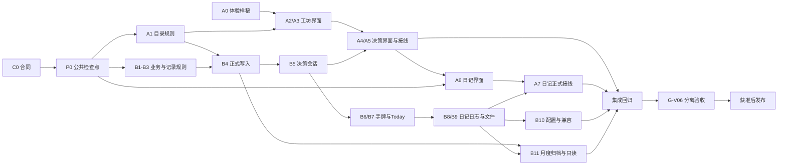

# v0.6 通用牌堆、抽卡决策与记录功能并行开发计划

日期：2026-10-07。当前状态：**完整 v0.6 源码已提交并上传 main（`e2d07c1`），随后两份浏览器检查补修已上传（`43bd74f`）**。正式 Host、会话、工坊／行动编辑、Today、日记、文件与月度归档已有；A7 采用 B 内联日记界面，A6 保留隔离样稿。最新作者 Node 727 通过＋1 原跳过、独立核心 32/32、I1 15/15、188 模块构建及干净安装通过；本轮非作者数据增量与界面静态复核分别记录。首次源码 CI 浏览器失败已定位并补修，精确远端结果见第 25.4 节。真实 OS 目录授权／撤权、实体触屏与完整 I2／G-V06／R-V06 待补；package／lock 仍 0.5.0，P0 发布戳仍 draft，未正式发布 v0.6.0。接手以第 25 节及当前交接为准，第 11—24 节保留历史快照，不重启旧任务；未处理个人数据。

完整版本包括卡牌框架、时间线日记和维护日志。日记自动段跟随表盘放置／移动／收回，感想独立并有原记录／修改时间；日志覆盖应用内操作与清单发起的网址打开。两者实际生成 `.txt`／`.md` 纯文本文件；不做外部双向编辑，外部改动恢复到最后成功输出版本。睡眠复用已有表盘安排。

同日目录移动见第 24 节，当时构建字节与原产物一致；第 25 节随后继续格式整理和功能补修，不能把第 23—24 节旧指纹扩展为当前源码的非作者证据。

策划初始要求（历史）：文件连接、容量边界、旧正文映射和故障规则须纳入 C0/P0；下表是开发路线，不代表这些接口已冻结。文件恢复按文件范围解释，不能把外部修改当成回滚整个工作区的指令。详见产品合同第 10 节，不把记录功能降为增加“导出”按钮。

用户已确认[产品合同第 11 节的简化路线](../产品设计/15-v0.6抽卡决策与通用牌堆框架.md#11-降低首版开发复杂度的方案已确认)：自动段只读表盘投影、感想按条目保存、日志在现有数据库独立存储区、两种文本共用文件队列。外部改动在写入／重连／主动刷新时检测，不做持续监控。业务与全部日记沿用 JSON 主备份，维护日志单独保存；先验证并调整容量门槛，不提前建分库／分片或日志打包功能。如规模验证不能达标再审必要改动；C0 冻结具体实现，不重复询问已定路线。未实际改代码。

## 1. 真实起点与交付目标

| 项目 | 已核对的起点 |
| --- | --- |
| 仓库／分支 | `D:\Develop\codex\CardGrid`／`main`，核对时工作树干净 |
| 精确 HEAD | `d5c9996c62ee022d9601a62a6b0138ceb54067f5` |
| 应用根／版本 | `D:\Develop\codex\CardGrid\app`；`app/package.json` 为 0.5.0 |
| 数据与配置 | Envelope v4／Data v4；完整备份 v4，当前配置包 ConfigV3 |
| 已有能力 | 工坊、书目／卡池、每日库存、行动球体、具体词条组合、Today 排期／事实／批注、日记及备份恢复 |
| 既有证据 | Node 365 项：364 通过、1 原有跳过；独立数据 32/32；构建 120 模块；浏览器 20 脚本／159 用例；A0 18/18 |
| 精确提交 CI | [d5c9996 的 checks success](https://github.com/ANNLE5923/cardgrid-workbench/actions/runs/37320000826)，含浏览器门禁与证据上传；这是 v0.5 基线，不是 v0.6 验收 |

开工重新核对 Git、版本和工作树；有其他修改时先确认归属，不回退到旧提交覆盖它们。根目录保持 7 项布局，所有 npm 命令从 `app/` 执行。

交付通用框架，吃饭、阅读、锻炼三条路径以及一个未绑定任何卡的独立清单同时验收；这些行为在日记中可对应，感想独立保留，维护操作进入日志，实际文件可以读取。外部 AI 可用同一合同生成配置包；不预装个人卡包，不以阅读优先或新增三个领域专用页面代替通用机制。

## 2. 现有复用与新增范围

| 范围 | 复用基础 | 本版增量 |
| --- | --- | --- |
| 收纳与工坊 | `app/src/workshop/`、书目／池校验与矩阵 | 通用条目、独立牌堆、行动／决策关系、直接拿牌、三槽合成台 |
| 行动抽卡 | `app/src/drawing/`、候选选择、每日库存、共享球面 | 勾选牌堆范围，保持两步翻牌与静止路径；结果进入统一手牌 |
| 决策抽卡 | 复用候选选择纯规则与中立卡片组件 | 建议新增 `app/src/decision/`：问题矩阵、结果会话、稳定答案与合成预览规则 |
| 全局手牌 | `app/src/daily/hand/`、独立成员与堆叠 | 右下角浮窗、不同卡种投影、跨页预览；Today 独占打出 |
| Today 参考 | 现有 DayBoard、排期、撤回、事实详情 | 答案贴在行动旁共用安排；独立参考位置按 C0 规则实现，禁止重复计时和伪造事实 |
| 正式写入 | `app/src/workspace/`、token／epoch／回执／事务 | 拿牌、答案接受、原子合成、成员移动与参考摆放的正式命令及查询 |
| 配置与迁移 | 现有包识别、预览、备份与显式升级 | 新配置合同、AI 生成依据、校验反馈、旧书目／槽位映射、新格式精确备份 |
| 时间线日记 | `app/src/journal/`、正式计划／固定安排／事实、日记自动保存与 epoch 保护 | 自动行为段与独立感想的时间线，随表盘更新，原时间与修改标记，旧整篇正文兼容 |
| 维护日志 | 成功业务命令 `planner.history`、原每日副本归档记录 | 页面／具名操作／清单网址打开／错误的采集与分日输出；日志和生活日记分开 |
| 实际文件 | 当前没有用户目录自动写入 | 单向生成纯文本、用户目录连接、排队写入／重试、外部变动识别及恢复；不解析外部文件回写业务 |

不做全面源码重建、云同步、在线 AI 调用、完整目标项目管理、营养／训练统计或个人数据清理。新模块名与公开入口在 C0/P0 核对真实调用后落地；该计划不是要求新建多套空模块。

## 3. 两条真正并行的开发线

沿用现有“豆包 Pro＋Codex”的两条线建议分工，不分配工作量百分比。同一 AI 线内部任务按依赖串行，不能把它同时计作多名并行执行者。可替换具体模型，文件归属与公共负责人不随会话名称改变。

| 角色 | 建议负责人 | 负责什么 | 唯一写入范围 |
| --- | --- | --- | --- |
| A：工坊、决策与日记界面 | 豆包 Pro | 收纳／牌堆纯校验与编辑、决策矩阵、三槽合成、日记时间线与感想编辑、窄屏／焦点路径 | `app/src/workshop/**`；新增 `app/src/decision/ui/**`；日记现有 `JournalWorkbench.tsx`、`JournalMonthCalendar.tsx`、`journal.css` 及新增 `journal/ui/**`；A 自有测试与样稿 |
| B：业务、工作区与集成 | Codex | 决策／合成／日记纯规则、正式持久化、日志采集与文件输出、行动抽取、浮窗与 Today 参考、格式及应用接线 | `app/src/decision/` 除 `ui/**`；`app/src/journal/` 除上述 A 文件；`app/src/drawing/**`、`app/src/daily/**`、`app/src/workspace/**`、`app/src/app/**`；新增维护日志／文件模块及对应 B 测试 |
| 公共文件 | B 兼任协调负责人 | DTO、正式命令、公开导出、架构白名单、依赖／CI、版本与最终文档 | `app/package*.json`、`app/tsconfig.json`、`app/scripts/**`、`.github/**`、`app/tests/architecture/**`、共享出口及两份主计划文档 |
| G：分离验收 | 未参与该交付实现或修复的只读会话 | 冻结快照审查、原样回归、新增反例、证据与结论 | 忽略的验收输出目录；不改交付源码、作者用例或门禁 |

A 若需改中立矩阵组件，先列出实际文件，由 B 确认后独占该组件子目录；`shared/ui/index.ts` 仍由 B 合入。不能据此修改全部 shared、球面逻辑或全局样式。日记 UI 与纯规则／自动保存 hook 按上表分文件归属，`journal/index.ts` 等公共出口由 B 协调；新日志／文件模块的实际路径在 P0 发布。不让 UI 直接改工作区格式、写 IndexedDB 或接管用户文件句柄。

### 3.1 工作目录和合入协议

1. 两条线在独立分支、独立工作目录中开发，从同一个已核对公共检查点起步。不能在同一个 checkout 同时修改，即使声称会避开同名文件。
2. 本次策划不创建 worktree 或派发开发消息。执行者开工时确认已有合适工作目录；没有再按当次授权安排隔离目录。
3. 每个文件只有一位写入负责人。A 的需求触及格式、命令或 App 时，提交接口差异，由 B 实现；B 不并行修改 A 正在编辑的界面。
4. 接口变更先更新 C0 记录和共同 fixture，再更新双方调用。各线不能用 `any`、临时字段或私有深层导入绕过合同。
5. 公共检查点和每个增量通过后，用明确 patch 依次交接；如采用 Git 检查点提交，需已有用户授权，不能把内部合入当作自动提交许可。
6. A 的界面适配器与 B 的正式 Host 必须可识别：mock 成功只算界面开发结果，不能标成正式保存成功或产品验收通过。
7. 集成工作目录只由 B 写入；先合一项、验证、再合下一项。冲突按业务意图解决，不回退或批量覆盖另一线成果。

## 4. 批次 0：C0 合同与 A0 体验验证可并行

### C0 增量业务合同（B 主持，A 核对）

输入是 15 号产品合同，输出是在两份现有文档中补充已冻结结论、接口表与可运行 fixture。重要产品取舍由用户决定，不以“技术已选”为由绕过。

- 核对行动原卡、决策原卡、独立条目、牌堆、本次素材、答案、成品、参考位置及历史快照的身份；保持资源库和本次手牌生命周期分离。
- 具体冻结独立答案的时间位置／占用、已排期素材的合成边界、同字段冲突、分步合成、每日来源的期限继承与事实参考快照。
- 保留 n 对 1 合成归属；独立参考使用与严格归属不冲突。无绑定清单合法，多决策共用候选，成员移动不改旧快照。
- 冻结“只取答案／明确同时拿行动牌”两种路径；确认三槽结果与取消、重试、已消耗提示。
- 设计最小可扩展候选字段和映射。书、食物、锻炼项目用同一流程；补充字段有明确校验，不强制每个条目创建行动关系。
- 提出 Envelope4／Data5／Backup5／Config4 的具体差异及版本门禁。旧客户端拒绝未知格式，旧包精确恢复，旧 Data4 经备份、预览和显式提交升级；真实个人数据不自动迁移。
- 旧 v0.3 书目与槽位到新框架给出逐字段映射及无法自动映射的报告；既有每日库存、七天归档、事实、批注、日记和回执语义保留。
- 用三类用例、无绑定清单、共享候选、两份相同行动、重复提交和工作区替换提供相同 fixture 和确定预期。
- 按产品合同 P12—P18 冻结时间线自动段、独立感想、睡眠复用及文件恢复规则；补齐跨日／未来日、时区、记录与修改时间、随记写入粒度和语义日志覆盖清单，不重新把已定路线变成待选项。
- 单独评估维护日志的分日存储与失败、离线、导出／恢复，以及时间线日记的条目更新和旧正文映射。现有 5 MiB 工作区备份边界与全文前后历史必须处理，不能把所有访问／点击记录无限塞入主工作区，再让正常保存因日志量失败；旧历史不得自动删改。
- 具体化用户已确认的第 11 节简化路线：表盘自动段不重复存储，旧正文不自动拆分，日志复用业务历史并仅增加缺失事件，两种文本共用单向文件输出。区分普通保存容量与导入文件保护，代表性规模下验证现有 JSON 备份／恢复是否可承担需求；未证明需要前不做分库／分片。主备份包含业务与全部日记，维护日志单独保存；无自动清理／日志打包，不擅自设保留期限。
- 文件输出需具备用户目录连接、排队更新、失败补写与可见状态；工作区已提交而文件失败不能笼统报成“保存失败”诱使重复提交。写文件与正式数据库不是同一事务；多窗口、改期／撤回、重试、恢复后的旧任务与外部改动均须有确定规则。

### P0 公共接口检查点（B，依赖 C0）

先交付纯 DTO、端口类型、规则输入输出和合成 fixture，供两条线在同一版本独立工作。A 的目录纯规则继续从 `workshop/model.ts` 导出，B 的决策纯规则建议从 `decision/model.ts` 导出；React 界面只能从明确的界面出口接线。

接口至少覆盖目录读写、拿牌、决策预览／答案接受、合成预览／确认、统一手牌查询、参考摆放、成员移动、导入预览、日记时间线读取与随记写入、维护日志记录、目录连接及文件同步状态。每项说明参数、返回 ID／快照、token、版本、取消、错误和重试语义。时间戳不充当唯一记录 ID，自动段关联稳定来源，感想不级联依附可撤回计划。

纯端口可由测试适配器实现；新增正式命令进入生产联合类型时必须同时具备输入校验、执行和拒绝错误，不能发布“成功返回但未写入”的临时接口。

2026-10-06 已交付 [workspace/v06.ts](../../app/src/workspace/v06.ts) 公共草案与 typed fixture，详见第 12 节及[产品合同第 14 节](../产品设计/15-v0.6抽卡决策与通用牌堆框架.md#14-p0-公共接口包2026-10-06v06-p0-1-草案)。A/B 核对使用 `v06-p0-1`，样稿暂存类型不得当作正式合同；测试适配器只有隔离读取，预览／写入显式返回未实现。容量政策状态为 provisional，未给正式 ZIP／Host 验证盖章。

### A0 体验样稿（A，可与 C0 并行）

用隔离合成数据检查工坊矩阵、独立清单、问题翻成答案、三槽合成及右下角浮窗外观。展示参考与成品两条用法，不强制阅读主线。新增“睡眠段＋早晨随记＋早餐移时／收回”的日记样稿，检查感想独立、修改时间和文件同步反馈。浮窗外观与 A0 样稿只供 B 正式接入，不让 A 直接编辑 App 或 daily。

桌面和 320px 下走一次“吃什么、读什么、练什么、只存网址清单”。核对用户是否理解哪些是原卡、哪些是本次牌；样稿不连接个人 IndexedDB，不冒充正式保存。

**放行条件：** C0 的阻断项有明确结论，P0 相同 fixture 在两线得到相同解释，A0 主路径可审阅。未冻结前仅允许独立样稿与合同讨论，不进入新格式、合成消耗或时间占用的生产写入开发。

**A0 完成记录（2026-10-06，A 线）：** 样稿可运行，浏览器走查 **15/15 通过、退出码 0**（桌面 1280 十组、320px 五组）。新增文件：
- 工坊矩阵与三槽合成：`src/workshop/ui/v06-sample/`（sample-data.ts、WorkshopMatrixSample.tsx、SynthesisBenchSample.tsx、synthesis-types.ts、workshop-sample.css、synthesis-sample.css）
- 决策矩阵：`src/decision/ui/`（sample-data.ts、DecisionMatrixSample.tsx、decision-sample.css）
- 时间线日记：`src/journal/ui/`（sample-data.ts、TimelineJournalSample.tsx、journal-sample.css）
- 浮窗样稿与总装：`tests/browser/v06-a0/`（HandDockSample.tsx、v06-a0-harness.tsx、hand-dock-sample.css、harness.css）与驱动 `tests/browser/v06-a0.mjs`

全部使用隔离合成数据，未连接个人 IndexedDB，保存／写入／打出均明确标注“样稿模拟”；未改生产代码、版本号、package/lock、门禁脚本或共享出口。验证结果：tsc 通过；Node 364 通过＋1 原有跳过、0 失败（含架构边界）；独立数据 32/32；生产构建成功（新样稿未被 main.tsx 引用，不进产物）；A0 15/15。证据与截图：`app/test-results/v06-a0/`。**待 B 线：** 将 v06-a0.mjs 纳入浏览器门禁列表，并在 P0 冻结后正式接入浮窗与各界面；样稿类型为临时定义，P0 后由正式 DTO 取代。

## 5. A 线任务

| 任务 | 依赖 | 交付与验收 |
| --- | --- | --- |
| **A1 通用目录纯模型（已完成）** | P0 | 原卡／决策／资源／牌堆纯校验；允许无绑定清单，支持共享候选与字段映射；拒绝失效引用、循环、超百和歧义；无 React／数据库依赖。实现 `src/workshop/catalog-v06.ts`，从 `workshop/model.ts` 导出，测试 20/20 |
| **A2 收纳与工坊编辑（已完成）** | A1、A0 | 矩阵牌堆管理、条目编辑与成员移动、决策归属、直接拿牌入口；注入 workshop 自有可写内存 host（非正式持久化），错误／草稿／空清单可解释。实现见 `src/workshop/catalog-editor.ts` 与 `src/workshop/ui/v06/`，host 单测 12/12、浏览器 6/6 |
| **A3 三槽合成界面（已完成）** | A2、P0 | 三槽：槽1本次行动/composite、槽2同归属答案、槽3预览成品；同字段冲突逐字段保留原值/采用新值，缺必填提示待补全；预览不消耗，确认在内存 host 内原子地以一张 composite 替换两张素材，取消保留素材。实现 `synthesis-preview.ts`、`catalog-editor.ts` 扩展与 `ui/v06/SynthesisBenchV06.tsx`，单测 6/6、浏览器 9/9 |
| **A4 决策矩阵界面（已完成）** | A0、P0 | 正面问题、明确抽取翻出固定答案、手选／重抽／取消；答案稳定，空候选或失效有反馈；只通过注入会话操作，组件不自己随机、不写库。实现 `src/decision/ui/DecisionMatrixV06.tsx` 与会话端口，单测 8/8、浏览器 9/9 |
| A5 卡牌正式接线与界面收尾 | A2—A4、B4／B5 | 接入正式 Host／会话；四类场景刷新保留，目录编辑与历史快照区分，保存失败不假成功；键盘与窄屏路径可用 |
| **A6 时间线日记界面（已完成）** | A0、P0、B3；A 自有卡牌任务依次交接 | 自动行为段与独立感想穿插，显示原时间／修改时间；早餐收回不丢感想，睡眠复用表盘；编辑及文件状态通过注入端口，先用明确测试适配器；区分活动日记与历史归档只读视图。单测 10/10、浏览器 10/10 |
| A7 日记正式接线 | A6、B8／B9 | 接真实随记会话与文件状态，切日／离页／保存失败仍有保护；320px 与键盘可编辑，文件失去权限或外部恢复有可理解的反馈 |

A3 与 A4 同属 A 负责人，按就绪度串行推进，不把它们计作两个并行执行者。A1 完成后立即交给 B，不等待所有界面完成。

**A1 完成记录（2026-10-06，A 线）：** 通用目录纯模型已实现并通过验证。
- 新增 `src/workshop/catalog-v06.ts`，并从 `src/workshop/model.ts` 导出：`validateCatalogV06(catalog)`（返回 `{valid, issues}`，issue 含 `code/path/message`）、`assertValidCatalogV06(catalog)`、`CatalogV06Error`、`MAX_DECK_MEMBERS=100`。
- 仅 `import type` 引用 `workspace/v06.ts`（公共出口），无 React／存储／runtime workspace 依赖。
- 覆盖：四集合内 id 唯一；牌堆成员按 deckKind（entry/action/decision）解析、成员上限 100、重复成员；`parentDeckId` 失效与层级循环（含自引用，循环上每个牌堆只报一次）；决策 `ownerActionId`、候选 `deckIds`（失效/重复/必须为 entry 类型）；字段映射的 fieldId 归属、重复映射歧义、`entryPath`（title 与 `attributes.x`）在候选资源上的可解析性与值类型兼容。
- 明确**允许**：无绑定清单（不被任何决策引用的牌堆）、共享候选（多决策引用同一牌堆）、同一行动被多决策拥有、空牌堆/空候选（不产生映射误报）。
- 测试：新增 `tests/modules/workshop/catalog-v06-a1.test.ts` **20/20**，以 P0 共同 fixture（`tests/support/v06/fixtures.ts`）为基线（0 issue），逐类反例断言**精确错误码**。
- 全量验证（均退出码 0）：tsc 通过；`npm test` 407 通过＋1 原有跳过、0 失败（含架构边界）；`test:independent` 32/32；`npm run build` 成功。
- 交接：A1 为纯规则，可供 B 线 B1/B4 与 A 线 A2 直接消费；未改 P0 DTO、端口、共享出口、版本号或任何 B 线文件，未提交或推送。

**A2 完成记录（2026-10-06，A 线）：** 收纳与工坊编辑已实现并通过验证；所有写操作经注入的可写内存 host，不直接写库。
- 新增纯规则 host `src/workshop/catalog-editor.ts`：窄接口 `CatalogEditorHost`（`stamp / readCatalog / readHand / saveEntry / saveDeck / saveDecision / moveMember / takeAction / takeEntry`）与工厂 `createInMemoryCatalogEditor(seed, options?)`；纯 TS、无 React/存储、刷新即丢。内部以 `CatalogV06` 为状态，每次保存前后做 P0 形状校验（`validateV06Dto`）与 A1 跨实体 gate（`validateCatalogV06`），**gate 失败事务性拒绝、不改状态**，错误信息前缀原始 gate code（如 `PARENT_CYCLE decks[x].parentDeckId: …`）；`moveMember` 校验版本、成员存在与 deckKind 匹配、容量；`takeAction/takeEntry` 校验版本与 active 后构造对应 HandCard 并入内存手牌，每次成功写 token.revision+1。
- React 层新增 `src/workshop/ui/v06/`：`WorkshopEditorV06.tsx`（加载、execute 成功后重读 catalog+hand、notice/busy、视图互斥切换；含 `MatrixView` 与 `DeckMembersPanel`）、`EditorForms.tsx`（`DeckForm/EntryForm/DecisionForm`、属性/映射编辑、`genId/parseAttributeValue`）、`workshop-editor-v06.css`。
- 覆盖能力：新建/编辑牌堆（名称、deckKind、父）、新建/编辑条目（标题、网址、属性、状态、加入牌堆）、新建/编辑决策（归属行动、候选牌堆勾选、字段映射）；成员上移/下移、移动到其他同类型牌堆、从其他牌堆移入；矩阵行动牌堆“直接拿牌”、成员管理“拿牌”（action→HandCard(action)、entry→HandCard(entry)）；空牌堆/空候选/校验错误均有可解释文案。
- 走查 harness `tests/browser/v06-a2/`：在共同 fixture 上额外加 action 牌堆「行动原卡」（read/meal/train），使直接拿牌入口可达。
- 测试：新增 host 单测 `tests/modules/workshop/catalog-editor-a2.test.ts` **12/12**；浏览器走查 `tests/browser/v06-a2.mjs` **6/6**（桌面 1 条连续编辑流＋窄屏 5 条自包含），证据 `app/test-results/v06-a2/`（旧失败截图已清理）。
- 全量验证（均退出码 0）：tsc 通过；`npm test` 419 通过＋1 原有跳过、0 失败（含架构边界）；`test:independent` 32/32；`npm run build` 成功（121 模块；大 chunk 提示为既有，非错误）。
- 走查中修复两处真实 UI 缺陷：① 矩阵“直接拿牌”原为 fire-and-forget，成功后不刷新手牌计数也无提示，现经结果回调刷新并给 notice；② `HandSummary` 仅挂载时读一次手牌，现按 handCount 变化重读。
- 未完成/待 B 线：新建条目并加入牌堆在 UI 为**两步**（saveEntry→saveDeck），非原子，正式原子命令在 B4；B4 提供正式 Host/持久化后，把内存 host 与 UI 临时类型替换为正式 DTO/会话；`v06-a2.mjs` 待纳入 `scripts/browser-gate.mjs`（同 A0）；成员管理为全屏替换视图（手牌入口仅矩阵视图），如需常驻手牌请在接线阶段确认。未改 P0 DTO、端口、共享出口、版本号或任何 B 线文件，未提交或推送。

**A3 完成记录（2026-10-06，A 线）：** 三槽合成界面已实现并通过验证；预览不消耗、无正式持久化写入，确认仅在内存 host 内原子替换。
- 新增纯函数 `src/workshop/synthesis-preview.ts`：`buildSynthesisPreview(...)`，校验两素材 available、ID 不同、answer 与 action 同归属（否则 ACTION_OWNER_MISMATCH）；逐字段合并（action 无 answer 有则填入、Scalar 严格相等含类型则合并、值不同记 conflicts），冲突按 FieldResolution（keep 取原值/replace 取新值）取值，未给 resolution 阻塞 ready；按 fieldSpecs.required 计 missingFieldIds；构造 composite（继承 ownerAction/contentSnapshot/fieldSpecs，provenance 两份来源，inputIds 去重，expiresAt 取两输入最早、全 null 则 null）；输出对齐 P0 SynthesisPreview。
- 内存 host `catalog-editor.ts` 扩展三方法：`stageAnswerMaterial({decision,entry})`（校验决策/条目版本与 active、条目在决策候选牌堆成员内，按 mappings 从 title/attributes.x 解析 fieldValues，构造 answer HandCard；B5 selectDecisionEntry 取代）、`previewSynthesis({inputs,resolutions})`（解析两卡、校验 kind/版本，调纯函数并缓存）、`confirmSynthesis({previewId})`（确认前重新校验两输入仍在且版本/state 一致，否则 MATERIAL_CONSUMED 不半改；ready=false 拒绝 REQUIRED_FIELD_EMPTY；通过则移除两输入、push composite、删预览、bump revision）。
- React 新增 `ui/v06/SynthesisBenchV06.tsx`：读手牌，槽1 action/composite、槽2 answer 候选；选齐或 resolutions 变化经 effect（cancelled 防竞态）重跑预览；渲染三槽（＋、＝）、成品字段、冲突区（逐字段 radio 保留原值/采用新值）、缺字段待补全 alert、来源/到期；确认合成（仅 ready）、取消/清空保留素材、返回矩阵；成功后重读手牌并回调。主组件加 synthesis 视图与矩阵工具条入口「三槽合成台」，css 追加 `.we3-*` 与 `.we2-btn-accent`。
- 测试：新增 `tests/modules/workshop/synthesis-a3.test.ts` **6/6**（完整流、分步冲突 keep/replace、归属不一致、缺必填阻塞、候选外条目拒绝）；浏览器走查 `tests/browser/v06-a3.mjs` **9/9**（桌面 4＋窄屏 5），harness `tests/browser/v06-a3/`（host 挂 window 以暂代 A4 接受答案 UI，产品 UI 无测试按钮），证据 `app/test-results/v06-a3/`。
- 全量验证（均退出码 0）：tsc 通过；`npm test` 425 通过＋1 原有跳过、0 失败（含架构边界）；`test:independent` 32/32；`npm run build` 成功（121 模块；大 chunk 提示为既有，非错误）。
- 未完成/待 B 线：合成/答案为 workshop 临时实现，B2 正式合成纯规则、B4 原子 Host/持久化到位后，替换 buildSynthesisPreview/stageAnswerMaterial/内存合成为正式 previewSynthesis/selectDecisionEntry/ConfirmSynthesis；期限继承（expiresAt 非 null）与确认时素材变更（MATERIAL_CONSUMED）在当前 manual/内存素材下未由浏览器覆盖（纯函数/host 主要分支已覆盖）；`v06-a3.mjs` 待纳入 `scripts/browser-gate.mjs`（同 A0/A2）。未改 P0 DTO、端口、共享出口、版本号或任何 B 线文件，未提交或推送。

**A4 完成记录（2026-10-06，A 线）：** 决策矩阵界面已实现并通过验证；随机与写入全部经注入会话，组件不内置 Math.random、不改 catalog；正式入口接线在 A5。
- 会话端口接口 `src/decision/ui/decision-session.ts`（A 可写 ui 层，仅依赖 workspace 公共 DTO）：`DecisionSessionPort`（`listDecisionCandidates / previewDecisionDraw / acceptDecisionAnswer`）与类型 `DrawChoice(random|manual)`、`DecisionCandidatesView`、`DecisionDrawPreview`、`AcceptDecisionAnswerResult`。
- 内存实现留在 workshop `catalog-editor.ts`（结构满足该端口、不 import ui，避免跨 owner）：候选 `computeCandidates`（决策 entry 候选堆并集、按 id 去重、只取 active、首次出现序）、`buildAnswerSnapshot`（按 mappings 从 title/attributes.x 解析 fieldValues，含问题/决策版本/归属/条目完整快照/来源堆/选择时间）、`loadDecision`（版本与 active gate）。`previewDecisionDraw` 用注入 rng（options.rng，默认 Math.random）选候选、返回固定 AnswerSnapshot 且不写手牌；`acceptDecisionAnswer` 校验后固定答案，alsoTakeAction 时一并构造归属行动牌（owner 非 active 拒绝 ENTRY_UNAVAILABLE），一次接受一次 revision、失败不半改。`stageAnswerMaterial` 重构为复用同一 helper（A3 行为不变）。
- React 新增 `src/decision/ui/DecisionMatrixV06.tsx`：正面问题（候选数/空候选提示），明确“翻牌抽取”后 0.55s 翻面显示固定答案（抽取前答案不进 DOM）；支持重抽、手选面板、取消；两种接受“只取答案 / 同时拿行动牌”；渲染/导航/重开不重抽（preview 仅由按钮触发，挂载只 list）。样式 `decision-matrix-v06.css`（dm6-*，决策紫 #6b5b95）。
- 测试：新增 host 会话单测 `tests/modules/workshop/decision-session-a4.test.ts` **8/8**（候选并集、注入 rng 抽取/重抽、手选与越界拒绝、只取答案 1 张/带行动 2 张、空候选、决策归档、归属行动归档拒绝带牌）；浏览器走查 `tests/browser/v06-a4.mjs` **9/9**（桌面 4＋窄屏 5），harness `tests/browser/v06-a4/`（决策列表从 host 动态读、host 挂 window 以准备多候选/空决策夹具），证据 `app/test-results/v06-a4/`。
- 全量验证（均退出码 0）：tsc 通过；`npm test` 433 通过＋1 原有跳过、0 失败（含架构边界，decision/ui 未跨 owner 引 workshop）；`test:independent` 32/32；`npm run build` 成功（121 模块；大 chunk 提示为既有，非错误）。
- 未完成/待 B 线：决策会话为 workshop 临时实现，B1 决策纯规则、B5 正式会话到位后替换为 previewDecision/selectDecisionEntry/AcceptDecisionAnswer；决策矩阵的**正式入口与导航**（从工坊决策卡/行动球体进入）在 A5 由 app 接线（当前 WorkshopEditor 因跨 owner 不能渲染 decision/ui，走查用独立 harness）；`v06-a4.mjs` 待纳入 `scripts/browser-gate.mjs`（同 A0/A2/A3）。未改 P0 DTO、端口、共享出口、版本号或任何 B 线文件，未提交或推送。

**A5 完成记录（2026-10-06，A 线）：** A2 工坊、A3 三槽合成台、A4 决策矩阵已从「A 线自建内存 host」切换到 **B 线正式 Host（IndexedDB / DataV5 `action-v5`）与正式决策会话**；拿牌、接受答案、合成、清单编辑真正持久化走通，刷新保留，目录编辑与历史快照区分，保存失败不假成功，键盘与窄屏路径可用。
- 合流（经用户当次授权）：**b1-b5.patch（60 文件、+2776/-36）已应用到 main 工作树**，main 现同时具备 B 线运行时（v06-host、v5-format/operations/migration、决策/行动会话、V06CardWorkbench）与 A 线 UI；a4-b5-interface 的等价改动已落地——`decision/ui/decision-session.ts` 给 `DecisionSessionPort` 加两个**可选**方法 `readDecisionDraw?`/`cancelDecisionDraw?`，`DecisionMatrixV06.tsx` 用 useRef（generation/locked）做竞态/重入保护、挂载 list 后 `readDecisionDraw` 恢复未接受 draft（重开不重抽）、取消/退出调 `cancelDecisionDraw`，公共出口 `decision/ui/index.ts` 由 patch 创建。
- 新增正式适配器 `src/workshop/formal-catalog-editor.ts`：`createFormalCatalogEditor(host: V06Host): CatalogEditorHost`。内部 `createV06DecisionSession(host)` 并把决策方法原样委托；`readCatalog` 走 `loadV5`+`readCatalog`，`readHand` 走 `readMaterials` 并**只保留 `state==='available'`** 包装为 `UnifiedHandItem`（readMaterials 保留 consumed/placed/expired 历史记录，不计入「本次手牌」）；`saveEntry/saveDeck/saveDecision/saveMember/takeAction/takeEntry/confirmSynthesis` 全部构造具名 `V06Command` 经 `host.submit` 原子提交、成功后从提交后快照按回执 `resultRefs` 读回；维护 `pending`（signature=JSON.stringify{type,payload}），失败仅在 `retry!=='same-command'` 时清 pending，same-command 复用同一 commandId，保证丢回复不重复执行；`stageAnswerMaterial` 正式版返回 `CONTRACT_NOT_IMPLEMENTED`（答案只由决策接受产生）；`stamp.backend='formal'`。
- UI 正式化：`WorkshopEditorV06.tsx` banner 按 `host.stamp.backend` 区分——正式显示「正式存储模式…刷新后保留…保存失败明确提示、不会假成功」，内存仍显示「刷新即丢失」；去掉手牌三处「（内存）」字样；`execute` 调整为先跳转（清 notice）再置成功，使新建牌堆/条目/决策保存后回到矩阵仍有可见成功反馈。`SynthesisBenchV06` 措辞本就中性（预览不消耗、确认才持久化），未改。
- 测试：新增浏览器走查 `tests/browser/v06-a5.mjs` **10/10**（桌面 8：正式 banner＋初始 1 answer、直接拿 action、reload 保留手牌、UI 新建独立清单持久化＋reload 保留、合成预览、确认合成持久化＋reload 保留 composite、IDB abort 显示错误且数据不变＋恢复后重试成功、reduced-motion 键盘 Enter 确认；窄屏 2：320 拿牌不溢出、320 合成确认不溢出），harness `tests/browser/v06-a5/`（installB4 引导正式 v5：migrate v4→v5＋seed fixture＋SaveDeck 行动牌堆「行动·阅读」＋仅首次预置一张同归属 answer，再 `createFormalCatalogEditor` 驱动 `WorkshopEditorV06`；脚本含一次性预热 context 消除 Vite 冷编译首测超时），证据 `app/test-results/v06-a5/`，无 failure 截图。
- 全量验证（均退出码 0）：tsc 通过；`npm test` 611 通过＋1 原有跳过、0 失败（合 patch 后，含架构边界）；`test:independent` 32/32；`npm run build` 成功（149 模块；大 chunk >500kB 提示为既有，非错误）。
- 未完成/待 B 线：正式 **App 入口/导航**（挂载 `V06CardWorkbench`、工坊收纳与三槽合成入口、B6 全局手牌浮窗）属 app owner、B6/B7「App 接线 B 独占」，A 线未改 `src/app`，需把入口需求交接给 B；A2/A3/A4/A5 浏览器脚本待纳入 `scripts/browser-gate.mjs`（B）。除 B patch 自带内容外，未改 P0 DTO、端口、共享出口或版本号，未提交或推送。

**A6 完成记录（2026-10-06，A 线）：** 时间线日记界面已实现并通过验证；自动行为段（表盘投影）与独立随记按时间穿插，随记保留原记录时间、修改附修改时间，收回自动段不删随记（P16），睡眠复用表盘（P18），文件状态经注入端口；活动日记可编辑、月度归档只读。当前使用测试适配器，正式随记/文件会话在 A7 接入。
- 会话端口 `src/journal/ui/journal-session.ts`（A 可写 ui 层，仅依赖 workspace 公共 DTO 与 B3 投影类型）：`JournalSessionPort`（`readTimeline / saveNote / readFileState / writeFileNow / retryFile / reauthorizeFile`）与类型 `JournalTimelineView`（`access:'live'|'archive'`、`editable`、`projection`）、`SaveNoteRequest`/`SaveNoteValue`、`JournalFileState`/`JournalFileStatus`、`JournalSessionStamp`、`JournalResult<T>`。
- 测试适配器 `tests/support/v06/journal-test-session.ts`：`createJournalTestSession()`。持有底层 DataV4 表盘（b3 fixture：睡眠 fixed＋早餐 plan）、随记（note-1）、一个迁移旧正文块（legacy-1）与文件状态。`readTimeline` 调 B3 `projectJournalTimeline`（live 日可编辑、归档日标记只读）；`saveNote` 构造 `SaveJournalNote` 经 B3 `prepareJournalNote` 并把 `draft.after` 应用到内存随记，改动后文件置 pending；`writeFileNow/retryFile/reauthorizeFile` 模拟文件队列（失权时写入被拒）。额外测试方法（UI 仅在 test 戳下调用）：`moveBreakfastTo10/retractBreakfast/restoreBreakfast`（改 DataV4 后重投影，演示 P13/P16）、`setFileStatus`（返回新状态以驱动 React 重渲染）、`setNow`。
- React 新增 `src/journal/ui/TimelineJournalV06.tsx`：banner 按 stamp 区分测试/正式；日期及时区控制＋历史归档入口；文件状态条（pending→立即写入、error→重试写入、permission-required→重新授权后写入；test 戳下另附「测试：模拟失败/失权」）；随记撰写区（仅 live 日）；时间线 `projection.rows`——automatic 显示 clipped 时间/标题/状态标签（计划·固定安排·已确认事实）/参考答案，reflection 显示原记录时间、文本与编辑（修改后显示「原时间…·修改于…」，原时间位置不变），reference 显示独立参考点；底部「历史正文」单列迁移旧块（只读文本＋原篇创建/修改时间，不拆段）；归档日显示只读面板并隐藏撰写。样式 `timeline-journal-v06.css`（tj6-*：自动段 accent、睡眠紫 #6b5b95、随记暖棕 #b98a3f）。
- 测试：新增单测 `tests/modules/journal/timeline-journal-a6.test.ts` **10/10**（初始穿插＋legacy 块、新增随记 recorded=created、修改保持原 recordedAt 并 bump updated/version、收回早餐仅删自动段且随记保留、移到 10:00、睡眠 clipped 00:00—06:00、归档只读且保存被拒 ARCHIVE_READ_ONLY、文件 error→retry 与 permission→reauth 流程、改动置文件 pending、空白内容不建档）；浏览器走查 `tests/browser/v06-a6.mjs` **10/10**（桌面 8＋窄屏 2），harness `tests/browser/v06-a6/`，证据 `app/test-results/v06-a6/`，无 failure 截图。
- 全量验证（均退出码 0）：tsc 通过；`npm test` 621 通过＋1 原有跳过、0 失败（含架构边界）；`test:independent` 32/32；`npm run build` 成功（大 chunk >500kB 提示为既有，非错误）。
- 未完成/待 B 线：正式随记会话与文件状态（B8/B9）在 A7 接入，键盘可编辑为 A7 验收；日记正式入口/导航属 app owner、B 线接线（任务 #27）；`v06-a6.mjs` 待纳入 `scripts/browser-gate.mjs`（B）。未改 P0 DTO、端口、共享出口或版本号，未提交或推送。

## 6. B 线任务

| 任务 | 依赖 | 交付与验收 |
| --- | --- | --- |
| B1 本次牌与决策纯规则 | P0 | 素材／答案／成品身份和稳定快照，通用候选选择、同源归属、结果继承；不把答案自动解释为执行事实 |
| B2 合成与参考纯规则 | B1 | 两输入到一输出预览、消耗冲突、期限与字段冲突；参考贴附／独立位置，按 C0 占用规则计数；预览无写入 |
| B3 日记与日志纯规则 | P0；B 线依次执行 | 稳定自动段／随记身份、三类时间、表盘镜像、收回不删感想、跨日投影；语义日志和文本格式；源版本／最后成功输出指纹区分正常更新与外部修改 |
| B4 格式、迁移与原子 Host | A1、B2、B3 | 具名命令、格式／包校验、合成消费＋输出＋回执＋历史单事务；目录移动、拿牌、参考和随记保存；旧日记全文保留；C0 的日志／日记容量与备份策略落地；真实 IDB 失败、丢回复、多窗口竞争、epoch 替换验证 |
| B5 决策会话与行动球体接线 | B4 | 问题→选中答案→接受；明确重抽不在刷新时变值；只取答案／明确拿行动牌；行动球体勾选池、具体 ID 一致、旧库存与两步翻牌保留 |
| B6 全局手牌浮窗 | B4、A0 | 统一权威手牌与来源，右下角展开／关闭，跨页预览与 Today 打出；非 Today 不提供打出，多个相同素材不混身份；App 接线由 B 独占 |
| B7 Today 参考与记录 | B2、B4、B6 | 默认答案贴在相关行动旁，共用安排；独立位置按 C0 实现，撤回／跨日／刷新后可解释；事实确认保存应有快照，不重复计时 |
| B8 日记会话与维护日志采集 | B3、B4 | 表盘变更后权威时间线刷新，独立随记具名保存、自动保存排空和 epoch 保护；页面／清单网址／业务及错误记录，重试不伪造新操作；日志独立存储，不因记录量阻断普通业务 |
| B9 真实文本文件同步 | B8 | 用户连接目录，两种按天完整文本共用单向写入队列、失败补写、版本与 epoch 校验；写入／重连／主动刷新时检测外部改动并恢复最后成功输出，建议保留改动副本；不持续监控、不导回工作区；实际目录验证 |
| B10 AI 配置与兼容回归 | A1、B4、B5 | 新配置包规范、样例、生成提示词和校验入口；三场景＋独立清单导入／导出，日常睡眠可由同一配置建立；同 ID 更新、重复包、引用错误、超限及旧日记恢复／迁移测试 |
| B11 月度归档与只读历史 | B4、B9；闭包与 ZIP 探针先作为 C0/P0 冻结输入 | 月度提醒、封存依赖闭包、实际 ZIP 导出与外部重读、明确清理的原子事务；逐包去重／冲突、懒加载与解码释放；活动 JSON＋必需包覆盖诊断、旧备份精确恢复、文件队列不覆盖旧日；容量／损坏／失败／多窗口反例 |

B1—B11 由 B 按依赖串行执行，A5/A7 可随正式接口就绪并行接线；A6 先用 P0 fixture／明确测试适配器推进，不能等待所有文件能力完成才开始界面。B11 不是普通 Save 中的过滤数组，也不是自动清理许可。格式或公开接口后改会使已完成界面返工，必须先交接差异再推进。

## 7. 真实并行顺序与合流

| 批次 | A 线 | B 线 | 合流门槛 |
| --- | --- | --- | --- |
| 0 | **A0 体验样稿（A 线报告 15/15）**，核对 P0 | C0 候选，P0 草案已交付 | 同版 fixture 对齐，完成冻结核对；未做正式新数据写入 |
| 1 | **A1 目录模型（已完成）** | B1 本次牌与决策规则 | 双方纯规则独立通过，A1 及时交接 |
| 2 | **A2 编辑、A3 合成界面（均已完成：A2 host 12/12＋浏览器 6/6；A3 单测 6/6＋浏览器 9/9）** | B2 合成／参考，再 B3 日记／日志规则 | 各守职责，卡牌与记录接口同时明确 |
| 3 | **A4 决策矩阵（已完成：单测 8/8＋浏览器 9/9）**，准备正式接线 | B4 正式 Host／格式／存储 | 首次真实保存具备条件；旧正文与容量策略已落地 |
| 4 | **A5 卡牌正式接线（已完成：浏览器 10/10；决策、合成、清单实际持久化走通，刷新保留、失败不假成功）** | B5 会话／球体，再 B6 浮窗 | 决策、合成、清单实际持久化走通 |
| 5 | **A6 时间线日记界面（已完成：单测 10/10＋浏览器 10/10；自动段/随记穿插、收回不丢感想、归档只读）** | B7 Today，再 B8 日记会话／日志采集 | 三领域及独立清单贯通，记录来源一致 |
| 6 | A7 日记正式接线与界面收尾 | B9 文件、B10 配置，再 B11 月度归档 | 日记、日志、实际文件与历史只读完整交付；文件失败／缺包不假成功 |
| 7 | 各自修复所属文件 | I1／I2 集成与作者回归 | 固定候选快照，作者证据齐备 |
| 8 | 停止修改受检快照 | G-V06 非作者验收 | 反例与必要回归通过；缺陷退回原作者后再冻结复验 |
| 9 | 补齐所属使用说明 | R-V06 发布整理 | 用户授权后才提交／推送，核对精确提交 CI |



不按“两个 AI 所以工期减半”排期；C0/A0 完成后按实际接口与任务退出标准估算。B4 是共有关键依赖，文件与记录增加了 B 线任务，不能把本版按原卡牌框架工量估算。其他线不能为赶进度自行增加另一套数据写入。

## 8. 集成、回归与分离验收

### I1 首个生产框架检查点

在同一隔离工作区导入三类合成配置和一个无绑定清单，依次走通“拿／抽→决策→参考或合成→手牌→Today”。该检查点要求三领域同级覆盖；不以单独阅读成功放行整个框架。允许视觉继续打磨，不能用 mock 保存替代正式 Host。

同时核对这些表盘行为在日记中一一对应：改期只更新同一自动段，收回移除自动段但独立感想仍在。文件能力在 B9 完成后的 I2 验证，不能把 I1 的页面成功扩大为真实文件写入结论。

### I2 作者完整回归

| 维度 | 必须覆盖 |
| --- | --- |
| 三类用例 | 吃饭、阅读、锻炼全部走通，随机与手选，参考与合成，工坊直接拿牌与行动球体入口 |
| 独立清单 | 无行动／决策／规则也能建空堆、加条目、移动、导出、刷新恢复；共享候选解绑后原清单保留 |
| 决策 | 空堆／无有效候选、结果不随渲染漂移、取消零新增、主动重抽、来源变化导致正确重新预览 |
| 合成 | 两素材→一成品，原库保留；两份同名素材只消耗指定份；分步合成、字段冲突、已排期／事实限制、来源到期与重复消费 |
| 故障与并发 | 真 IDB 事务中止、提交后丢回复、同 commandId 重试、不同窗口竞争同一素材、预览后外部写入、恢复／清空后旧组件不得混入新 epoch |
| Today 与参考 | 默认共享安排不重复占时；独立位置按 C0 规则；事实和批注不可改写，目录改名／移已读不改变旧快照 |
| 全局浮窗 | 各页面相同权威手牌，非 Today 仅预览；展开关闭／返回焦点，小屏不遮挡关键操作，切页不掉未保存草稿 |
| 时间线日记 | 00:00—06:00 表盘睡眠带入；08:00 早餐改到 10:00 更新同一记录；收回早餐自动段消失、08:12 感想保留；随记修改保留原时间并显示修改时刻；跨午夜与时区稳定 |
| 维护日志 | C0 列出的页面／具名操作／打开网址／错误覆盖；记录真实发起操作与结果，不伪造外部网页后续活动；业务重试与回执重放不重复记为新行为；独立存储的容量与失败策略 |
| 真实文件 | 实际授权目录的逐日完整文本可读取；主数据保存后文件失败可补写；写入／重连／主动刷新触发外部改动检测与恢复，正常更新不被误判；外部恢复不回滚工作区，旧任务不覆盖新文件；后缀／重连按 C0 验证 |
| 月度归档与历史 | 提醒不删除；封存闭包完整、跨月／未完成依赖保留；实际外部包重读验证后明确清理、失败原库不变；多包去重／冲突与按月解码释放；历史只读、缺包不报告完整恢复、旧日文本不被不完整活动投影覆盖 |
| 备份范围与容量 | 业务和全部日记进入 JSON 主备份，维护日志独立保存，界面说明一致；旧正文全文保留；规模用例验证调整后的保存／导入／恢复门槛和耗时，不静默删除或截断来通过测试 |
| AI 配置 | 三类＋无绑定清单同包、稳定 ID 更新、重复包、不合法引用／未知字段／超百全包拒绝；导入预览明确，失败无部分配置 |
| 兼容 | Data2/3/4、旧配置及备份原样可解释；精确恢复不偷偷升级；显式迁移保留日记、旧来源、规则、库存记账、事实与批注 |
| 体验 | 空白、拥挤、跨午夜、DST、320/390/720/1280px；鼠标、键盘、减少动态；实际触屏另行记录，不用模拟器结果冒充 |
| 离线与交付 | 新生产构建、首次受控页面、正常／迟到观察／慢激活三组 SW 更新，离线重开数据保留；干净源码安装构建和 A0 归档仍可运行 |

文件接口的内存／测试适配器通过只算规则验证；另记录受支持浏览器中实际目录授权、生成文件及恢复的证据。自动化无法覆盖的权限弹窗与真实目录连接由人工补验并如实列出，不将 mock 写入宣称为实际落盘。

保留原 Node、独立数据与 20 脚本浏览器门禁的行为断言。导航与手牌入口改变时可适配定位，不删关键断言或跳过脚本；新增场景进入正式门禁。新数量从实际发现结果记录，不能把基线 159 当作 v0.6 的全部验收数。

从仓库根先进入应用执行：

```powershell
Set-Location 'D:\Develop\codex\CardGrid\app'
npm ci
npm test
npm run test:independent
npm run build
npx playwright install chromium
npm run test:browser
```

浏览器门禁串行，优先项目 Chromium。证据位于忽略的 `app/test-results/v06-<阶段>-<日期>/`，记录命令、环境、退出码、用例数、未测项及冻结文件指纹；不覆盖历史证据或上传个人数据。

### G-V06 非作者验收

受检交付与代码指纹先冻结；检查者原样复跑作者矩阵，并独立增加并发消耗、epoch 替换、未绑定清单、三个领域真实 UI 路径、参考重复计数、随记独立性、旧文件任务和外部恢复、备份精确恢复反例。只修改独立证据目录。作者交叉审查、同一实现者另跑测试或 CI success 不能代替此门槛。

发现阻断缺陷交还文件负责人修复；新冻结快照重新执行失败场景与受影响回归，保持修复者和复验者分离。不得因时间不足把未验证项写成通过。

### R-V06 发布整理

G-V06 通过后同步实际功能地图、模块地图、使用／AI 配置与升级说明，将 package、lock、侧栏及当前文档版本统一为 0.6.0；保留归档历史。确认差异无依赖产物／备份／个人截图，用户明确授权后才提交、推送并核对该精确提交的 Actions。旧发布授权不覆盖本版。真实个人数据升级单独执行。

## 9. 每个增量的交接格式

一个交接包含：任务编号、起点／当前状态、修改文件、公开接口差异、正式或 mock 的接线状态、验证命令和结果、未完成项及阻断依赖。只报“构建通过”或“页面完成”不足以放行。

业务规则改变记录在 15 号合同，依赖与任务状态记录在本计划；常规细节不用再建多份过程文档。各线可以把证据放忽略目录，公共负责人统一维护当前入口。

## 10. 可直接派发的开工指令

### 给 A 线

> 请阅读 v0.6 产品合同第 14 节和本计划第 12 节，核对独立工作目录与 main／d5c9996 基线。A0 已报告完成，先保留原成果并核对 workspace/v06.ts 的 v06-p0-1 DTO／fixture；完成冻结核对后推进 A1—A7：通用牌堆／独立清单、工坊、合成与决策矩阵、时间线日记界面。严格只改 A 的文件，不改 workspace、App、daily、日记规则与保存 hook、锁文件或共享出口。三领域与独立清单同级覆盖；感想独立，行为收回不删感想；区分活动日记和归档只读，文件状态通过注入端口。草案测试适配器不执行写入，未冻结前不接新持久化。每个增量交接文件、接口、验证和未完成项；不自行提交、推送或处理个人数据。

### 给 B 线／主线负责人

> 请阅读 v0.6 产品合同第 12—14 节和本计划第 12 节，从真实 main／d5c9996／v0.5.0 核对新的起点。A0 已报告完成，P0 v06-p0-1 草案已有；保留所有成果，先主持双方 fixture／C0 剩余项核对和必要 ZIP／闭包／容量探针，完成冻结后依次推进 B1—B11、I1/I2。你独占正式数据、事务、迁移、公共出口、App、浮窗与 Today 参考、日记规则／会话、维护日志、文件输出和月度归档。A1 完成即依次合入；A 卡牌和日记 UI 就绪后接真实 Host。感想独立，睡眠来自表盘；文件单向生成，外部改动只恢复文件、不导回或回滚工作区。月度包外部重读通过后才可明确清理，历史按月只读，缺包不报告完整恢复。保留事实、旧日记全文、七天来源与旧备份精确恢复；三领域和独立清单同级走通。作者回归后交非实现／修复者做 G-V06，真实文件权限和落盘另记证据；不自行提交、推送或处理个人数据。

第一批是 **C0＋A0**，卡牌与日志／日记同时纳入。C0/P0 冻结后按依赖分线，新增的记录任务不能排除在 v0.6 集成验收之外。这是当时开工状态；第 11 节保留 C0 证据，第 12 节保留 P0 草案交付，当前实现与验收见第 23 节，不代表接口已整体冻结、功能已实现或验收已通过。

## 11. C0 本轮执行记录（2026-10-06）

用户指示“推进 c0”。开工核对 main／`d5c9996c62ee022d9601a62a6b0138ceb54067f5`／app 0.5.0；原 4 修改＋2 新增策划保留。本轮唯一写入范围是当前 C0 相关文档及 `docs/开发/v0.6-c0/**`，不改 app/src、依赖、格式、版本或个人工作区。

| 交付 | 当前结果／边界 |
| --- | --- |
| 卡牌、参考、合成及记录合同 | [产品第 12 节](../产品设计/15-v0.6抽卡决策与通用牌堆框架.md#12-c0-候选合同2026-10-06本轮推进)：字段、身份、消费／来源／期限、参考／事实快照、旧映射、端口／错误与文件故障；F1—F3 仍待确认，A 接口核对未发生 |
| 共同字面向量 | [fixtures.mjs](v0.6-c0/fixtures.mjs) C01—C32，[verify.mjs](v0.6-c0/verify.mjs) 内部一致性通过；未运行 v0.6 命令，不能标成 32 个产品行为测试通过 |
| 容量探针 | [capacity.mjs](v0.6-c0/capacity.mjs)，Windows／Node 24.19.0／全新 Chrome 157.0.8081.0 context／隔离回环源及 `cardgrid-c0-synthetic-only` 数据库；不用个人 profile 和正式工作库 |
| 一年／三年模型 | v5 未验证格式的规模模型分别 20,839,400 bytes（19.87 MiB）／62,273,830 bytes（59.39 MiB），完整 JSON 往返一致；clone／hash 均测量。不能充当正式 v5 格式校验 |
| 真实 IDB 结构探针 | 365／1095 天及 32 MiB 边界的 current＋previous 写入、读取、JSON 往返、中止保留 current 和 previous 全通过。带 previous 写入约 175／565／258 ms；这是结构探针，不是完整 Host／权限目录测试 |
| 现行完整校验 | 合法 v4 控制组 365／1095 天分别 24,460,365／73,450,965 bytes，validateActionData 3,489／13,889 ms；旧 5 MiB 门槛未放宽，控制组不是可由现有 Host 写入的样本。仅放宽容量不能认定普通保存性能通过 |
| 边界及旧恢复 | 拟议 32 MiB 全包字节等值／下一字节检查通过；当前 v4 小样精确恢复通过，8.92 MiB 纯日记包被旧入口拒绝。64 MiB 输入保护与正式 v5 容量入口尚未实现／验证 |
| 月度新候选 | [产品第 13 节](../产品设计/15-v0.6抽卡决策与通用牌堆框架.md#13-月度归档与多压缩包只读浏览用户新提案待设计确认)。31 天模型 1,908,946 bytes（1.82 MiB），合法 v4 控制组校验约 345 ms；归档闭包、ZIP 和清理没有实现 |

运行（先 `cd app`）：

```powershell
node '..\docs\开发\v0.6-c0\verify.mjs'
node --experimental-strip-types --expose-gc '..\docs\开发\v0.6-c0\capacity.mjs'
node --experimental-strip-types '..\docs\开发\v0.6-c0\capacity.mjs' --month-only
```

最终详细证据保存在忽略的 `app/test-results/v06-c0-20261006/capacity.json`、`capacity-run.log`、`month-capacity.json`。主探针退出 0，month-only 退出 0；首轮边界构造误把当前正文与历史引用为同一对象导致 padding 重复计量，已隔离当前记录与历史快照并重跑。峰值 RSS 为整个多规模 Node／浏览器驱动进程的累计运行峰值，不能解读为产品或每月独立内存承诺。当前不对压缩比作保证。

执行中另出现 `app/src/decision/ui/*Sample*`、`app/src/workshop/ui/v06-sample/**` 等另一线材料，本线只观察并保留，未修改、集成或验收；样稿所在 checkout 尚不构成计划要求的独立目录验证。不得把本轮纯 C0 检查扩大为其类型检查、构建或 A0 验收结论。

**下一步**：优先明确用户新月度提案是否替代集中备份路线、归档后旧日记是否完全只读或允许追加补记，随后冻结跨月关系与备份合同并更新 B 任务。原 32/64 MiB 提案、Data5／Backup5／Config4 和接口均为候选，不发布 P0、不派发新的持久化任务。现有卡牌／随记／文件规则可继续对齐，A 若开展样稿须注明容量／归档端口尚未冻结。作者探针不代替 G-V06 非作者验收。

## 12. P0 公共接口包交付（2026-10-06）

用户继续指示 P0，并报告 A0 完成；本线完成独立 `v06-p0-1` 草案包。第 11 节末尾“不发布 P0”是先前 C0 节点，现已产出可审阅草案；未把未决业务或容量写成已确认。公开入口、字段和失败语义见[产品第 14 节](../产品设计/15-v0.6抽卡决策与通用牌堆框架.md#14-p0-公共接口包2026-10-06v06-p0-1-草案)。

| 归属 | 文件 |
| --- | --- |
| B 纯公共接口 | `app/src/workspace/{contracts-v06,ports-v06,v06-validation,v06}.ts` |
| B 测试支持 | `app/tests/support/v06/{fixtures,test-port,typechecks}.ts` 与专用 tsconfig；`app/tests/modules/workspace/v06-p0.test.ts` |
| B 架构入口登记 | `app/tests/architecture/module-boundaries.test.ts` 只增加 workspace/v06.ts 白名单，原越界／循环检测继续生效 |
| 共同合同 | 本计划、产品第 14 节、现有交接与入口索引；保留原 C0 容量结果与 A0 完成记录 |

**作者验证（本轮）：**

- `npx tsc --noEmit` 与 `npx tsc -p tests/support/v06/tsconfig.json` 成功；专用类型反例验证 P0 不启用生产 Data／Command、答案不当行动、归档不可编辑、句柄隐藏、随记时间不由调用方伪造。
- P0 边界测试 **23/23**。全 Node **388 项：387 通过、1 原有跳过、0 失败**（含架构边界）。既有独立反例 **32/32**；本轮执行该套旧反例，不等于新增 P0 非作者验收。
- `npm run build` 成功，仍为 **120 模块**。新 P0 入口和 A0 样稿没有被生产 App 引用；现有大 chunk 提示仍在，未为纯接口包改动产物拆分。
- 当前生产 contracts／format／commands／store、package／lock 的 SHA-256 与开工值相同；分支／HEAD 保持 main／d5c9996，版本 0.5.0；无暂存、提交、推送及个人数据操作。
- 日志：`app/test-results/v06-p0/{node,independent,build}.log`（忽略目录）。未运行新 ZIP、实际文件权限、清理事务或 A0 浏览器脚本；这些不是本轮完成项。

新增 M01—M12 是月度行为规格，与 C01—C32 一起待正式任务执行。manifest 校验只检验边界，尚不证明包内 hash／引用／闭包正确；测试适配器写入与预览均拒绝，不能用于宣称合成和保存完成。

**下一步：** A/B 从同一 v06-p0-1 和 fixture 核对实际 UI 所需字段、C0 F1—F3 与归档编辑边界，补 ZIP／闭包／容量探针，再提升冻结状态；按已定独立目录及文件归属进入 A1／B1，随后串行推进各线。当前 checkout 的 A0 文件由原作者持有，本线未修改、正式接线或独立验收；生产开发不能用旧版本同名任务或本轮类型测试冒充已完成。月度历史放入 B11 和最终集成门槛，不遗漏它，也不自动处理个人数据。


<!-- B 独立目录的历史交付记录；当前 main 状态见第 23 节。 -->

## 13. B1 纯规则交付（2026-10-06）

用户明确指示“推进 b1”，授权推进不涉及持久化的本次牌／决策规则。B1 基于 P0 草案实现已明确的身份、快照、选择和来源继承；未据此冻结 F1—F3、月度容量或生产格式，未提前实现 B2 消耗与参考摆放或 B4 正式保存。

### 13.1 独立目录与文件归属

- 开发目录：`D:\Develop\codex\CardGrid-v06-B1`；分支 `codex/v06-b1`，HEAD 从 `d5c9996c62ee022d9601a62a6b0138ceb54067f5` 起步。旧 CardGrid-A1／CardGrid-B3 均属旧版本，没有复用或修改。
- 将当前未提交 P0／A0／C0 文档和 fixture 复制为只读输入快照，记录在 `app/test-results/v06-b1/input-snapshot.json`。A 线在主目录出现的目录模型未被本线修改；本轮未合入其新公开导出或测试。B1 不依赖 A1 的新实现。
- 源码、分支和测试输出独立；已安装的 node_modules 通过目录联接复用，只运行现有工具，package／lock 无变更。快照复制的覆盖选项错误已修正；原目录未改。
- 当前聊天位于仓库父目录，应用的托管 worktree 工具未识别 Git 仓库；改用 `git worktree add -b codex/v06-b1 ... d5c9996` 创建普通独立 worktree。未创建开发会话、提交或推送。

| B1 文件 | 作用 |
| --- | --- |
| [decision/model.ts](../../app/src/decision/model.ts) | 唯一 B1 纯规则公开入口，无 React、Host、数据库或文件操作 |
| [candidates.ts](../../app/src/decision/candidates.ts) | 候选并集、固定答案、条目来源和字段映射；复用原无偏 uint32 选择器 |
| [materials.ts](../../app/src/decision/materials.ts) | 行动／条目／答案素材构造、明确同时拿行动、归属核对、文字渲染、来源及期限继承 |
| [rule-checks.ts](../../app/src/decision/rule-checks.ts) | 本轮参与对象的 ID／版本／字段与快照一致性检查；不替代 A1 的全目录校验 |
| [b1.test.ts](../../app/tests/modules/decision/b1.test.ts) | 25 个隔离业务规则反例与字面结果；不模拟生产 Command 成功 |
| 架构白名单 | 新增 decision/model.ts 和 drawing/selection.ts 两个纯入口；原引用越界／循环检测继续生效，随机选择实现未重写 |

### 13.2 对外行为

collectDecisionCandidates 接受 catalog、decision ID／version 和可选 deckIds。未传 deckIds 表示该决策全部配置来源，显式空数组表示未选任何堆；按选中牌堆顺序与直接成员顺序组成候选，按条目 ID 去重并保留所有来源堆版本。同名不同 ID 不合并；不递归子堆，不偷用无绑定清单。归档条目退出候选但原库不变；失效成员、重复 ID、非法来源和映射歧义明确拒绝。

selectDecisionAnswer 只在明确选择时执行，手选使用条目 ID／version，随机由调用者注入 nextUint32；沿用原拒绝采样以避免模偏差。空候选不调用随机源。结果固定问题、决策／行动版本、完整条目、来源堆版本、映射值及调用者提供的选择时间；返回副本与原目录脱离。attributes 缺键时不补造值，显式 null 保留；0／false 是有效值，text 对应 JavaScript string，不自动把数字转成文本字段。

createActionMaterial／createEntryMaterial／createAnswerMaterial 接受独立 ID 和原时间，仅构造草案；明确重复拿牌需提供不同 ID。答案／条目没有可执行 Content／Instance；行动暂有 actionInstanceId:null，不隐式创建 Instance 或 Fact。createDecisionMaterials 默认只返回答案，只有显式提供行动参数才一起返回两个草案；两 ID 必须不同、行动归属 ID 与版本一致。它不提供事务／回执，真正原子提交由 B4 负责。

renderActionContent 使用已冻结 Content、字段和值，单次替换 title／criteria 的已知标签，插入内容的花括号不递归展开，其他 Content 原样复制。必填 null／空白／缺失列入 missingFieldIds，保留未填标签并返回 ready:false；可选空白标签移除，0／false 正常呈现。此函数不决定 Today 放行或消费资格，B2／B4 必须继续检查。

assertSameActionOwner 区分不同归属（ACTION_OWNER_MISMATCH）与同 ID 不同版本（ENTRY_STALE），不猜测版本间字段兼容。inheritMaterialSources 保留两个直接输入 ID、已有递归来源及最早非 null UTC 期限，精确比较到纳秒；不改变输入 state、不消费素材、不覆盖原卡。是否已排期、已附着、已消费或有事实由 B2 检查。

日副本来源保存 copy ID／version、原来源日及冻结时区；拿牌不续期。expiresAt 须与原日 D+7 在冻结时区的 dayRange 起点一致，到期时刻本身拒绝再拿；沿用已有时区日界处理 DST，不按固定 168 小时计算。副本与原卡的权威关联、冻结版本获取仍须 B4／B5 校验，不能只靠调用者填写这些字段。

错误遵循 P0 的 code／field：非法输入 INVALID_INPUT，不可用／空候选 ENTRY_UNAVAILABLE，版本变化 ENTRY_STALE，归属不符 ACTION_OWNER_MISMATCH，到期 MATERIAL_EXPIRED；已有时间校验继续返回相应 ActionTimeError。B5 将这些纯规则错误映射为端口失败并实现 token／preview／取消／重抽；当前读取和草案构造均无正式保存成功反馈。

### 13.3 作者验证与交接

- B1 **25/25**；全 Node **413 项：412 通过、1 原有跳过、0 失败**，含架构门禁。既有独立反例 **32/32**，仅复跑兼容基线，不等于新 B1 非作者验收。
- `npm run build`（含 tsc）成功，仍为 **120 模块**；B1 未被生产入口引用，构建沿用原产物。当前大 chunk 提示保留。
- 保留首轮失败：callback 联合类型缩窄经 tsc 指出；首轮 24 项为 17 通过／7 失败，发现 text→string 类型名映射遗漏，修正后原三域字面测试通过；再补 DST／禁止续期验证。记录在 first-failure.log，未删失败用例或旧证据。
- 生产 contracts／format／commands／store 与 package／lock 无 Git 内容变化。新 checkout 行尾与原目录不同，原始字节哈希不同；规范化 CRLF 为 LF 后逐文件完全相同，比较证据在 protected-files.json。P0 DTO 和 fixture 未改，个人数据未读写。
- 证据目录为 `app/test-results/v06-b1/`：node.log、b1-final.log、independent.log、build.log、输入快照和保护文件检查。未运行新 UI／真实 IDB／文件／ZIP 或非作者验收；这些不属于 B1 本轮结果。

可交接 `app/test-results/v06-b1/b1.patch`（本机忽略目录中的交付文件），只含四个纯规则文件、B1 测试及架构入口的增量，前提为本轮 P0 已存在。文档保存在 B1 独立目录；主工作树没有回写，以免与 A 线并行开发混用 checkout。后续统一合入时先检查补丁和 A1 交接，保留原库、旧事实／日记、原 P0／A0 及未提交改动。

**B1 交付时的下一步 B2：** 补合成资格、字段冲突、两输入到一输出预览，以及贴附／独立参考规则；正式消费／回执留 B4。B1 当时未启动 B2、B5 会话、生产迁移或月度归档；随后 B2 结果见第 14 节。非作者验收仍待独立检查者执行。

## 14. B2 合成与参考纯规则交付（2026-10-06）

用户指示“推进 b2”，本轮在 B1 独立目录继续串行开发：`D:\Develop\codex\CardGrid-v06-B1`／`codex/v06-b1`，HEAD 仍为 d5c9996，B1／B2 均未提交。主目录 A1／A2 文件只读核对，没有回写，没有复用旧版本工作树。输入为已复制的 v06-p0-1 DTO、共同 fixture 与 C0 候选；不扩大整体冻结结论。

### 14.1 文件与公开行为

| B2 文件 | 作用 |
| --- | --- |
| [decision/model.ts](../../app/src/decision/model.ts) | B1／B2 公共纯规则入口，不导入 React／Host／存储 |
| [material-state.ts](../../app/src/decision/material-state.ts) | 权威读快照、身份／版本、可用状态、活动计划／参考与事实锁检查 |
| [synthesis.ts](../../app/src/decision/synthesis.ts) | 合成预览、冲突方案、同版本模板渲染、两消费＋一成品草案 |
| [references.ts](../../app/src/decision/references.ts) | 贴附／时间点、随计划投影、收回草案、新事实答案快照 |
| [b2.test.ts](../../app/tests/modules/decision/b2.test.ts) | 38 个作者规则测试，沿用共同三领域字面输出与反例 |

previewSynthesis 接受两个素材 ID／version、outputId／at、MaterialContext 和原归属版本 actionSource。MaterialContext 为后续 Host 提供的 materials／instances／plans／facts／references 权威快照，不能换成 UI 自报资格。输入顺序可交换，直接 inputIds 保留槽位顺序；必须是一张行动／中间成品和一张答案，ID 不同、归属 ID／版本一致，新成品 ID 未占用。已消费、已收回、已到期、已排期、已贴附／独立摆放及已有事实均拒绝；无事实且计划已撤回的素材可再合成。

空原值填入、相同值合并，不同值逐字段产生 conflicts，必须显式 keep／replace；重复／未知／非冲突方案拒绝。未解决冲突的暂按原值展示 output 不可消费，canConfirm:false。0／false 不作为空值，类型不自动转换；采用 null 可以形成待补全材料。canConfirm 只表示冲突已解决；readyForToday 还要求必填齐全、预设时长非 null，缺时长走 Today 原有补时长流程。中间成品允许确认，再合成补全。

反复合成必须从保留的同版本原卡／历史获得 actionSource，核对 ownerAction、字段与当前 contentSnapshot，再用原模板＋全部合并值渲染 title／criteria。不能把已替换的成品标题当模板，否则下一次 replace 无法更新旧答案。来源版本不一致报 ENTRY_STALE；不从新原库或名称猜兼容，原卡后来停用不抹掉已拿出材料。B4／B5 负责权威获取冻结版本及防伪，纯函数参数不是来源能力。

prepareSynthesisConsumption 从新读快照重算资格；未解决冲突报 FIELD_CONFLICT。成功只返回两个 version+1、state:consumed、consumedBy:成品 ID 的输入草案和 version:1 成品。成品保留直接输入、递归来源及最早非 null UTC 期限，到期时刻本身拒绝使用。B4 必须同事务应用三份对象，让消费材料退出手牌并阻止 ReturnWithdrawn 复活；本轮不续期、不改原库、不删除旧 Instance、不保存或签发回执，未验证正式重放／竞争／事务失败。

previewReferencePlacement 的 point 只有 UTC 时刻／IANA zone／完整当地分钟／offset，落在 5 分钟网格；DST 重复分钟必须选偏移，不存在分钟拒绝。occupiedMinutes 恒为 0，不创建零长度 Plan 或 Fact；答案不能放到到期时刻及之后。attached 要求目标 Instance 版本、唯一行动来源映射、同归属版本和唯一活动 Plan；来源不明的旧手牌不猜归属。projectReferences 随当前 Plan 移时、保留参考 ID，无额外占用；已确认行动参考改由事实快照展示，不再投影为活动参考。

prepareReferenceReturn／prepareAttachedReferenceReturn 只返回位置 version+1 的 returned／expired 草案与答案 ID，后者用于行动撤回时成组收回贴附参考。过期答案不回可用手牌，消费答案不复活；事实关联不可收回，独立时间点可单独收回。函数无感想参数或级联修改，旧正文和感想保留；B4／B7 同事务接 Plan 收回及位置变化。

snapshotAttachedAnswers 在新 ConfirmActual 写入前返回 factId＋已贴附答案完整副本，排除独立点，拒绝覆盖旧事实。无贴附答案返回 null，旧行动没有来源映射仍可按原路径确认，不补造旧事实答案。B4 把新 Fact 与快照原子保存；原 Fact 类型、旧内容及批注规则不改。

### 14.2 接线、证据与后续

- P0 DTO／标记／测试适配器不变。B2 草案不签发 token、previewId、sourceFingerprint 或会话能力；B5 须绑定输入／原卡版本、字段方案及权威指纹。**P0 SynthesisPreview.ready 映射 canConfirm，missingFieldIds 显示待补全；不能因缺必填禁用中间成品确认，Today 资格另由 B7 检查。** 该接线约定须 A3／B5 核对，不能把纯草案当提交凭据。
- B2 作者测试 **38/38**；首轮 32/32 与 tsc 通过，随后补时长、倒置输入、采用 null、到期、重复参考和来源版本反例。完整 Node **451 项：450 通过、1 原有跳过、0 失败**，含架构门禁。旧独立反例 **32/32** 是作者复跑兼容基线，不等于新 B2 非作者验收。
- `npm run build`（含 tsc）通过，生产仍为 **120 模块**；原入口尚未引用新模型，既有大 chunk 提示保留。本轮无新 UI、真实 IDB、正式提交、迁移、文本文件或 ZIP 验证，不替代 G-V06。
- 日志在 `app/test-results/v06-b2/`：b2-first.log、tsc-first.log、node.log、b2-final.log、independent.log、build.log 与保护文件／补丁检查。B1 原日志及 b1.patch 保留。
- b2.patch 为 **B1 之上 5 文件增量**；b1-b2.patch 为 **P0 之上 10 文件累计源码／测试补丁**，不含输入快照、A 文件或文档副本。累计补丁在 main 只做 `git apply --check`，未应用；本目录的 B2 文档由集成逐段合并并保留 A 进度。

本节为 B2 交付时的节点，随后 B3 结果见第 15 节。B4 负责严格全包验证、同事务消费／参考／事实快照、幂等与迁移；B5 获取冻结原卡并签发预览能力，B7 接 Today。C08 重放、C17/C18 完整日记联动未因 B2 局部规则通过而标成验收完成。没有自动提交／推送或个人数据处理。

## 15. B3 日记、日志与文本纯规则交付（2026-10-06）

用户指示“推进 b3”。继续使用 `D:\Develop\codex\CardGrid-v06-B1`／`codex/v06-b1`，在已保留的 B1／B2 上串行开发；HEAD 仍为 d5c9996，均未提交。主目录 A 线及 P0 只读核对，生产入口、格式、依赖、版本、原数据不改。新实现不调用存储、浏览器文件 API 或个人工作区；以下为作者开发与回归结果，不是 G-V06。

### 15.1 文件及日记规则

| 文件 | 作用 |
| --- | --- |
| [journal/model.ts](../../app/src/journal/model.ts) | 日记纯规则入口，与现有 React journal/index.ts 分开 |
| [timeline.ts](../../app/src/journal/timeline.ts) | 从正式 DayView 投影自动段、感想、旧正文、参考和原计划对照 |
| [records.ts](../../app/src/journal/records.ts) | 新感想／旧整篇正文单条编辑草案，原时间及版本保护 |
| [text.ts](../../app/src/journal/text.ts) | 可读 Markdown 内容、LF、源 token 与输入指纹 |
| [maintenance/model.ts](../../app/src/maintenance/model.ts) | 语义事件、回执／历史派生、去重、分区文本；不保存正文 |
| [text-output/model.ts](../../app/src/text-output/model.ts) | 两种文本共用 UTF-8 SHA-256 与文件核对步骤规划；无实际 IO |
| [日记测试](../../app/tests/modules/journal/v06-b3.test.ts)、[日志测试](../../app/tests/modules/maintenance/b3.test.ts)、[文本测试](../../app/tests/modules/text-output/b3.test.ts) | 52 个新增作者反例；[B3 fixture](../../app/tests/support/v06/b3-fixtures.ts) 使用合成 v4 数据与真实 projectDay |

projectJournalTimeline 使用正式表盘 DayView，不另算排期，不从名称或空闲推断睡眠。午前／午后及 DST 显示片段按相同来源合并为每来源每日一个自动段；完整范围保留，按查看日界裁剪，23／25 小时日均复用既有时间接口。计划来源键为 instance、固定为 fixed，未保存模板为 template＋原版本／来源日／条目；键中 ID 编码避免分隔符碰撞，表盘模板旧不透明 ID 有歧义时拒绝猜测。移时改变范围但不改变来源／当日行 ID，跨日使用不同片段 ID；撤回移除计划行，不改独立感想或旧正文。

事实只作为实际自动段显示，原计划在 plannedComparisons 中单独对照，不再计一次生活行为。贴附答案加入相同行动段，事实参考取冻结 FactReferenceSnapshot，不回查现行原库；独立参考点作为零区间的 reference 行，不加入 automatic 或生成 Fact。感想按原 recordedAt 排序；相同归属日跨时区的文字全部可见并保留各自 zone，同刻以类型／ID 固定排序。旧正文单列历史正文，不为句子推造时间。未来表盘安排可投影为计划，个人感想及正文仍禁止写未来。

prepareJournalNote／prepareLegacyJournalEdit 接受 P0 具名命令和 Host 后续提供的原时刻、设置时区及权威条目。它们只返回单条 before／after／changed 草案，B4 才保存历史与回执。新空白不分配 ID；现有清空保留 ID、日期、时区、创建／原记录时间；修改只变 text／version／updatedAt。ID／版本冲突、时间倒退、伪造 recordedAt 或试图挪日期／时区均拒绝。未来保护沿用当前工作区时区，不能通过 payload zone 绕过。过去补记的归属日与实际写下时间分开。相同文本无变更，不复制整天正文。

toLegacyJournalBlock 保留原篇全文，包括 CRLF、空白、空正文和旧时间，只为展示增加 kind；编辑旧正文也只针对其原 ID／version。生成文件的展示文本转换为 LF，原库和主备份的旧全文不归一化。归档访问报 ARCHIVE_READ_ONLY；若权威上下文指出日期已经归档，活动区追加补记暂报 CONTRACT_NOT_IMPLEMENTED，等待此前尚未冻结的归档编辑规则，不能暗中开放写归档或将这项限制记录为用户已确认。

### 15.2 日志、文本与文件判定

业务成功由原回执及同一 commandId／原时刻的变更历史派生，每次用户操作一个事件，保留 sourceHistoryIds；多对象变更不拆成多次操作。重复事件 ID＋相同内容去重，冲突 ID／重复使用历史明确拒绝。工作区替换使用独立 LifecycleReceipt 构造成功日志，不编造 planner.history；按 epoch／date／zone 分区，旧 epoch 不删除。额外页面、会话、失败／重试和文件阶段由 createOperationEvent 构造，普通业务成功不能从该通道自报。

日志只接受有限操作元数据，正文／未知顶层字段、自由异常消息及伪装成计数的文字拒绝；感想只记录 ID、字符数、版本等。清单 URL 仅由条目网址产生 requested／blocked／failed，不报告外部网页加载成功或后续活动。导航只描述 CardGrid 实际页面／启动；纯渲染不会自动采集事件。hasGaps 明示未落库事件缺口，不把日志失败改报成业务失败；实际采集、单独持久化和重试队列仍由 B8 实现。

日记与维护文本均生成 UTF-8／LF 的 Markdown 内容，支持 md／txt 由 B9 选后缀。日记源保留投影自身 token，旧视图不能被配上新 token；维护源绑定 epoch／dayRevision。两者都区分渲染输入指纹和实际文本字节 SHA-256；仅版本改变、渲染输入相同时，输入／文本 hash 不变，元数据版本仍准确推进。日记显示原记录、补记、修改及原篇时间，带完整日期、offset／zone 和精确 UTC 时刻；同一天多个时区不隐去来源。

planTextReconciliation 只返回有序步骤，不报告 synced，也不写磁盘：磁盘等于 lastSuccess 时，新内容未写入属于正常更新；外部变化先 preserve-external 原始字节，再 restore-last-success，再 write-latest；文件缺失先重建成功版本；首次连接未知同名文件先保留副本后初始化。磁盘匹配持久化 intent 时先 record-reconciled，随后再处理最新源，避免把 close／状态提交间隙当外部修改。同 epoch 较旧的已写意图可核对为成功旧版本；来源领先、同版本不同指纹、epoch 或连接版本变化均拒绝旧任务。元数据 hash 与 UTF-8 实际内容不符时报错，不伪装成外部编辑。

**B9 必须按步骤成功才前进**：保留副本失败不能继续覆盖；实际写入前持久化 intent，close 后重读字节、核验源／连接／epoch，再条件提交 lastSuccess，之后才能报告 synced。B3 不证明权限、Web Locks、实际文件恢复或崩溃耐久性；也不持续监控、导回外部改动、回滚工作区或清理旧文本。B11 必须检查归档后的来源覆盖，禁止用不完整活动数据覆盖旧日文件；本文的 hash 本身不证明完整历史覆盖。

### 15.3 接线、证据与下一步

- B3 增加公开纯入口 journal/model.ts、maintenance/model.ts、text-output/model.ts；架构越界／循环门禁继续通过。P0 DTO、测试适配器及生产查询／命令没有修改。JournalProjection 在原 JournalTimeline 外带 token／rows／plannedComparisons，供参考点、原计划对照和文本渲染；A6／B8 接正式端口前必须统一这份读模型，不能偷偷向 P0 DTO 塞未知字段。未来 Data5 的 readDay／来源映射由 B4／B7 接上，B3 不启用新 Data。
- 新 B3 **52/52**；完整 Node **503 项：502 通过、1 原有跳过、0 失败**；旧独立反例 **32/32**，为作者兼容回归。`npm run build`（含 tsc）成功，仍为 **120 模块**，既有大 chunk 提示保留；新规则尚未由 App 引用。没有新 UI／真实 IDB／真实目录／ZIP／非作者验收。
- 保留首轮证据：tsc 指出日志 URL 缩窄、readonly JSON 分支及维护源 inputFingerprint 的遗漏，已按 P0 原合同修正；规则首轮 47/48，失败是“不同 hash”样例用了非十六进制字符，改为合法不同 SHA-256 后保留反例。完整回归先 500 通过＋1 原跳过；随后补旧视图 token 绑定及纯元数据更新的两项检查，最终为上述 52／503 项。
- 证据在 `app/test-results/v06-b3/`：b3-first.log、tsc-first／second.log、node.log、node-final.log、independent.log、build.log、build-final.log、b3-final.log、保护文件与补丁／链接检查，以及合成日记／维护文本示例。原 B1／B2 日志与补丁保持。
- b3.patch 是 **B2 上 11 文件增量**；b1-b3.patch 是 **P0 上 20 文件累计源码／测试补丁**。分别基于复制的 B2 架构入口和当前 main 只做 apply --check，未应用；不含文档／A 输入副本，文档由最终集成逐段合并。所有改动未暂存、提交或推送，个人数据未读写。

下一步 B4：先核对 A1 交接、共同格式及仍待冻结的业务／归档编辑／容量门槛，再实现严格全包验证、具名原子提交、迁移及精确恢复。B8 接日记与维护采集，B9 验证真实文件故障，B11 实现归档及完整来源保护。C17/C18/C19/C20/C21/C22/C24/C25/C26/C27/C29 本轮验证的是纯规则相关部分，不把它们扩大为正式命令、实际文件或完整用户路径已验收。

## 16. B4 格式、迁移与原子核心交付（2026-10-06）

用户指示推进 B4。继续使用 `D:\Develop\codex\CardGrid-v06-B1`／`codex/v06-b1`，HEAD 仍为 `d5c9996`；目录名称保留 B1 历史。核对并直接复用当前 A1 catalog-v06.ts、workshop/model.ts 公开导出和 20 项目录测试；未修改 A2/A3 界面，不回写主目录。新增 [createV06Host](../../app/src/workspace/v06-host.ts) 是同一 WorkspaceStore 上的正式原子核心，scope 为 b4-formal-core；尚不冒充完整 V06BusinessPort 或 formal/frozen 端口，B5／B8 接完整会话与查询。

### 16.1 格式、兼容与迁移

- [v5-format.ts](../../app/src/workspace/v5-format.ts) 严格校验当前 Data5／Backup5、Config4，区分旧 Backup4 与新 Config4，拒绝未知字段、断链、伪造来源／快照、缺回执的本次牌和感想、覆盖范围不一致。目录及素材／参考／感想使用完整版本链；合成从保留历史取得冻结行动模板，不从当前原卡猜模板。
- 旧目录不复制为第二个活动库：从未改写的旧历史构造临时校验视图，复用原 v4 严格语义检查。原库旧历史、事实、实例、批注、旧副本、接受记录、生成记账、旧日记全文及其 CRLF／空白／时间保持原样。旧日记不拆分、不推测段内时间，自动日记段仍为投影。
- [prepareV5Migration](../../app/src/workspace/v5-migration.ts) 仅显式准备；书目→资源、卡池→牌堆、槽→字段及独立决策，生成 catalogAliases。稳定决策 ID 为 `legacy-decision:` 加 JSON 字符串二元组，槽来源 alias 同样用二元组；区分冒号、百分号、引号和孤立 UTF-16 代理字符，不通过标题猜映射。旧作者 null／字段缺失不混同。
- 原有超 100 项池仅在精确迁移快照未修改时保留豁免，成员不截断、仍可决策；新建、导入或修改后按 100 项校验。只有 daily.copyId、冻结原卡、选词和精确渲染内容可证明的旧实例得到材料映射；无法证明的旧手牌保留原实例，不猜合成归属。
- 迁移需要本会话完整备份、匹配 token／指纹、明确保存确认及只读预览；提交重新检查权威来源。恢复旧 v1—v4 备份仍用原解析器、保持原格式，不在读取／恢复时自动升 v5；恢复和迁移更换 epoch。恢复点与 current 同事务保存，迁移前旧全文可从 previous 精确恢复。未处理个人数据。
- 新 DailyCopyV5／DailyArchiveLogV5 分支尚未启用，当前完整验证明确拒绝，B7 接生成／接受语义时扩展。非空 archiveIndex 也明确拒绝，B11 同时接闭包验证与恢复覆盖，不能先放行未验证的未来包。配置核心只导入四类通用目录；若 Config4 想改变计划定义或生成规则，当前预览明确拒绝，B10 完成全配置兼容。

### 16.2 正式命令与事务

已实现 SaveCatalogEntry／SaveDeck／SaveActionCardV5／SaveDecisionCard、MoveDeckMember、TakeActionMaterial／TakeEntryMaterial、AcceptDecisionAnswer、ConfirmSynthesis、ReorderUnifiedHand、CommitReferencePlacement／RetractReference、SaveJournalNote／SaveLegacyJournalBlock、ImportCatalogV4。CommitMonthlyArchive 明确留在 B11，不产生成功或清理回执。

决策／合成／参考能力由 Host 发给当前 token，调用方不能传完整新 Data 或自报已核验；预览不写数据。每个决策预览固定答案，读取／重试不重新随机，明确重抽由 B5 新建预览会话。取消只撤销未接受能力，不收回已提交的牌；旧 epoch 能力失效。导入需要额外匹配的备份 evidenceId。

合成在一个 readwrite 事务内重新运行 B2：两份输入 version＋1／consumed、成品及新实例、输入实例退为 withdrawn、手牌顺序、历史和回执一起提交。保留原实例和原库，拒绝已有安排／事实、已消费、错误来源和未解决字段冲突；缺字段中间品可确认，Today 资格由后续接线控制。收回参考保留答案和感想；随记原 ID／日期／时区／recordedAt 不变，清空仍保留记录及历史。

同步 reducer 不做异步 IO。事务从真实 current 检查 epoch／revision／原文，两个窗口只有一个提交；中止同时保留 current／previous。回执随提交写入；丢回复后同 epoch 重发同 commandId＋内容，可以没有原会话地回放，复用 ID 为另一内容则拒绝。替换后先报 WORKSPACE_REPLACED，再检查格式，避免把旧能力误报为版本不支持。

数据库 3→4 仅增加 maintenance、text-output 两个槽；打开／升级不迁移业务 JSON。日记仍进主 JSON／恢复点；维护日志和文件意图／句柄不进主备份。日志采集及独立持久化在 B8，真实文件队列在 B9；本步没有日志打包、自动清理、分库或分片。

### 16.3 容量与作者验证

旧命令／恢复／迁移与新 Host 共用 **活动 JSON 32 MiB、输入 64 MiB**，按完整备份 UTF-8 字节计数，历史 before／after 和回执都计入；拒绝不改数据。旧硬编码 5 MiB 输入和提示已统一，两项容量用例按新合同更新；旧独立验收测试文件保持原样。

真实浏览器证明超过 5 MiB 的有效备份可保存、预览；**恰好 33,554,432 字节可经正式 Host 恢复到真实 IDB，多 1 字节拒绝，current／previous 不变**。精确边界恢复及读取约 3.5 秒，是大文件操作证据，不据此承诺大数据编辑速度。

严格 v5 模型（每天 4 条感想各修订一次、6 条事实／实例）：31 天 **1,124,913 字节**，校验约 119 ms、恢复和读取约 473 ms；365 天 **13,050,652 字节**，校验约 1.13 秒、恢复和读取约 4.87 秒。与 C0 原一年 19.87 MiB／三年 59.39 MiB 为不同负载，保留旧事实，不当作同一模型重测。此处只验证活动 JSON；ZIP 闭包、压缩／解压预算和解码释放仍在 B11，完整 CapacityPolicy 不能因此标 validated。

- B4 核心 **37/37**；复用 A1 20/20。全 Node **560 项：559 通过、1 原跳过、0 失败**；旧独立反例 **32/32**。构建／tsc 成功，141 模块；既有大 chunk 提示保留。
- 新真实 IDB **8/8**：DB 升级不迁移、在 recovery／workspace put 后中止、丢回复回放、多窗口竞争和通知、epoch 替换与 v4/v5 精确恢复、重开原文本、精确字节边界、月／年格式模型。仅隔离浏览器及合成库名，无个人 profile。
- 旧 `npm run test:browser` 完整 **20/20 脚本、退出码 0**，最终日志为 `legacy-browser-final.log`；其中 v03-closure **20/20** 输出在 `legacy-v03-final-complete/`。含日记原独立反例的作者复跑，原独立测试文件未改，未据此标记 G-V06。
- `app/test-results/v06-b4/` 保留首轮及修正后的 tsc、核心／全 Node、旧独立、构建和 browser-complete/results.json。首次失败包含 fixture 与旧池同 ID（修正测试来源 ID）、旧 5 MiB 断言（按新门槛更新）；实际 IDB 首轮发现 epoch 错误顺序，已修正并保留失败证据。作者运行不等于新的非作者验收。
- 旧浏览器 fixture 的原业务断言保留：3g／action-storage 的原始只读 IDB 检查不再指定已落后的 DB 版本 3；超限合成文本按新 32 MiB 门槛扩大；journal 的两个实时计时用例固定原约定的 2026-10-05 日期，计时器继续运行。离线测试曾在更新开始前偶发超时，诊断显示注册已 activated、当前文档 controller 仍为空；只换导航 URL 未解决。现改为同一隔离 context 新开受控页，确认控制后关闭注册页，再进入原更新测试；页面错误监听覆盖新页。完整 v03 脚本已 20/20，正常更新／迟到观察／慢激活、缓存版本、离线重开及 IDB 精确保留断言均保留。生产 SW 未改；前述诊断是测试前置条件证据，不据此声称定位了生产故障。临时诊断代码已移除，日志留在 sw-diagnosis／sw-full-initial-document／sw-fresh-client 输出中。

B4 增量 [b4.patch](../../../CardGrid-v06-B1/app/test-results/v06-b4/b4.patch) 为 B3 上 **27 文件**；[b1-b4.patch](../../../CardGrid-v06-B1/app/test-results/v06-b4/b1-b4.patch) 为当前 P0＋A1 输入上 **46 文件**累计源码／测试补丁。分别用复制的 B3 基线、当前 main 只做 apply --check，均通过，未应用。补丁不含共享 P0／A1 输入副本或文档，最终集成须逐段合并文档；184 条文档相对链接通过。11 项共享 P0／A1／入口／版本／依赖文件与 main 规范化内容一致，5 项旧日记／表盘／时间源码未改。Git HEAD／版本不变，未暂存、提交或推送。

下一步 **B5 决策会话／球体正式接线**。B6 浮窗，B7 Today 与新副本／参考事实冻结，B8 日记和日志，B9 真实文件，B10 全配置兼容，B11 ZIP。主入口尚未提供 v5 UI／自动迁移；B4 未提交、推送或合入 main，C0／完整 P0／G-V06 不在本步整体宣布完成。

## 17. B5 正式决策会话与行动球面接线（2026-10-06）

用户指示推进 B5。继续在 `D:\Develop\codex\CardGrid-v06-B1`／`codex/v06-b1` 串行开发，HEAD 仍为 d5c9996。只读核对主目录 A4 交付，复用 DecisionMatrixV06、对应样式和会话接口。下面均为作者开发与回归结果；本目录不回写 A 线／main，不处理个人数据，不提交或推送。

### 17.1 正式会话与公开边界

- [createV06DecisionSession](../../app/src/workspace/v06-decision-session.ts) 使用 B4 同一 Host／WorkspaceStore，适配 A4 DecisionSessionPort。公开 stamp 为 formal／draft，范围只有决策会话，未冒充完整冻结 BusinessPort 或已验证 ZIP 容量政策。
- 新只读查询 loadV5、readDecisionCandidates、readMaterials 返回严格验证后的类型视图；旧 JSON／未知格式仍明确拒绝，读取不迁移、不拿牌、不生成历史或回执。候选查询不分配抽取能力和随机值。
- 普通读取／同问题重开返回同一私有选中快照；重抽与手选才建立新预览。接受必须匹配确切 decision／entry ID 与版本；默认只取答案，只有明确同时拿行动牌才原子保存两张本次素材。原库后来改名／修改不改写已保存答案。
- 会话保留原 commandId、token、selectionId 和拿牌方式。存储失败／丢回复后同请求重试；不能在结果不明时换成另一个问题、重抽、取消或改拿牌方式。离页再回到同问题仍能读回固定预览并重试；重复成功回执不多拿，恢复后的新 epoch 不重放旧成功。
- [createV06ActionSession](../../app/src/drawing/v06-action-session.ts) 仅使用明确勾选的行动原牌堆直接成员，并集按 ID 去重；过滤暂停／归档行动，不自动选择未勾选牌堆或递归猜子堆。未勾选、空堆和无可用行动均有反馈。显示视图为分离且冻结的对象，呈现 ID／版本和范围 token 由会话私有保存。
- 行动两步为 presented→revealed，不能在卡背阶段接受、不能在锁定期间偷换 ID；接受发 TakeActionMaterial。范围变化或外部 revision 变化令旧预览失效；失败保留原请求，明确再次抽取才生成另一份材料。旧每日库存、补日、重复接受、七天来源及归档规则未改写，本步不提前启用 DailyCopyV5。

### 17.2 UI 接线与 A4 差异

[V06ActionDrawPanel](../../app/src/drawing/ui/V06ActionDrawPanel.tsx) 复用现有中立 Sphere，包括键盘两次 Enter、静止列表和选中锁定。新增 [V06CardWorkbench](../../app/src/app/v06/V06CardWorkbench.tsx) 由 app/index.ts 导出，真实接 B4 Host、A4 矩阵和行动会话；可在 A5／B6 接入正式应用壳。浏览器 harness 只负责建立隔离合成数据，组件和保存走正式源码／真实 IDB，没有内存 mock 成功。

A4 本地集成补丁只扩展两个自有文件：DecisionSessionPort 增加可选 readDecisionDraw／cancelDecisionDraw，原 mock 保持结构兼容；矩阵在重开时读取固定预览，取消／退出撤销未接受能力，加载和异步回包使用忙锁与世代保护。公共出口 decision/ui/index.ts 由 B 协调。该差异单独导出供 A5 合入，未覆盖主目录 A4 源码。

核对发现 B4 放宽底层门槛后，旧 App 文件选择仍有 5 MiB 提前拦截。现由公共 MAX_INPUT_BYTES 统一为 64 MiB；活动 JSON 32 MiB 和旧格式解析行为保留。入口反例证明 6 MiB 文件能到格式校验，真实 64 MiB＋1 字节 File 在读取内容前拒绝，均不改数据。历史 legacy/domain.parseImport 的旧辅助限制未改，该函数不被当前正式导入入口调用。

### 17.3 作者验证与交接

- B5 核心 **26/26**，含三领域、候选并集与确切手选来源、取消、快照保留、同请求重试／丢回复、导航期间结果不明、双接受、revision／epoch、行动范围和两步 ID 锁定、旧副本／归档／生成记账／旧日记保留。
- 完整 Node **586 项：585 通过、1 原跳过、0 失败**；旧独立反例 **32/32** 为作者复跑。构建／tsc 成功，**149 模块**，既有大 chunk 提示保留；依赖、锁文件和版本号未改。
- 新浏览器场景含三领域与导航／重开、真实事务中止、丢回复、双窗口、键盘球面、320px 与旧上传门槛；已加入 browser-gate.mjs；B5 新走查 **10/10**、整套 **21 脚本通过，退出码 0**，结果在 app/test-results/v06-b5/browser-gate-final.log。最后取消能力的内存释放调整后，受影响 B4＋B5 **63/63** 复跑；重建产物 hash 与门禁构建一致。
- 首次 tsc 揭示旧 snapshot.data 还含通用 JSON 分支，现用严格 loadV5 查询发布准确类型；失败结果用判别失败分支避免 generic never 推断。浏览器初次失败是 legend 控件的定位与旧导航图标的可访问名称，后者采用原门禁的 nav 定位；Playwright 超 50 MB 不能直接传内存 payload，改用忽略目录中的实际 64 MiB＋1 字节合成文件。首轮和最终日志、截图留在 app/test-results/v06-b5/。

默认 App 尚未整体接 v5，新接线面由 B6／B7 与浮窗／Today 一起接入；不让旧 Today 在部分格式支持下假成功。下一步 B6：统一权威手牌及浮窗、跨页来源预览和 Today 独占打出；B7 接新副本／参考／事实边界，B8 日记，B9 文件，B10 全配置，B11 ZIP。C0／完整 P0／G-V06 不因本步局部通过而整体完成。

## 18. B6 全局手牌浮窗（2026-10-06）

继续在 **D:\Develop\codex\CardGrid-v06-B1**／**codex/v06-b1** 串行开发，HEAD 仍 d5c9996。源码包含未提交修改和未跟踪文件，不能只查分支提交树判断产物是否存在。本步全部写入 B 独立目录；期间只读核对发现 main 已另外收到 B4/B5 和 A4 可选生命周期接口，保留其推进，不把这次来源变化说成本步已合入 B6。

### 18.1 查询、身份和应用边界

- Host 新增 readUnifiedHand，复用严格 v5 读取与 live token 检查；查询不随机、不迁移、不写历史或回执。来源与标题读取本次素材快照，原库后来改名不改既有答案。公开 P0 DTO／端口／fixture 没有改动，Host 仍是 formal-core／draft，未标成完整冻结 BusinessPort。
- [纯投影](../../app/src/daily/hand/unified.ts) 区分行动、答案、成品和资源，排除消费、撤出、已经安排／参考摆放、已确认事实；时间上到期的持有素材仍能预览但不能打出。未填必填字段的行动／中间成品不可执行，资源素材不直接执行。相同标题各自保留 ID＋版本，不合并实体、不默认替用户挑一份。
- [createV06HandSession](../../app/src/daily/hand/v06-hand-session.ts) 只保存分离且冻结的展示视图，较旧异步回包不能覆盖新读取，关闭后不重发旧视图。不同 epoch 清掉预览；外部更新／读取失败期间禁用打出，不沿用旧资格；失败或选择失效后提供“重新读取手牌”，只读恢复最新资格，不重复提交业务。映射过的旧实例不重复显示；未能映射的原 Instance 继续按原身份出现，没有裁剪或自动修复个人数据。
- preparePlay 是具名 Today 选择入口：非 Today 立即拒绝，重新读权威手牌并验证 token、确切 ID／version 和资格；返回选择请求，没有保存安排，也没有成功业务回执。B7 必须把该请求送入正式排期／参考命令，再显示保存结果。

### 18.2 浮窗与真实 Today 接线

[GlobalHandDock](../../app/src/daily/hand/GlobalHandDock.tsx) 固定右下角，跨页保持展开及同一份手牌，支持关闭、Escape、来源详情、焦点返回和 320px；详情跟随当前确切 ID，材料被消费或工作区替换时旧详情退出。非 Today 不渲染打出；组件不含排序、撤出、合成或隐藏安排写入。

[V06HandDock](../../app/src/daily/hand/V06HandDock.tsx) 从同一 Host 订阅查询，窗口重新激活时刷新；可见页面仅设置下一个到期点的唤醒，不保存倒计时或制造时钟历史。公开接口从 daily/index.ts 和 daily/model.ts 使用。B5 V06CardWorkbench 已在应用层接它，工坊／决策页仅预览；B7 可注入 isToday 和 onPlay，回调收到 requestId、live token 与独立素材 ID。

默认 App 的既有行动手牌同样接入浮窗，直接投影当前 WorkspaceSnapshot，不在每页养第二份可写牌库。Today 的浮窗打出先重验工作区，再把准确实例传给原 DayBoard 的排期预览／确认路径；取消不保存，确认仍提交原 CommitPlacement。离开 Today 或替换 epoch 清除待处理选择，不允许迟到请求在另一页面打开安排。旧手牌页、表盘、事实、批注和日记入口保留。

**格式边界：默认 App 没有自动升级到 Data v5，完整 v5 Today／新每日副本／答案参考／事实快照由 B7 接入。** 新格式浏览器 harness 的 Today 只验证上述选择接口，并明示没有保存安排；旧格式默认 App 的确切 ID 排期则经过真实 IDB 提交与刷新验证。二者不能混记为 v5 Today 已验收。

### 18.3 作者回归与补丁

- B6 核心 **16/16**；与架构检查合跑 **19/19**。覆盖四种素材、同名独立 ID、消费与来源保留、参考收回、到期边界、未映射旧实例、不可变视图、非 Today 拒绝、过期 revision／epoch、错误 ID／版本、关闭和异步竞态。
- 完整 Node **602 项：601 通过、1 原跳过、0 失败**；旧独立反例 **32/32** 是作者复跑，未记为新的非作者验收。tsc／生产构建成功，**154 模块**，依赖、版本和锁文件保留，只有已有大 chunk 提示。
- 新浏览器走查 **12/12**：四种素材与跨页零写入、同名准确预览、Today 资格、真实合成／原库保留、双窗口与刷新、查询故障后明确重新读取零写入、epoch 替换、320px／键盘，以及默认 App 旧 Today 的 i-other 准确排期、取消零写入、确认一次与刷新保留，以及默认夜间主题浮窗可读。证据在 app/test-results/v06-b6/，全部为隔离合成数据。首次完整 **22 脚本门禁通过，退出码 0**；最终重新读取按钮与故障反例补齐后，B5 **10/10**、B6 **11/11** 通过；四个旧 action-2g 脚本因 5173 端口冲突在页面打开前退出，失败日志保留在 browser-gate-complete.log。只在测试服务器增加 strictPort:false，使用原有实际监听地址，保留外部服务、生产端口配置及全部业务断言；修正后完整 **22 脚本全部通过，退出码 0**（browser-gate-release.log，当次 B6 11/11）。随后浮窗样式收尾改用现有 --surface 主题变量，补夜间背景／文字反例，避免未知 --paper 变量回退成白底；最新 B6 独立作者走查 **12/12、退出码 0**（browser-release.log 与 browser-release/results.json），当前源码再构建／tsc 通过，154 模块。这个样式改动只复跑受影响 B6 走查，没有再重复整套门禁。
- 首次新浏览器失败是作者用例误把有 aria-label 的 section 当作不存在的 region，以及用后代选择器查按钮自身 disabled；修正选择器后全部通过，生产实现没有靠放宽断言改数据。首轮、最终日志及截图保留。
- 本步 [b6.patch](../../../CardGrid-v06-B1/app/test-results/v06-b6/b6.patch) 为 B5→B6 的 **19 文件**增量；[main-b6.patch](../../../CardGrid-v06-B1/app/test-results/v06-b6/main-b6.patch) 针对当前已收到 B5 的 main 核对，git apply --check --whitespace=error-all 通过，均未应用；其中四个旧浏览器脚本只有上述端口策略调整。A4 目前与 B 本地副本一致，本步没有改 A 文件或重复应用旧 A4 补丁。源码累计清单 75 文件只是 B1—B6 来源清单，不是一份重新覆盖 main 的全量补丁。

下一步 **B7 Today 参考与记录**，使用同一权威手牌查询及选择请求，补齐 Data v5 排期／参考／撤回／事实冻结与旧每日来源边界；不提前处理个人数据、真实文件、ZIP、提交或推送。G-V06 仍待独立非作者验收，C0／完整 P0 不因本步通过而整体完成。

## 19. B7/B8 Today 时间线会话与维护采集（2026-10-06）

用户指示“推进 b78”，按 B7＋B8 执行。实际产物仍在 **D:\Develop\codex\CardGrid-v06-B1**，分支 **codex/v06-b1**，HEAD **d5c9996**；所有修改和新增文件未暂存／提交。目录名称保留 B1 历史，分支提交树不是工作区产物清单。本轮只写 B 独立目录，main／A 工作目录只读核对，没有合入、提交、推送或处理个人数据。

### 19.1 B7 正式 Today、来源与事实

- [v5-today.ts](../../app/src/workspace/v5-today.ts) 以临时只读 v4 视图复用原排期、重叠、固定安排／睡眠、解锁与实际确认规则，正式写入仍由同一 v5 Host 原子提交；旧视图从不保存为新的主 JSON。旧 Planner 结果引用与 v5 引用用明确联合类型发布，P0 DTO／标记／fixture 保持原样。
- [TodayClient](../../app/src/workspace/v06-today-client.ts) 为既有 DayBoard 和排期会话提供窄接口，保留 epoch／revision／存储失败等关键错误；默认 [RootApp](../../app/src/app/RootApp.tsx) 按真实格式选择旧 App 或 [V06App](../../app/src/app/v06/V06App.tsx)。读取不自动迁移；旧 v4 只有下载完整备份、明确确认文件已保存并确认丢弃草稿，才提交现有 CommitMigration。预览／取消没有业务写入，旧版本精确恢复继续回到旧界面。
- 手持行动／成品从浮窗选择确切 material／Instance 后，送原 DayBoard 预览和确认；取消零写入。后端也拒绝已消费素材复活、到期材料、未补全必填字段以及借旧 UpdateOpenInstance 改写本次冻结内容；资源不能直接执行。返回旧手牌入口不能绕过限制。
- 答案默认贴在已安排的同原卡／版本行动旁，共用其时间，额外占用为 0；同源多个安排须明确选择。独立参考时点保持 C0 的五分钟粒度及 DST offset，增加 0 个计划、0 分钟占用。移动跨日后参考随新安排投影；撤回同事务收回贴附位置，未到期答案回手牌，消费／到期答案不能复活，感想独立保留。
- 实际确认同事务冻结当时贴附的完整答案快照；后来改原库、来源到期和库存归档不改事实／答案快照／感想。事实关联参考不可单独收回。严格恢复验证从事实发生前的位置历史重建答案，拒绝缺失或伪造冻结记录。
- [v5-daily.ts](../../app/src/workspace/v5-daily.ts) 开启 DailyCopyV5／DailyArchiveLogV5：按来源日有效历史冻结规则、原卡、字段与决策；生成记账去重，七天保留，禁止未来／过远补日。新具名 TakeDailyMaterial 使用独立标记 v06-b7-1 和 copy ID／version，没有扩写旧 P0 命令。取材、实例、来源、接受记账、历史与回执同事务；旧副本 AcceptDailyCopy 原语义仍可通过 Host 使用。
- 通用来源在 HandCard.provenance 精确保存 copy v1／来源日／原规则时区／UTC 期限；兼容 Instance.source 为 manual，避免伪造旧 slotSelections 或旧 daily 指纹。合成继承该来源和最早期限；旧来源可证明的迁移 Instance／原记录保持。归档到期库存仍是原七天业务，不是 B11 月度 ZIP 清理；旧接受记录、生成记账、原库及全文不丢弃。
- [v5-format.ts](../../app/src/workspace/v5-format.ts) 同时验证通用副本版本链、来源日在场版本、期限、接受材料、归档快照、回执与事实参考。非空 archiveIndex 仍拒绝，不能用未实现 B11 的未来格式恢复出假完整数据。

### 19.2 B8 日记会话、日志与 A 接线边界

- [createV06JournalSession](../../app/src/journal/v06-journal-session.ts) 提供 start／subscribe／getSnapshot／edit／flush／changeDay／select／discardDraft／close。权威只读 [readJournalProjection](../../app/src/workspace/v06-host.ts) 返回 B3 的 token＋rows＋plannedComparisons；原 P0 readJournalTimeline 返回原合同形状，不偷加字段。自动段来自同一表盘，睡眠来自已有固定安排；独立时点参考也可读。
- 感想按 ID 保存，修改保留原 recordedAt／归属日／时区，updatedAt 与历史单独推进；旧正文全文独立呈现，可显式编辑但不自动拆分或推测时间。自动保存排空等待写入过程中追加的最新文本；切日／离页先 flush，失败保留草稿并阻止切换。丢回复后先重试原 commandId，再保存最新输入，不重复创建感想。外部同条记录改动不覆盖，旧 epoch 草稿不写进恢复后的工作区；未来感想只读并由后端拒绝写入。
- 新 [maintenance 分区](../../app/src/workspace/v06-maintenance.ts) 使用既有 IDB maintenance 槽，按 epoch／date／zone 保存有限元数据，与 workspace／recovery 分开事务。业务成功从真实回执＋原历史时刻构造一个事件；重放相同事件 ID 去重，失败日志只记录有限错误码。生产采集只保留小事件，不在队列里滞留整份主 JSON；业务响应不等待日志 IO。
- 实际应用导航采集启动／页切换；A5 清单网址按钮经 Host 重新检查条目 ID／version 后，仅记录 requested／blocked／failed。只打开清单保存的网址，不采集网页内容、外部浏览或虚构加载成功。日记正文、自由异常消息不进维护日志，维护数据不进业务 JSON 备份。
- 日志存储失败不回滚业务，当前会话显示 hasGaps，补写使用原事件；失败事件暂存在内存。**当前尚无跨强制关闭的耐久失败 outbox**：刷新前未落库的页面／网址事件可能丢失，读取提示为“本批采集无已知缺口”，不承诺完整历史。已落库分区刷新保留；业务丢回复同请求重放可由原回执重建成功事件。B9 文件失败补写不能被此内存队列冒充为已实现。
- 本轮只读复用 main 的 A5 catalog-editor／synthesis-preview／formal-catalog-editor 与 v06 编辑器、表单、三槽及 CSS；没有覆盖 main。A 自有 WorkshopEditorV06 仅增加可选 onOpenListUrl 传递，默认 A5 行为保留；该最小接线差异单独补丁供 A 核对，其余复制内容一致。
- 末轮核对 main 已有 A6 TimelineJournalV06／JournalSessionPort。B8 的会话是草稿排空接口，**不宣称与 A6 端口可直接互换**；A7 可将 readTimeline 接 Host.readJournalProjection、saveNote 接具名命令和原请求重试，将界面草稿接本会话并在导航前 flush。A6 需要的 readFileState／writeFileNow／retryFile／reauthorizeFile 留 B9，不能返回假 synced；当前 B 所有 V06App 只提供可回归的基础日记入口，未改 A6 UI／测试。

### 19.3 作者验证、已修复问题与交接

- B7 **11/11**，B8 **8/8**，含真实具名命令、事务中止／丢回复、跨日参考、事实冻结、来源到期保留、伪造来源日期、并发感想冲突、排空与日志失败；架构三项通过。全 Node **621 项：620 通过、1 原有跳过、0 失败**；旧独立反例 **32/32** 是作者复跑，未标新的非作者验收。
- 新浏览器 **11/11**，使用隔离合成 IDB 与正式组件／Host：安排取消零写入、参考／事实／日记刷新保留、撤回不删感想、独立点零占用、感想故障阻止导航／同请求补写、真实 maintenance 事务中止不影响业务、双窗口、默认格式入口、显式升级取消／旧全文精确保留、A5 网址按钮、固定答案跨应用页面、320px／键盘／夜间。实际 .txt／.md 文件还未生成或连接。
- 完整浏览器门禁：**23/23 脚本通过，退出码 0**（browser-gate-final.log；其中 B5 10/10、B6 12/12、B7/B8 11/11）。生产 build／tsc 成功，**167 模块**；现有大 chunk 提示以及重复动态／静态导入提示保留，版本、依赖、锁文件未改。
- 首轮全门禁发现 RootApp 按 epoch 重建 LegacyApp，丢失旧替换提示／恢复状态；取消该旧分支的 key，让原 hook 处理 old→old 替换，today-entry、action-2g、journal-restore-independent 已原断言复跑通过。v5 换 epoch 仍清除原会话。新 Today 参考区域曾因订阅捕获旧 view 不刷新，改为最新回调＋世代检查；决策面用 active 切换保持同一次固定选择。升级取消用例先等待旧 App 正常每日生成完成再记录基线，保留预览／取消严格零写入；首个异步 waitForFunction 未保证轮询 IDB，改为逐次 await 原始读取并明确断言已生成，随后新走查 11/11。失败日志均保留，不删除旧断言。
- 最新证据在 app/test-results/v06-b78/：node-final.log、independent-release.log、build-final.log、edge-release／edge-release2.log、browser-stable.log、browser-gate-final.log、browser/results.json 与截图；browser-final／browser-gate／browser-release／browser-gate-release.log 保留早先失败。本轮仅作者回归，G-V06／非作者验收仍待独立执行。
- B6→B7/B8 与当前 main→B6/B7/B8 的源码／测试补丁分别为 [b78.patch](../../../CardGrid-v06-B1/app/test-results/v06-b78/b78.patch)、[main-b78.patch](../../../CardGrid-v06-B1/app/test-results/v06-b78/main-b78.patch)；[a5-url.patch](../../../CardGrid-v06-B1/app/test-results/v06-b78/a5-url.patch) 单独标明 A 文件差异。增量为 33 文件（含 7 个 A5 输入副本），当前 main 补丁为 41 文件，A5 网址差异为 1 文件；三个 git apply --check --whitespace=error-all 均通过，未应用。补丁 SHA-256 与源码逐文件 hash 见 patches.json／files.json；220 条文档相对链接通过，11 项 P0／A1／入口／依赖保护文件与 main 一致，8 项旧日记／库存／表盘实现未改。不打包覆盖 A6，不包含文档全量替换。最终集成逐段合并这六份文档并重新核对实际 Git／文件归属。

下一步 **B9 真实文本文件同步**：接现有 B3 纯文本与冲突计划、B8 权威日记／独立日志；用户连接目录，持久化 intent，实际关闭后重读核验，再条件更新 lastSuccess。外部修改在写入／重连／主动刷新恢复最后成功输出，不持续监控、不导回或回滚业务。A7 日记正式界面／文件状态、B10 全配置与旧应用其余页面兼容、B11 月度 ZIP／多包只读／明确清理和容量探针仍待后续。当前 v5 基础壳未接完整旧 Inbox／定义／项目／全配置界面，旧格式继续使用原完整 App；不把这次局部接线当作完整 v0.6 发布。C0／完整 P0／G-V06 不因本步回归整体冻结，个人数据未读写。


## 20. B9 单向文本文件服务（2026-10-06）

实际源码仍在 **D:\Develop\codex\CardGrid-v06-B1**，分支 **codex/v06-b1**，HEAD **d5c9996**；本轮是未提交工作树增量。main 仍为 d5c9996，另有 B5／A5／A6 的未提交成果；本轮只读核对，没有覆盖 main、A6 界面、旧事实／原库／日记或个人数据库。

### 20.1 正式实现与故障行为

- [text-output/index.ts](../../app/src/text-output/index.ts) 公开共用会话和运行能力边界；[browser.ts](../../app/src/text-output/browser.ts) 使用原生目录选择、readwrite 权限查询、文件流 write／close／abort 与独占 Web Locks。能力与权限检查遵循 [Chrome 文件访问文档](https://developer.chrome.com/docs/capabilities/web-apis/file-system-access)及 [Web Locks 规范](https://www.w3.org/TR/web-locks/)；缺少目录选择器／锁／安全上下文时明确 unsupported，仍可下载 UTF-8／LF 文本。
- [session.ts](../../app/src/text-output/session.ts) 共用两种文本队列，按 OutputKey 合并，生产默认 500 ms；启动从源与持久文件索引重识别日期。文件状态、完整 lastSuccess、prepared／closed／verified intent 和私有目录句柄只在现有 text-output 槽保存，不进入业务主备份或 recovery。文本状态事务读取当前 workspace 校验 epoch／连接，写入仅限 text-output。
- 写文件前先持久化 intent；close 后重新读取实际字节核对 SHA-256，成功状态持久提交后才 synced。若 close 后元数据事务中止，保留 intent，显示 reconcile-required；重连匹配自有 intent 时补提交，不把自身已写字节误判为外部修改。连失败状态也无法存储时，本会话仍显示有限错误；最后耐久状态保持原样，重开靠原 intent 和业务源恢复，不能宣称跨数据库／文件 exactly-once。
- 外部改动先将**原字节**另存 conflicts 并重读核验，成功后恢复 lastSuccess，再写最新源。副本失败暂停原文件，其他文件继续；首次同名文件无 lastSuccess 仅称初始化。缺失文件重建，收回最后一段生成明确空内容，均不删除原文件。路径安全编码包含时区分隔符、控制字符与 Windows 设备名；md／txt 切换明确新连接版本，旧文件保留。
- 权限失败不影响业务已保存状态，不后台请求授权，待用户按钮补写；正在写的旧源完成后继续取最新源。锁内重新读权威源与文件状态，两个窗口不会让旧队列盖过新成功输出。换目录／版本／epoch 后旧任务只能触及旧 namespace；恢复后暂停，点击“确认继续为当前工作区写入”才启用新 epoch。
- [v06-text-source.ts](../../app/src/workspace/v06-text-source.ts) 从严格 v5 与现有表盘投影生成日记，从独立维护日分区生成日志；当前对象及历史前后范围涵盖跨日移动／收回，保存通知丢失也可重新发现。维护仍有 hasGaps 时保留原文件并显示失败，先补写日志；B8 内存失败日志不因此获得跨强制关闭耐久性。B11 完整旧日来源未接入前，含 archiveIndex 的不完整活动来源不覆盖历史文本。
- 普通未变化源通知不读磁盘；只有输出排队、启动／重连或用户主动刷新处理文件，未增加持续监控、反向导入、工作区回滚、分库、日志打包或自动清理。既有 32 MiB／64 MiB JSON 门槛、包版本、依赖与 P0 DTO 不变；B9 测试没有验证多年文件缓存容量或 B11 的 ZIP 预算。

### 20.2 App 与 A7 可接位置

[Host](../../app/src/workspace/v06-host.ts) 公开 **host.textFilePort**。正式 TextFilePort 方法与 v06-p0-1 原 DTO 保持一致，stamp 为 backend=formal、release=draft；不宣称整个 P0 冻结。App 挂载启动文件队列，B 自有 [V06TextFiles](../../app/src/app/v06/V06TextFiles.tsx) 在日记／维护／备份页提供连接、重授权、切后缀、主动刷新、断开、逐文件补写、成功时刻／指纹、恢复副本位置及实际下载。

| A7 所需能力 | B9 实际接口与含义 |
| --- | --- |
| 读连接与状态 | readActiveTextConnection()；readTextSyncState({bindingId})，按 kind=journal／date／zone 选 OutputKey。未连接或 unsupported 不能映射为 synced |
| 立即写本日 | requestTextOutput({kind:'journal',date,zone}) 只排队；需要等待时 await flush() 后重读。失败状态须继续展示 |
| 补写本文件 | retryTextOutput({key})；只补文件，不重放感想／排期业务命令。返回 ok 是取得状态，仍须看 value.status |
| 主动核对已有文件 | refreshTextFiles({bindingId,connectionVersion,epoch})；校验原连接版本，检测／保留外部改动后重写 |
| 目录选择／重新授权 | 用户手势直接调用 connectTextDirectory({epoch,suffix})；已有目录用 reconnectTextDirectory({bindingId,connectionVersion,epoch,suffix?})。epoch 更换和后缀变更必须明确确认 |
| 手工文本下载 | prepareTextDownload({kind,date,zone}) 返回完整 TextDocument；下载不会推进 lastSuccess 或自动同步状态 |
| 订阅／生命周期 | subscribe(listener)、start()、flush()、close()。页面只订阅显示，不拥有句柄或直接写库；Host 关闭停止新任务并等待已开任务 |

A6 的 JournalSessionPort 简化状态仍须由 A7 映射，本轮未修改该 UI 或编造直接可互换的适配器。B8 权威投影／草稿排空接口保持原状。接口实物在上述绝对目录的工作树，不能只检查分支提交树判断是否存在。

### 20.3 作者证据与尚未完成的验收

- 新 B9 协议测试 **18/18**：共用写入、最新源合并、实际隔离 OS 文件、无效 UTF-8 原字节副本、首次同名初始化、副本失败阻止覆盖、权限／close 失败、关闭后元数据中止及持续不可写、epoch 竞争、后缀保留、缺通知重开、双会话、活动写入期间新入队文件的主动刷新排空、断开与无变化源不查磁盘。
- 新浏览器 **10/10**：真实原生 OPFS 目录／文件句柄、write／close、句柄在真实 IDB 中保存并重载、真实 text-output 事务中止、独占 Web Locks 双窗口、原字节副本／失败暂停、跨日移动两天重写、收回空日保留文件、缺通知启动修复及 320px 实际下载。**选择器是明确的 OPFS 测试输入，权限拒绝是明确注入**；不当作系统目录弹窗、外部 OS 权限撤销或非作者验收。
- 最终全 Node、生产构建及完整浏览器门禁结果在下方最终核对记录。旧独立反例 **32/32** 为本作者复跑；G-V06／I2 尚未通过。首轮 Node 的提前通知通道导致进程不退出，已限制为浏览器使用；首轮浏览器等待没有等完 UI 发起的异步文件请求，改为记录并等待真实端口 Promise；恢复用例改用正式 backupV5，保留原失败日志，不删除原断言。
- 证据在 app/test-results/v06-b9/：session-tests-final.log、node-final.log、independent.log、build-final.log、browser-gate.log（首轮两项超时）、browser-gate-final.log、browser/report.json、截图与实际下载；files/ 保留协议测试的临时实际文件。早先失败日志均保留。增量和当前 main 累计补丁、逐文件 SHA-256、保护文件及链接检查见同目录 export.mjs／files.json／patches.json；补丁仅 git apply --check，未应用。

**系统目录／权限人工验收尚未执行。** 提供可运行的合成数据入口 [v06-b9-manual.mjs](../../app/tests/browser/v06-b9-manual.mjs)：在 D:\Develop\codex\CardGrid-v06-B1\app 运行 node tests/browser/v06-b9-manual.mjs，Chrome／Edge 桌面打开 http://127.0.0.1:4199/__v06b9?nativePicker=1，专用数据库 cardgrid-b9-manual-synthetic-only，原生运行时不替换选择器／权限。进入日记，连接**新空临时目录**，保存合成感想，等待已同步，在系统中打开生成的 md／txt 核对完整文本；外部修改后主动刷新核对 conflicts 原字节与恢复输出；撤销该目录授权后再保存，确认业务已保存、文件未前移且没有后台弹窗，再点击重授权补写；关闭重开后再核对原文件。只使用该合成库和临时目录，记录浏览器版本、连接身份／epoch、实际文件字节／hash、权限动作与截图，作者人工实测和非作者 I2 分开登记。当前工具不能控制原生系统目录弹窗，此项没有通过，不能将 B9 整体标为已验收。

下一批可按用户指令推进 **B10 配置兼容**，A7 已有实际文件端口可接；B9 原生目录／撤权实测、B11 月度 ZIP／多包只读／明确清理、最终集成与非作者验收仍待完成。未提交、推送、应用补丁或处理个人数据。


### 20.4 最终核对与可审查产物

最终全 Node **639 项：638 通过、1 原跳过、0 失败**；新 B9 18/18，旧独立反例作者复跑 32/32；tsc／生产 build 成功，173 模块，版本与依赖未改。保留既有大 chunk／重复导入提示。完整浏览器门禁串行复跑 **24/24 脚本，退出码 0**，其中 B9 10/10；首轮 22/24 的离线壳与指针保存超时证据保存在 browser-gate.log／first-gate-failures，未降低旧断言。首轮同时构建共享 dist 存在干扰可能；隔离构建后完整复跑通过。最终 source 完成后重新构建，再串行复跑依赖该 bundle 的 today-entry／v03-closure／workspace-v3，均退出码 0（4/4、20/20、7/7），对应 dist 文件 SHA-256 在 bundle-evidence.json。失败原因的完整定位不扩大为已证明的产品缺陷或未经过实验的因果结论。

[B7/B8→B9 增量](../../../CardGrid-v06-B1/app/test-results/v06-b9/b9.patch)为 **18 文件、98,851 bytes**，SHA-256 f2f625b7a5b3b1e260016908bde154a61733f9c95e22520aa0c4a39cdd7f4c27；[当前 main→B 累计](../../../CardGrid-v06-B1/app/test-results/v06-b9/main-b9.patch)为 **54 文件、292,707 bytes**，SHA-256 efb3db74aebbb6f34b4e793eb09bd5375d875e66878a2040c19bd4711632cd73。两者及既有 A5 网址回调单文件补丁均通过 git apply --check --whitespace=error-all，未应用；[逐文件与归属清单](../../../CardGrid-v06-B1/app/test-results/v06-b9/files.json)、patches.json 和保护记录可复核。本次没有新增 A UI 差异，不把 A6 打包覆盖；A4 两文件、A5 六个原输入、11 项 P0／A1／入口／依赖保护与当前 main 相同，A5 原有可选回调差异单独保留。旧 8 项日记／库存／表盘实现保持原样；六份现有文档逐段更新，累计补丁不含文档整体覆盖。

B9 结论为：**正式作者代码和自动回归已交付，原生系统目录授权／实际撤权与非作者 I2 尚未验收。** 不能据此宣布完整 v0.6 发布或 C0／P0 已冻结。Git 无暂存／提交／推送，main 未应用本轮补丁，个人数据未读取、迁移、清理或替换。


## 21. B10 通用配置与兼容回归（2026-10-06）

实际产物在 **D:\Develop\codex\CardGrid-v06-B1／codex/v06-b1** 的未提交工作树；基线 d5c9996，npm 先 cd app。没有把分支提交树、旧 CardGrid-B3 的同名任务或当前 main 当作本轮实物。

### 21.1 ConfigV4 与正式导入

[v5-config.ts](../../app/src/workspace/v5-config.ts) 与 Host.exportConfiguration／previewCatalogImport／ImportCatalogV4 构成正式入口。包根固定 format=cardgrid、version=4、kind=config；config 必须包含 settings、definitions、templates、rules、generationRules、actionCards、catalogEntries、decks、decisionCards。精确字段与枚举沿用 [contracts-v06.ts](../../app/src/workspace/contracts-v06.ts) 和 [v5-format.ts](../../app/src/workspace/v5-format.ts)，未知字段、引用错误、循环牌堆、超过 100 成员的牌堆或容量不符拒绝。包不能携带实例、事实、日记或维护日志。睡眠是现有 templates 中的表盘安排，不造事实。

配置导出把可移植对象 source 规范为 manual；活动库中的原来源、旧版本及事实快照不改写。合并按 ID 更新；重复内容不抬实体版本，变更只推进下一版本。替换仅停用缺失配置：行动／资源／决策／规则归档，定义禁用、模板停止自动周安排；原对象及冻结业务记录继续保存。settings 和旧定义／模板／规则与新目录同事务导入，复用导入前备份证据、token、回执及精确恢复点，不做隐式每日生成。

旧 ConfigV3 先走原完整校验，然后显式映射 slot 为 fields、pool 为 deck、bookEntry 为 catalogEntry，并为每个槽产生具有稳定 ID 的独立 decisionCard。预览列出字段／决策映射，未确认零写入。旧格式 1—4 主备份继续精确恢复，不升级、不拆旧日记全文；更早配置仍由原应用入口处理，不声称全部旧配置都转换为 ConfigV4。

### 21.2 样例、AI 与界面

[v5-config-example.ts](../../app/src/workspace/v5-config-example.ts) 提供吃饭、阅读、锻炼三个同级结构和不绑定行动的独立网址清单；同包含 22:00／480 分钟睡眠模板。没有在生产库种入内容。[校验入口](../../app/scripts/check-v06-config.mjs) 支持 --example／--prompt／文件路径，输入保护引用统一 MAX_INPUT_BYTES；可重现输出在 test-results/v06-b1011/config-v4-example.json 与 config-ai-prompt.txt。

B 自有 [V06Configuration](../../app/src/app/v06/V06Configuration.tsx) 已接数据页：下载样例／AI 提示、导出配置、读取文件预览、显示旧映射、合并／替换、下载导入前活动 JSON、明确确认备份后提交。含归档时提示完整历史还需原外部 ZIP，不能将索引 JSON 叫作全历史备份。预览时验证两种模式；正式提交重新核对权威来源与容量。通用每日规则也允许引用新行动头，仍用 B7 七天来源和记账；没有要求伪造旧 actionSlots。

作者 B10 核心 **6/6**，真实界面／IDB／刷新路径在 B10/B11 浏览器报告内；三场景导入／导出、重复包、同 ID 更新、引用错误、101 成员超限、事务失败、旧 ConfigV3 映射和旧 v4 整体备份恢复均有证据。这是配置交付，不代替 I2 三领域各自完整操作验收。

## 22. B11 月度归档、只读历史与 B 线交接（2026-10-06）

### 22.1 生命周期与闭包

正式端口为 **host.archivePort**，P0 原方法／DTO 未扩写，stamp 为 formal／draft。应用打开时查询旧月份并提示，未处理月份继续显示；没有后台定时器或自动移除。月份必须已结束，先按具体依赖组件封存，未完成行动、跨月未封存、现有 top3／日覆盖／capture／occurrence／迁移绑定或独立参考的活动依赖保留并解释原因。事实跨午夜仍是一条，包可覆盖两个自然月。已确认事实连同计划、材料消费链、贴附答案、事实答案快照、批注、日记和各自历史封存；原库、来源版本历史、生成记账及请求回执保留。

[archive-data.ts](../../app/src/workspace/archive-data.ts) 使用既有 ArchiveRecordsV1 的 13 个 records 集合，不新增根字段。catalogSnapshot、definitions／templates／rules／generationRules 及原来源版本保存独立解释所需上下文。包内 history 还必须有唯一 **ArchiveReadContextV1**：entity=settings/workspace、before=null，after 精确为 format=cardgrid-archive-read-context、version=1、days／occurrences／captures／refs／goals。它冻结真实保存的日模板覆盖／取消和来源信息，仅存在包内，不写活动历史、也不作为执行命令。缺帧、非法帧或缺引用拒绝；因此取消过的睡眠不会在历史视图重新出现，项目／目标名称不靠猜测补造。

移除仅限预览 selected ID。活动 history 留下 CommitMonthlyArchive 的小摘要 {index,removed} 与回执，严格验证被移出身份，使旧请求重放仍可解释；不会为了通过校验而接受任意缺失引用。原库、旧全文或运行绑定不符合封存条件时继续保留，月度归档不是无限容量保证。已覆盖归档日期的随记／旧正文写入明确拒绝，新的感想写当前活动日；不从只读包回写。

### 22.2 真实 ZIP、外部证明与存储

[archive-zip.ts](../../app/src/workspace/archive-zip.ts) 产出普通 ZIP 两文件 manifest.json＋records.json，STORE 或 raw DEFLATE；manifest 保存来源身份、日期、计数和 records SHA-256，外部 ZIP 整体解包还核对 CRC32、实际长度、本地／中央目录一致、连续范围和文件白名单。实现依据 [PKWARE 格式](https://pkware.cachefly.net/webdocs/casestudies/APPNOTE.TXT)与 [Compression Standard](https://compression.spec.whatwg.org/)。不接受 ZIP64、加密、分卷、注释、额外字段、数据描述符、未知文件或隐藏内容；它是明确的两文件普通 ZIP 子集，不是任意 ZIP 管理器。

流程为预览→下载 ZIP→用户重新选择实际保存的外部文件→严格重读→清理预览→明确勾选并提交。运行时不接收导出缓冲区作为外部证明；verified:true、旧 capability、旧 revision／epoch、文件损坏、引用不闭合或写入中止都不能清理。清理前精确恢复点、活动数据／小索引和本机 ZIP Blob 在**同一现有 IndexedDB 事务**落盘；DB schema 4→5 仅增加私有 monthly-archive 区，业务 envelope／P0 DTO 保持原格式，普通打开不迁移业务。

多文件逐包输入，逐项反馈；同 archiveId、相同索引／hash 判重复，重读有效重复包也能补回缺失 Blob；同 ID 内容不同拒绝并保留原包。不同来源的同月包可共存，只登记压缩 Blob／小索引，不合入活动 Data。readArchive 返回 archive／editable=false，不提供活动 token 或业务写入口；readArchivedJournalProjection 是 B 的具体只读读模型，用于 P0 时间线之外的独立参考点和原计划对照，也不含活动 token。B 自有 [V06Archives](../../app/src/app/v06/V06Archives.tsx) 显示逐日自动段、答案、独立参考、感想原时间／修改时刻、旧全文和事实批注；按月加载、换包替换缓存、关闭释放，A7 可按明确读模型接线。

### 22.3 容量与文件故障证据

CapacityPolicy 数值：活动紧凑 JSON 32 MiB、输入 64 MiB、ZIP 压缩 32 MiB、实际展开总计 64 MiB、两文件、单个解码缓存；manifest 另限 1 MiB。字节等于门槛接受、下一字节拒绝。ZIP 数值已置 validated，表示下列**作者设备／合成探针范围**，不冻结整个 C0/P0、不承诺任意设备最大堆内存或所有压缩比。

- Node ZIP 预算 **3/3**：两套头部都伪报长度仍按实际 DEFLATE 输出拦截；压缩／展开超限；实际展开恰好 64 MiB 完整读取。
- Chromium 151／Windows 实际解压 **64 MiB** 通过，超限与伪报拦截；约 4.8 秒为编码＋解码＋超限实验合计，不冒充普通保存耗时。
- 一个 12 MiB 重复 ASCII 感想及保存历史的合成月包，展开 **25,185,394 bytes**；真实 IDB 清理后活动 JSON **25,192,137→27,394 bytes**，换月缓存只剩新包、release 后 decodedBytes=0；包含外部文件重读的整段流程约 13.9 秒。28,706 bytes 压缩结果只适用于该重复文本，不能套到一年真实数据；缓存归零是释放程序持有对象，不声称浏览器已经立即 GC。
- 本机 .NET ZipFile 能读取实际下载的 ZIP 两文件及各自 JSON 格式，证据 zip-dotnet-interop.json；没有把伪 ZIP 后缀当压缩包。

活动备份明确 active-plus-archives／requiredArchives；恢复预览按目标索引列出缺失 ID／hash，缺包也可精确恢复活动数据但显示覆盖不完整，随后匹配包导入恢复历史可用性。coverage.complete 表示匹配的已校验索引与 Blob 在场；打开、文件输出仍逐包解码校验内容，不以该可用性清单冒充全库持续完整性监测。

B9 文本来源已接完整归档＋保留的活动记录；同区先筛日期，其他时区保守逐包转换。每次只解码一个包，生成目标日完整文本后再核对当前 token。缺包／损坏／旧源显示失败并保留磁盘旧字节及 lastSuccess；维护日志仍可独立输出。恢复包后主动刷新补写，不持续监控、反向导入或回滚业务。

### 22.4 作者验证与交接门槛

本轮 B10 **6/6**、B11 **12/12**、ZIP 预算 **3/3**；新真实浏览器 **8/8** 覆盖 UI 下载与实际外部文件、IDB 原子中止／丢回复、双窗口竞争、完整旧日文本／缺包暂停、外国同月包、容量／缓存与真实解压。全 Node、构建及完整浏览器门禁的最终数字见下方最终记录；旧独立 32/32 为作者复跑，不能改记为非作者通过。

第一次完整 Node 回归中，无归档要求的旧测试存储没有新增私有区，恢复预览被错误拦住；覆盖诊断改为缺能力时列出实际必需缺包，空 required 不阻断旧恢复，原断言保留。新增贴附回归先修正测试准备（唯一活动安排、最新未消费答案、下一实体版本），后验证消费链封存。首轮浏览器 B6／B78 的原读取夹具强制打开数据库 v4，对已升级 v5 抛 VersionError／挂起；改为读取当前数据库版本并正确处理错误，仍保留旧 v4 创建／升级用例和精确数据断言。workshop-hierarchy 的 Vite 动态导入遭导航，测试服务提前固定依赖优化；对应失败日志全部保留，不降低操作或数据断言。

最终产物只在 B 工作树。B9→B10/B11 增量、当前 main→B 累计与 A5 原有网址回调差异分别导出为 [b1011.patch](../../../CardGrid-v06-B1/app/test-results/v06-b1011/b1011.patch)、[main-b1011.patch](../../../CardGrid-v06-B1/app/test-results/v06-b1011/main-b1011.patch)、[a5-url.patch](../../../CardGrid-v06-B1/app/test-results/v06-b1011/a5-url.patch)；逐文件归属与 hash 见 [files.json](../../../CardGrid-v06-B1/app/test-results/v06-b1011/files.json)，只做 git apply --check，不应用。六份现有文档逐段更新，不把累计源码补丁用于覆盖 A6 或整份 main 文档。

**B 线本批作者开发可交接，不等于 v0.6 已发布或验收。** A7 正式 A6 日记／文件状态／归档适配、I1 合流与完整三域路径、B9 系统目录授权／真实 OS 撤权、I2／非作者 G-V06 及版本发布仍待。升级后的 v5 基础壳没有完整旧 Inbox／定义／项目页面；旧格式原 App 路径保持，其余 v5 入口在 I1 明确范围，不能把配置完备当作所有旧页面已迁移。本轮不自动提交、推送、合入 main、启动旧版本计划或读取／处理个人库；下轮先核对当前 Git、文件归属和这些实际未提交产物。


### 22.5 最终核对

全 Node **660 项：659 通过、1 原跳过、0 失败**（node-release.log），旧独立反例 **32/32** 为作者复跑（independent-final.log）；生产 build／tsc 成功，**182 模块**（build-release.log），版本／依赖／锁文件保持原样，既有大 chunk／重复导入提示保留。完整浏览器串行复跑 **25/25 脚本，退出码 0**（browser-gate-final2.log），其中 B5 10/10、B6 12/12、B7/B8 11/11、B9 10/10、新 B10/B11 8/8。随后 UI 核对补修已处理月份的提醒状态和长 ID 窄屏换行，再对最终源码新浏览器复跑 **8/8**（browser-release.log）：实际两外部文件同时上传、外国同月只读／关闭释放、390px 页面宽度与月度处理后提示消失均通过；桌面／窄屏截图在 browser/。最终构建的三份产物回归与补丁 hash 见下条最终交接记录。

失败证据保留 browser-capacity.log、archive-regression*.log、node-final.log 和 browser-gate-final.log；不把夹具故障隐藏为已通过、不删除原业务断言。早先大包／解压探针报告被最新同名报告替换，旧日志保留；本节具体字节和耗时取最新 browser/report.json，不冒充真实用户资料或峰值堆内存测量。运行期缓存指标表明程序已释放月包引用，垃圾回收时机仍由浏览器决定。

B10/B11 最终补丁：B9→本轮 **29 文件、202,422 bytes**，SHA-256 08f99ae3eba490f96a3392ab5a1d82603d7f02f8c20e1abac3e04e28741a011d；当前 main→B 累计 **72 文件、430,630 bytes**，SHA-256 bf5099ba87831cb4f87759cb4fed7fe1bc46c59049e4fe97dce97893801b0d72；A5 原有可选网址回调仍单列一文件。三个 git apply --check --whitespace=error-all 均退出码 0，未应用；11 项 P0／A1／入口／版本／依赖保护与当前 main 一致，A4 两文件与 A5 除原可选回调外保持输入原样，旧 8 项库存／日记／表盘实现未改。最终构建的 today-entry／v03-closure／workspace-v3 产物回归退出码均 0，bundle-evidence.json 保存实际 dist SHA-256；没有边跑共享 dist 的浏览器边构建。六份文档相对链接检查通过，源码补丁不含文档全量替换或 A6 覆盖。

## 23. 主线集成与整体收尾（2026-10-07）

本节是目录整理前的集成验收记录；历史描述中的旧文件位置与当时指纹保留。当前路径、归档映射及整理后证据见第 24 节。

用户授权按项目现状整体收尾，并明确 A7 在豆包，无须通知，直接继续。本轮主代理是唯一源码写入者；两位检查者分别独立设计业务／文件及界面反例，只写各自忽略证据目录。作者修复、作者回归、非作者复验和人工未测项分开记录，不自动提交、推送或处理个人数据。

### 23.1 实际产物与保留

- 当前工作目录：`D:\Develop\codex\CardGrid`，分支 main，HEAD `d5c9996c62ee022d9601a62a6b0138ceb54067f5`，package／lock 保持 0.5.0。生产源码和所有既有 A/B 成果仍未提交。
- 已应用 B1—B11 累计补丁：`D:\Develop\codex\CardGrid-v06-B1\app\test-results\v06-b1011\main-b1011.patch`，72 文件、430,630 bytes，SHA256 `bf5099ba87831cb4f87759cb4fed7fe1bc46c59049e4fe97dce97893801b0d72`；check／apply 均退出 0。原 B 工作树未改，提交树不代表这份产物。
- 应用前 checkpoint 在 `app/test-results/v06-i1-20261007/before-main/`，531 个跟踪及非忽略文件；清单 `before-main.json`。补丁外 503 文件逐字节保留，见 `preserved-main.json`。后续收尾小修单独列在本节及最终清单，不用累计补丁覆盖其他输入。
- main 现在具有 `src/app/V06App.tsx`、正式 Host、决策／行动／日记会话、text-output 和月度 archive。A7 采用 B 界面，抽出 B 拥有的 `src/app/V06JournalView.tsx` 与 CSS；A6 `journal/ui/TimelineJournalV06` 继续作为隔离样稿。
- B 第 13—22 节交付历史已逐段合入本计划，原 main 的 A/C0/P0 记录保留。所有 npm 命令先进入 `app/`。不重新启动旧版本计划或 C0／A0／B1。

### 23.2 收尾补修

正式日记显示计划／事实／固定安排、零分钟参考、原记录时间、修改于和过去日补记时间；长正文及网址换行，320/390/720/1280px 键盘完整编辑。切日／离页 flush 失败停留并保留同一草稿，旧全文保持；保存与文件同步状态分开说明。

官方三领域配置补上行动／决策牌堆；同窗导入后行动候选更新，切换问题时读取排队，避免旧异步读取锁住新问题。示例按原 `{字段}` 合同渲染，既有 v5 标题与来源快照不重写。

非作者发现并复验关闭归档旧正文可改、向封存日新建安排、错误锁住 retained 计划、历史模板／zone 漂移、多个源日冻结上下文混用、SOURCE_STALE 使输出停在 failed，以及短暂扩大渲染语法破坏精确恢复等 7 条 P2。范围检查位于正式 Today／参考写边界，历史投影按实际区间选择每包冻结上下文；正常源更新仅在仍合法连接／epoch 中标 pending，旧任务隔离保留。

非作者 UI 又实测 3 条 P2：创建提交后丢回复重试重复建条目、条目保存后的入堆失败重试重复建条目、成员移动失败没有提示。小修 `WorkshopEditorV06`、`EditorForms`、`formal-catalog-editor` 保留对象身份和原命令、继续第二步而不重复第一步、显示失败并阻挡重入。没有改变数据格式或增加新写入通道。三个反例已加入正式 `v06-i1.mjs`，修前截图与数据保留。

完整作者门禁又发现缺 ZIP 被过宽的 SOURCE_STALE 分类掩盖为等待更新。正式 TextSource 现仅将 revision 竞争判为 SOURCE_STALE，换工作区保留 WORKSPACE_REPLACED，缺包／坏包／缺归档能力判为 IO_FAILED。缺包必须显示 failed 且不覆盖旧文件／最后成功记录，原 B1011 断言保持，修后 8/8；正常源竞争仍会补最新内容。

### 23.3 当前验证与范围

| 检查 | 结果与边界 |
| --- | --- |
| 作者 Node 全量 | 705 项：704 通过、1 原跳过、0 失败；`node-final2.log`；加入缺 ZIP 错误分类的永久反例 |
| 旧独立数据反例 | 32/32；`independent-final.log`，是本轮作者复跑，不代替新增非作者验收 |
| 类型／生产构建 | tsc 成功；最终构建 185 模块成功，既有 chunk／重复导入提示保留；`tsc-final.log`、`build-final2.log` |
| 干净源码安装／构建 | 579 文件复制到全新忽略目录，未复用原 node_modules；使用锁文件指定的工作区缓存离线 npm ci 与类型／生产 build 均 exit 0，源文件指纹不变。`clean-build-result.json`、`clean-source-manifest.json`、`clean-install-cached.log`、`clean-build-cached.log`；首轮全局缓存权限失败及本地缓存联网中止另存，不抹去 |
| 作者 I1／A7 增量 | 10/10；原 7 项加工坊 3 项；三领域正式 UI、4 尺寸键盘、日记 flush 和 OPFS 文件反馈，`gate-author/i1/` |
| 作者完整浏览器 | 原 32 脚本串行 31 通过、B1011 7/8；定位缺包分类后最终构建 B1011 8/8。首轮失败保留于 `browser-gate-author.log`，修后为 `b1011-final.log`／`gate-author-final/b1011/`；最终完整快照由下方非作者原样复跑 |
| 非作者业务／文件 | 11/11 最终独立探针全部 exit 0，业务源码检查期间无变化；含实际 Host revision／epoch 分流、缺包／坏包、补包精确恢复，`test-results/v06-independent-20261007/{review.md,final-probe-results.json}` |
| 非作者界面增量 | 12/12 逻辑案例，修前 3 缺陷复验关闭；最终 TextSource 修改后又补文件反例 1/1，严格确认只有该文件相对 12 案指纹改变，`test-results/v06-ui-independent-20261007/acceptance-current.json`，最终清单 SHA256 `b142f3297995f32f24ced6dd05eced4d6511c5e63720e291a180a43756a5d540`；首轮 `acceptance-report.json` 与指纹保留 |
| 非作者完整矩阵 | 32 浏览器脚本／279 案例通过（工坊层级计一个连续场景），Node 705 项（704 通过、1 原跳过）、独立数据 32/32，三个进程均 exit 0；B1011 8/8、I1 10/10。源码／测试／脚本／构建 639 文件按起止并集核验无变化，`test-results/v06-ui-independent-20261007/official-rerun/{review-report.json,report.json,source-tests-build-start-sha256.json,source-tests-build-end-sha256.json}`；完整 G-V06 尚缺下节人工项 |

业务独立探针包含 7 种旧格式／v5 精确恢复、DST／半开边界、逐次三字段合成谱系和贴附答案封存、缺 ZIP 恢复诊断／补包、完整历史文本及旧 namespace 隔离；其中内存 store／权限 chooser 是协议适配器。UI 独立探针包含空白独立清单的创建／重排／移动／备份／刷新、三领域只耗指定份、错误归属／取消、五个非 Today 页无打出与焦点返回、随记失败／修改时间、实际 OPFS 原字节／副本失败保护、参考不增加占时／事实和后改原库冻结。真实 IDB 中止只在明确浏览器探针中计数。

所有验证使用隔离合成库，不读取个人库。修前失败、探针初始化／异步等待失误和修后通过分开保留；不删除行为断言来获取绿色。测试中不覆盖构建共享 dist。

整体未提交改动供直接复核：`app/test-results/v06-i1-20261007/final-files.json` 列出当前文件和相对应用前 checkpoint 的变化；`full-v06-working-tree.patch` 包含 main 上全部 A/B／集成的当前增量，不能再重复应用到本工作树；`bundle-evidence.json` 与非作者最终 manifest 记录源码及构建字节。`final-summary.json`／`doc-links.json` 记录 Git、保护文件和相对链接检查。新生成的清单不覆盖旧版本精确快照；忽略证据只在本机，不冒称已经提交或远端 CI 通过。

### 23.4 尚需人工与发布门槛

自动化未覆盖真实 OS 目录选择／撤权与物理触屏，因此 I2／完整 G-V06／R-V06 尚未整体放行，P0 发布戳仍 draft，版本号不提前改为 0.6.0。容量字节预算不等于任意机器峰值堆内存保证。完整旧 Inbox／定义／项目独立页面在 Data5 尚未接入；原数据和旧 App 保留，升级预览、功能地图及使用说明均明确其影响，完整项目系统不在本版。

人工文件验证已有专用入口，无须使用个人工作区：

```powershell
Set-Location 'D:\Develop\codex\CardGrid\app'
node tests/browser/v06-b9-manual.mjs
```

在受支持浏览器打开 `http://127.0.0.1:4199/__v06b9?nativePicker=1`，只用 `cardgrid-b9-manual-synthetic-only` 和一个空测试目录。记录执行者、浏览器版本、日期、目录及每步结果：

1. 在日记页从真实选择器连接空目录，编辑感想，核对磁盘逐日文本、状态与主数据；重新打开页面后验证连接状态及补写。
2. 用外部编辑器改变其中一个测试文件，主动刷新；核对外部原字节副本、最后成功内容恢复、最新完整输出，以及工作区数据不被回滚。
3. 实际撤销该目录授权，继续保存感想并触发写入；主数据仍保存，文件须提示需重新授权，不能假 synced。再由真实交互重新授权，补写最新内容并核对字节。
4. 另外用物理触屏验证 Today／球面静止路径／浮窗及关键确认；模拟 viewport 或触摸事件不计此项。

自动环境无法代替这几步真实交互。完成证据后补非作者复验，G-V06 完成才统一 0.6.0 版本与发布材料。提交／推送及个人数据升级仍需用户另行明确授权；旧 v0.5 发布授权不延用。

## 24. 代码与本地文件整理（2026-10-07）

用户要求整理代码和文件。本轮仅在 main 移动文件、更新导入与文档路径，未改业务规则、DTO、存储格式、依赖版本或公开导出，也未改其他 linked worktree；全部改动仍未提交。

- `app/src/app/v06/` 集中六个正式页面及三个配套 CSS。`RootApp.tsx` 保留格式分派，旧 `App.tsx` 保留 Data2/3/4；`app/index.ts` 仍导出原 App、V06App、V06CardWorkbench 名称。A6 样稿和正式 UI 分开保留。
- 根目录旧 `node_modules/`、`dist/`、`test-results/` 原样归入 `.local/legacy-root/`，分别 732／6／1,746 文件，共 2,484 文件；逐文件大小／SHA256 全部相同，没有删除或覆盖。`.local/` 被 Git 忽略。当前依赖、构建、测试输出仍在 `app/` 内，旧历史证据的根路径按上述映射查找。
- 整理前 checkpoint、九个页面文件路径及三项旧目录移动清单在 `app/test-results/v06-structure-20261007/`，`before-files.json`／`before/`、`moves-completed.json`、`legacy-*-before.json`／`legacy-*-after.json` 与 `preservation.json` 可复核或恢复。旧验收快照、备份和历史报告未被重写。
- 442 个源码／正式测试／脚本／package 文件核对通过：除九个文件移动和八个文件导入字符串更新，其他内容逐字节相同。重新构建的整个 `app/dist/` 与第 23 节接受的产物逐字节一致，185 模块；构建／类型通过。
- 整理后作者回归：Node 704 通过＋1 原跳过，既有独立反例 32/32，正式 I1 10/10，旧 v0.3 A0 原型 18/18。日志分别 `node.log`、`independent.log`、`build.log`、`browser-i1.log`、`legacy-a0.log`。未另跑非作者验收；真实目录权限和实体触屏仍按第 23.4 节待人工。

本轮最终清单与链接检查为同目录 `final-files.json`、`doc-links.json`、`final-summary.json`；当前 main 全部未提交成果的补丁为 `full-working-tree.patch`，不能重复应用到已有工作树。HEAD／版本仍 d5c9996／0.5.0，不自动提交或推送。

## 25. 编码质量与源码上传（2026-10-07）

用户要求整理完整、可读、职责清楚并便于扩展的 v0.6 源码，然后上传原 GitHub 仓库；本轮已按授权完成源码提交与常规推送。后续每个版本都按“开发完成 → 整理代码 → 整理文件 → 验证 → 提交在线仓库”收尾。本节是最新进度与上传记录，第 23—24 节的原快照和“不自动提交”说明保留历史语境。

### 25.1 范围与长期规则

- 工作目录 `D:\Develop\codex\CardGrid`／main，起点 d5c9996，远端 `ANNLE5923/cardgrid-workbench`。原 linked worktree、A/B 成果、验收证据与 `.local/legacy-root/` 保留；本轮不处理个人库。
- 整理前 579 文件 checkpoint 在 `app/test-results/v06-quality-20261007/before/`。生产源码和工程脚本统一格式，原功能、样稿和行为断言保留；101 个非 TSX 领域文件的独立 AST 对照中 99 个语法树一致，另外两个为明确的编辑器功能补修。
- 根 `AGENTS.md` 是编码及版本收尾的唯一指导入口，贡献指南和模块地图指向它。规则涵盖模块／状态归属、请求重试、预览失效、兼容、文件归属、作者／非作者证据和上传授权；临时版本门槛仍记在本计划。
- Prettier 固定版本与锁文件、`.prettierrc.json`、`format`／`format:check` 和 CI 风格检查已接入；`.gitattributes` 固定源码 LF、Windows 脚本 CRLF，并保留旧独立验收 manifest 的原字节例外。开发时持续保持风格和结构，收尾以核对和小修为主。

### 25.2 实际补修

正式 Host 独立反例确认：提交已经生效而读回失败、漏回执对象或抛异常时，适配器过早清空请求，重试拿牌重复创建，合成／移动无法确认原结果。现统一 `execute` 在完整读回前保留原 commandId 与 payload，不允许其他操作替换未确认请求；恢复发生在提交与读回之间、失败与重试之间时检查原 epoch，返回 WORKSPACE_REPLACED／reload，不假成功或写入恢复后的工作区。Host 事务、持久格式与原数据未改。

V06App 拆出 `BackupRestore` 与 `ReferencePlacement`，由各自拥有输入、对应预览和失效规则。换文件、无效／超限文件、参考输入修改、取消、切日和离页立即使旧请求失效，晚到结果不能重新启用旧确认；恢复预览显示文件名。参考默认目标与下拉统一按 owner id＋version 筛选。

P04 的行动创建／管理此前只有 SaveActionCardV5 和配置导入，工坊表单缺失。本轮新增 ActionForm、行动原库及成员编辑入口，支持标题、完成标准、时长、颜色、状态和稳定字段；编辑保留来源、parent、项目／目标等 metadata。行动与条目共用“保存原卡 → 加入牌堆”的续办流程，第二步失败只重试入堆，已接受素材继续冻结。未扩展为完整项目系统，公共页面出口及数据协议保持。

### 25.3 已完成验证与实际边界

| 检查 | 本轮结果 |
| --- | --- |
| 作者正式故障回归 | 新增 23 项通过，覆盖六种编辑命令的提交后读故障、读回期间恢复、失败后恢复及行动 metadata／素材冻结 |
| 作者全 Node／独立核心 | 728 项：727 通过、1 原跳过；独立核心 32/32 |
| 风格／类型／生产构建 | format:check、tsc 和 188 模块 build 通过 |
| 作者 I1 | 从 10 扩为 15 项，15/15；新增文件晚到／无效／超限、参考修改／取消后晚到、320px 行动创建／实际入堆中止／续办／编辑冻结；原三领域、清单、感想和文本断言保留 |
| 干净安装与构建 | 全新 585 文件副本，不复用 node_modules；锁文件离线 npm ci、format:check、build 均 exit 0，复制时源文件未变 |
| 非作者数据增量 | 原 12 种读回故障与 3 个提交后 Restore 反例修后全部通过；另行动 metadata／原请求重试／暂停拒取／旧合成冻结与新素材版本探针通过，原失败证据保留 |
| 非作者界面 | 对 UQ01—04 修复与 AGENTS 做静态复核，无新的确定阻塞；本轮新动态 0 项，不将作者 I1 或旧完整矩阵转称本轮独立动态通过 |

证据集中在忽略的 `app/test-results/v06-quality-20261007/`，作者日志、首轮选择器／localTime 测试修正、clean-result、独立修前／修后结果分开保留。旧第 23 节的 32 脚本／279 案例属于旧快照。

用户随后明确“直接推进到正式上传 GitHub，不用重复测试”，本轮据已完成结果继续，停止尚未启动的全量复跑与额外探针。人工 OS 目录授权／撤权、实体触屏和完整 G-V06／R-V06 仍按第 23.4 节保留，P0 发布戳为 draft，package／lock 仍 0.5.0。

### 25.4 源码交付

完整相关实现、正式测试、工程配置、编码原则和文档已按授权提交并常规推送到原 main：[`e2d07c1a65c26a65ffcd86e4005fcf296b0c398f`](https://github.com/ANNLE5923/cardgrid-workbench/commit/e2d07c1a65c26a65ffcd86e4005fcf296b0c398f)，提交信息 `feat(v0.6): integrate generic cards, journals and archives`。共 282 文件，未纳入依赖、构建、测试输出或本地历史产物；旧 v0.3 独立验收 manifest 的暂存字节与原提交完全一致。上传后远端提交核对一致，工作树干净。

首次 [CI 37567961432](https://github.com/ANNLE5923/cardgrid-workbench/actions/runs/37567961432) 于 2026-10-07 11:48:28（北京时间）结束 `completed／failure`：安装、风格、Node、独立核心及构建通过，32 个浏览器脚本中 30 个成功、2 个失败，证据上传成功。失败及补修如下，首轮日志原样保留在忽略的 `app/test-results/v06-quality-20261007/upload-ci-failed.log`。

| 失败脚本 | 原因与补修 |
| --- | --- |
| `journal-independent`，R05 | 跨时区旧日记的时区提示先渲染，自动保存 hook 随后采用已加载正文；旧断言只等提示即读取，可能读到过渡空值。现在等待确切旧正文就绪，保留正文／不创建新条目断言，另明确断言零提交 |
| `v06-a2`，三处数量断言 | 工坊新增行动原库后，旧 `.we2-grid .act-card` 同时选中 6 张牌堆和 3 张行动卡。现在按“编辑牌堆”控件限定牌堆；原 6／7 数量断言保留，另核对行动原库仍有 3 张，不改测试 seed 或业务 |

用户随后发来该失败通知，本轮据实际故障补修两份浏览器脚本；没有修改产品源码、数据格式、锁文件、测试发现或 CI 配置，没有删除失败断言。定向作者回归分别 **7/7、6/6**，证据在 `app/test-results/v06-quality-20261007/ci-followup/{journal,a2}/`；未在本地重复运行 Node、构建或完整浏览器矩阵。这次补修已提交并推送 [`43bd74f73f9456396faf9707dc6d4dd768eda8bf`](https://github.com/ANNLE5923/cardgrid-workbench/commit/43bd74f73f9456396faf9707dc6d4dd768eda8bf)，提交信息 `test: stabilize journal readiness and workshop deck checks`。

`43bd74f` 的 [CI 37569190287](https://github.com/ANNLE5923/cardgrid-workbench/actions/runs/37569190287) 由本次推送自动触发，当前为 `in_progress`，等待远端结果；只读核对状态，没有手动重跑旧 CI。随后文档补记不改变产品／测试，使用 `[skip ci]` 避免纯文档再次重复矩阵。最新文档 HEAD 通过实际 Git 核对，与上面受检代码提交分别记录。

源码上传与 v0.6.0 tag／Release、部署和个人数据升级分别处理；人工目录权限、实体触屏与完整发布门槛仍保留，不能因本轮上传或 CI 扩大验收范围。
