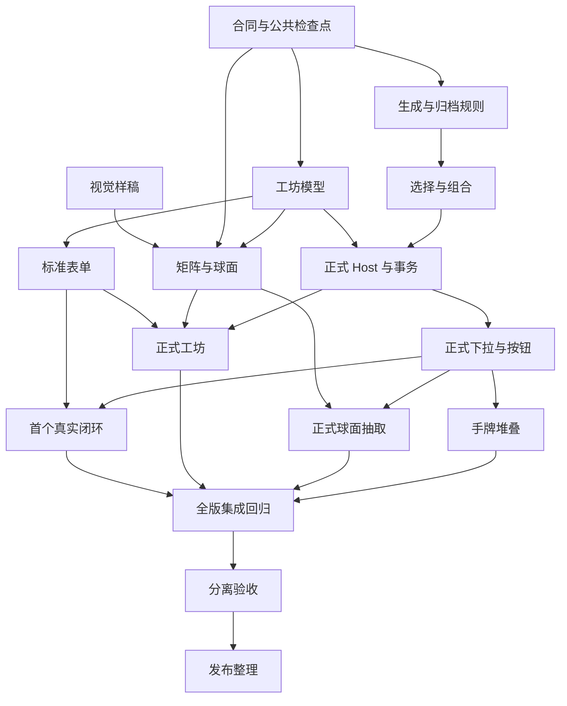

# v0.3 并行开发计划

日期：2026-10-03；收尾更新：2026-10-05。当前状态：**A1—A4、B1—B5、I1/I2 已完成收尾；G-V03 已通过只读分离验收。** 最终快照原样浏览器 138/138，独立核心 17/17、兼容 3/3、浏览器反例 7/7；284 个冻结文件复核无变化。本地版本 v0.3.0，Envelope4/Data3，新旧兼容与公开模块边界保持；提交/推送另行确认。实际修复、完整矩阵及未测范围以[收尾与验收记录](../开发/2026-10-05-v0.3收尾与验收.md)为准。C0 冻结合同在文末；正文任务表保留开发依赖与历史顺序。

本计划取代 [12 号计划](12-v0.3至0.4线性开发计划.md)的后续执行安排；旧文档保留为讨论历史，不再派发其中的架构任务。产品决策见 [03 号文档](../../../产品设计/03-项目决策与问题.md)，已落地结构见[模块地图](../../../架构/README.md)。

## 1. 目标与基线

v0.3 的完整闭环：**在工坊创建行动原卡、书目和卡池 → 按规则生成每日副本 → 随机或手选 → 可选填写预留位 → 接受完整行动到手牌 → 复用现有排期、实际确认和记录。**

验收还必须覆盖波浪矩阵、球面展开、两次点击翻牌、分层暂停与副本堆叠，不能只交付数据核心就宣布版本完成。

- 正式目录：`D:\Develop\codex\CardGrid`。起点：main `ef71af30a9c9f7bfa8cca671ea87b160c6094c82`。
- 当前结构：`app / workshop / drawing / daily / workspace / shared`；已有公共入口及依赖检查。保留结构，按功能增量扩展。
- 开发起点格式：Envelope v4 / Data v2、0.2.0。C0 冻结后新工作区为 Envelope4/Data3、0.3.0，旧格式继续精确恢复与显式升级；不能沿用旧版本号偷偷添加字段。
- 基线证据：[重建交接](../../v0.2-模块重建/2026-10-03-模块重建与迁移.md)。重建作者回归为 Node 226 通过、1 原有跳过，独立反例 8/8，浏览器 110/110，构建通过；这些是旧产品证据，不是 v0.3 验收。
- 初次编写阶段仅记录计划；当前实现与分离验收已完成，真实用户数据迁移和发布仍分别决定。

不纳入本版：新的全局架构整理、全面导航重建、云同步、在线大模型生成、饮食/消费等领域、重写已有事实。新增入口及工坊/抽卡页面如何衔接，在 A0 样稿中确认。

## 2. 已定需求与身份边界

| 对象 | 所属业务 | 身份与约束 |
| --- | --- | --- |
| 原卡 | 工坊 | 用户维护的来源；行动与书目保留各自字段，只有原卡按规则生成副本 |
| 卡池 | 工坊配置，抽卡读取 | 按种类隔离；目录层级表达导航，不能直接等同于抽取依赖 |
| 每日副本 | 抽卡库存，接受后由日常承载行动 | 独立身份，保留原卡版本、来源日期、生成规则和内容快照；库存状态与手牌状态分开 |
| 组合草稿 | 抽取会话 | 保存当前具体选择；取消后不创建行动；普通卡可没有预留位 |
| 已接受行动 | 日常 | 每次有意接受完整卡后生成独立 Instance；重复接受同一日期副本不复用旧手牌，来源日期与可修改的目标日期分开 |
| 完成事实 | 日常 | 继续不可覆盖，只能追加说明；不受原卡改名或池副本清理影响 |
| 归档日志 | 库存生命周期 | 先保存可核对的来源与内容，再删除活动副本；与操作回执共同保证可追溯 |

“阅读《{书名}》”中的书目是填写行动的词条，不能为了复用而强加排期、实际时长或完成状态。接受后的完整行动必须保存已填书名及来源快照，不能在每次打开时重新解析当前原卡。

已定交互：

- 工坊以整齐行列的波浪矩阵展示牌堆；进入当前牌堆后球面展开，支持多层深入，关闭单卡后归位。
- 进入球面后背景矩阵暂停；查看前置单卡时球面暂停。编辑模式露卡面慢转，抽取模式露卡背快转。
- 抽取每次进入洗位置；第一次点具体卡，停止并将该卡转到前方；第二次点击翻开。不能在停转或翻面时另抽一张替换它。
- 预留位绑定预设池；下拉框第一个可选择项是“随机”。主动选中后立即抽出具体词条，手选直接使用该词条；初始化、重渲染和重开详情不自行重抽。
- 球面是填写预留位的可选入口，不强制嵌套抽取；文字由模板与已选词条合成。
- 副本独立计数，堆叠显示 `×n`，展开后逐份查看。完成一份不能完成其余份；未完成行动不自动滚动到今日。

## 3. 本轮用户决定与待定边界

2026-10-03 用户已回答：

| 编号 | 已定方向 | 对实现的影响 |
| --- | --- | --- |
| P01 | 每日副本按来源日期保留七天，到期归档日志并删除活动副本；手牌中的每日副本也按此期限处理，同时撤销其未完成排期 | D 至 D+6 保留，D+7 起归档。每天生成一份、没有额外新增副本时，完全不行动的手牌累积到 `×7`，此后每天换出到期的一份；完成事实和批注保留 |
| P02 | 只自动生成当天，漏日可以手动补 | 不做离线漏日自动补齐；显式补生成与自动生成使用同一幂等规则 |
| P03 | 行动副本与书目都可重复抽取；再次接受同一日期副本会新增独立手牌，仍记原来源日期 | 候选不因接受耗尽；每次有意接受产生新 Instance，同一命令重试只重放同一次结果。主动重复接受可使数量超过七份 |

下表保留 C0 前的待定问题；**当前已按文末 C0 冻结决策实施，不再把历史待定项当作现有阻断。** 未裁定事项不能当默认授权，涉及已定体验的删减须由用户决定。

| 编号 | 需要裁定的具体问题 | 建议，尚未生效 | 受影响任务 |
| --- | --- | --- | --- |
| P02a | 自动生成触发点、时区，以及超出保留期的手动补生成？ | 启动/跨日时显式运行生成协调；按规则冻结的时区。超期补生成拒绝并说明，不生成后立即删除 | B1、B3、I2 |
| P04 | 空池、停用词条、必填/可空位、递归组合的边界？ | 导航可多层；首版槽位只引用具体词条，不递归组合。空池明确阻止必填位接受，可选位可留空 | A1、B2、B3 |
| P05 | 最小规则适用哪些卡种、暂停/归档、修改原卡和规则后何时生效？ | 每日/指定星期、开始日期、暂停/归档；旧副本快照不变，新版本按确定的生效日期生成。书目常驻还是按日生成也在此确认 | A1、B1、B3 |
| P06 | 堆叠按什么身份；没有今日副本时默认选什么？ | 按原卡版本与最终内容/来源组合分组，展开保留各自日期。无今日副本时要求手选旧份 | B5 |
| P07 | 小屏和减少动态效果如何表现；支持多大牌堆？ | 提供静止列表与等价键盘路径，仍保留选择前置→翻面两步。用 10/100/500 张合成场景测量，再确定支持容量 | A0、A3、B4.2、I2 |

P01 的范围、计时和排期撤销，以及 P03 的重复接受身份已由用户补充确定；其余待定项在 C0 给出具体场景后逐项决定。书目的最小字段也在 C0 确认，建议书名必填、作者可选。

七天清理只作用于已明确具有每日副本来源的新对象，不自动把旧 v0.2 实例或手动行动纳入清理。同一来源日期反复接受产生的独立手牌仍在同一天到期，接受或改期不重置七天。删除活动副本不等于删除完成事实及其关联身份；归档查询必须能解释原卡、来源日期、内容和处理结果。应用关闭期间不承诺后台定时执行，到期对象在下一次启动/跨日协调时处理，接受命令仍须拒绝已到期对象。

**兼容点：** 现有 `Rule/Occurrence` 在 `PrepareDay` 中直接生成 Instance，Occurrence 必须指向已接受行动。新库存副本不能复用该身份。建议旧规则维持原行为，新池生成规则显式启用；旧规则转入新池必须单独决定，不能自动改释义或双重生成。

## 4. 两条开发线与文件归属

| 线 | 负责人 | 交付职责 | 常规允许修改 |
| --- | --- | --- | --- |
| A：工坊与视觉交互 | 豆包 Pro | 原卡/书目/池/规则编辑；矩阵、球面、前置详情；界面层级和键盘路径 | `src/workshop/**`、`tests/modules/workshop/**`、A 线自有浏览器用例 |
| B：抽取业务与正式写入 | Codex GPT‑6.1 Sol | 每日库存、七天归档、公共选择核心、组合会话、原子接受；手牌堆叠、归档查看与应用接线 | `src/drawing/**`、`src/workspace/**`、`src/app/**`；`src/daily/hand/**`、归档界面及 `src/daily/model/domain.ts` 的接受/归档增量；必要的来源/读模型与对应测试 |
| 公共变更 | Codex GPT‑6.1 Sol | 格式、迁移、依赖、CI、共享导出、架构白名单与合入 | `package*.json`、配置/脚本、`.github/**`、`tests/architecture/**`、`src/shared/ui/index.ts` |

A 线另有一个明确例外：可新增并维护 `src/shared/ui/sphere/**` 与相应渲染/交互测试，供两条线复用。该组件只接收显示数据、卡片 ID、运动状态和回调；不读工作区、不决定随机结果、不保存或消耗副本。公共导出由 B 线依次合入，A 线不能因此接管整个 shared 目录。

`workshop/model.ts` 的原卡、池和规则业务类型/纯校验归 A；`drawing/model.ts` 的候选选择、生成与组合规则归 B；正式命令类型、存储类型与生命周期归 workspace/B。各业务模块自己的 index 归该模块负责人，共享导出与入口白名单由 B 协调。工坊和抽卡界面均通过注入的正式 Host 操作，不直接写 IndexedDB。workspace 可调用业务模块的纯规则入口；纯规则不能反向依赖 workspace 界面或应用装配。

角色划分依据是修改集中度和数据风险，不是模型工作量百分比。B 线内的数据、接线和手牌任务仍按依赖串行，不能把一个负责人同时列为三个并行执行者。

执行规则：

1. 开发时各线使用独立分支与工作目录，从同一个已确认合同检查点起步。当前编写规划不创建工作目录或启动开发会话。
2. 同一个文件只有一名写入负责人；跨边界需求先写接口差异，由该文件负责人实现。
3. 公开入口、命令、格式、规则语义有变化，先更新 C0 合同再继续依赖任务。类型正确不能代替业务合同一致。
4. A/B 完成一个增量就交叉审查并依次合入集成分支；禁止两线同时更改迁移、锁文件或 App。
5. 最终验收使用不参与实现或修复的只读检查会话。可以复用这两种模型，但检查角色和会话必须分离；作者交叉审查不代替整版独立验收。
6. 阶段合入、正式提交/推送及发布均按用户授权执行；本轮规划不自动提交或推送。

## 5. C0：先冻结增量业务合同

负责人：Codex；A 线参与核对工坊和球面输入输出。交付记录直接补充本计划的合同附录与现有正式接口文档，不另造一套重复设计文档。

开工前产出：

- P01—P07 的决定、例子和不纳入本版的部分；明确哪些任务仍被未决项阻塞。
- 原卡、池、生成规则、每日副本、组合草稿、已接受行动和归档记录的最小字段；日期、版本、来源快照及各身份映射。
- 生成/归档幂等键与生效规则。保留生成记账信息，活动副本删除后重复启动不能把同一日副本重新生成。
- 可重复抽取与接受：同副本两次有意接受产生两个独立 Instance，来源日期相同；同一 commandId 重试只重放同一次结果。翻面、填写和取消不写手牌；接受验证来源版本、完整性及库存状态。
- 七天归档、撤销未完成排期与删除活动副本在同一事务中提交；不能只删除后补日志。到期手牌移出活动读模型，不自动宣告完成或失败；事实不依赖活动副本的存活，引用有快照或明确归档定位。
- 工坊读写、库存查询、生成/补生成、组合接受及归档查询的 Host 合同：参数、返回引用、token、预期版本、错误、命令回执与权限生命周期。
- 正式格式/备份/配置版本差异与旧版本兼容；共用校验同时覆盖配置和备份，拒绝未知或不一致版本。真实数据迁移保留预览、备份和明确执行步骤。
- 生成与归档使用具名正式命令，不隐藏在读取/导入解析里；自动日期取规则时区的当前日，不跟随用户浏览的日期。恢复先按已有合同提交，新生命周期处理单独记录，不在恢复解析中悄悄删除副本。
- 旧 Definition、规则和已有实例的映射；`PrepareDay` 与新生成互不重复。不得借新生成改写既有固定块、计划、事实或旧来源。
- 球面共享接口与模式状态表；抽卡状态机最少区分候选、已前置、已翻开、组合未完整、可接受、提交中、成功/失败。

合同检查点可以先合入纯公开类型和合成 fixture；尚未实现的方法只能存在于明确的测试适配器，不能伪装成正式 Host。新增命令进入生产联合类型时，必须同时实现校验和执行。各所属文件负责人依次落地公共类型后，两线再从同一个检查点分支。

**C0 完成标准：** “阅读＋一本书”“普通无槽行动”“同一副本两次接受”“来源日 D 至 D+6、D+7 七天清理”“旧例行规则”五组例子都有确定结果，双方可用相同 fixture 独立实现。未定事项可以记录，但依赖其语义的任务不得进入生产持久化开发。

## 6. 任务拆分与验收

各任务的“通过”都要求实际结果与未测项；以下是未来验收要求，不是已经运行的测试。

### A 线：工坊与视觉交互

| 任务 | 依赖 | 交付 | 验收重点 |
| --- | --- | --- | --- |
| A0 视觉与入口验证 | 已定交互，可与 C0 同时进行 | 隔离合成数据样稿；矩阵→球面→前置详情，编辑/抽取两模式，小屏/静止方案 | 用户确认视觉主次与入口；模式切换、返回归位和两次点击可解释；不写正式数据 |
| A1 原卡、池与规则编辑模型 | C0 公共检查点 | 工坊业务类型、纯校验、行动/书目字段、池种类与层级检查 | 拒绝混种、非法引用/循环；修改版本与副本快照规则符合合同；无 React/数据库依赖 |
| A2 工坊标准编辑闭环 | A1 | 原卡/书目/池/生成规则表单；注入 Host，先用测试适配器 | 新建/修改/暂停/归档、空状态、错误反馈、草稿保留；表单与高级 JSON 走同一校验，不把适配器当保存成功 |
| A3 矩阵与共享球面 ✅组件/挂架 2026-10-04（正式接线待 B4.2） | A0、C0；数据由 A1 投影 | 矩阵相位波动、稳定球面布局、前置详情/归位；中立球面组件 | 当前层独占运动焦点；具体卡的两次点击不换 ID；减少动态、键盘、焦点返回；卡背不泄露内容 |
| A4 工坊正式接线与收尾 | A2、A3、B3 | 使用真实 Host 的工坊与层级浏览；修复 A 线集成问题 | 刷新后保留，冲突/保存失败不假成功，原卡修改不改旧副本；小屏、列表与球面读同一权威数据 |

### B 线：抽取业务与正式写入

| 任务 | 依赖 | 交付 | 验收重点 |
| --- | --- | --- | --- |
| B1 库存、生成与归档纯规则 | C0；使用冻结的工坊 DTO | 每日副本生成、手动补生成、七天判定、归档结果及生成记账 | 重复启动/补生成幂等；不补漏日、不创建手牌；每日一份且无额外新增时最多保留七份；过期后不复活；日期/时区/版本边界和新旧规则不冲突 |
| B2 公共选择与组合会话 | C0、B1 | 共用无偏选择核心、明确手选、槽位验证、确定文字合成与状态机 | 两种池复用算法；空池不随机；选随机立即填具体值，渲染不重抽；普通卡无槽可接受；取消不产生行动 |
| B3 正式 Host、格式与事务 | A1、B1、B2 | 原卡/池/规则保存、生成/补生成、归档与接受命令；版本化格式、备份、迁移和查询 | 使用 store 原子事务；归档+撤销未完成排期+删除、接受+回执无半成功；丢回复重试不重复；旧数据和事实可核对；真实 IndexedDB 多窗口验证 |
| B4.1 下拉与按钮正式路径 | B2、B3 | 有生产接线的选卡→填槽→接受；app 中权威快照、失败/重试与会话生命周期 | 无动画也能完整使用；同一副本/书目可重复；有意接受与重试区别明确；跨窗口失效与取消不遗留半成品 |
| B4.2 球面抽取正式路径 | A3、B4.1 | 将中立球面接入同一选择/组合会话，支持从预留位进入并返回 | 第一点击 ID=翻开 ID=最终选择 ID；新进入洗位，接受不再随机；层级/模式/返回不丢已选值；卡背无 DOM/aria/title 内容泄露 |
| B5 手牌堆叠与来源展示 | B3、B4.1、P06 | `×n` 读模型、展开独立副本、来源日期/组合详情；只读归档日志从属入口，位置由 A0 确认；复用现有计划/实际操作 | 堆叠不合并实体；只操作选中那份；来源日期不随改期变；到期项退出手牌，归档可查询，未到期手牌/历史事实仍完整；重复接受不设置七份硬上限 |

B4.2 与 B5 由同一负责人依次执行，可按 A3 的到位时间调换顺序；不能为等球面而阻塞 B4.1 和真实保存验证。

### 集成与版本门槛

| 任务 | 负责人/依赖 | 交付与放行条件 |
| --- | --- | --- |
| I1 首个真实闭环 | Codex；A2、B3、B4.1 的最小路径 | 在隔离生产工作区创建“阅读”原卡与书目池，生成→立即随机填书名→接受→刷新→排期→确认实际；重试、取消、七天归档至少各一例。允许 A3 动效继续开发，禁止以 mock 成功替代此检查 |
| I2 全版接线与作者回归 | Codex；I1、A4、B4.2、B5 | 统一入口与提示；本节后续矩阵实跑；新增浏览器回归运行方式及至少一条 CI 真实主路径；两线修复各自问题，依次合入 |
| G-V03 分离验收 | 未参与实现/修复的只读会话；I2 | 固定集成快照，原样复跑作者矩阵；新增反例与证据放隔离目录，不改交付源码/作者断言。审查格式/命令和公共边界；有阻断项则退回修复、再分离复测 |
| R-V03 发布整理 | Codex；G-V03 通过、用户确认发布范围 | 更新实际功能地图/架构差异、版本、使用与迁移说明；干净安装/构建与离线升级验证；提交/推送由用户授权，真实个人数据迁移单独执行 |

## 7. 实际并行顺序

| 批次 | A 线 | B 线/公共负责人 | 合流门槛 |
| --- | --- | --- | --- |
| 0 | A0 样稿 | C0 规则、合同与公共检查点 | 决策齐备、公开类型一致；先不保存新业务 |
| 1 | A1 编辑模型 | B1 生成与归档 | 两边使用同一 DTO/fixture，不等待对方内部实现 |
| 2 | A2 标准表单 | B2 选择与组合 | 测试适配器供 UI 开发；声明尚未接真实保存 |
| 3 | A3 矩阵/球面 | B3 正式存储和命令 | 模型合同已实测，生产 Host 到位 |
| 4 | ✅ A4 正式工坊（2026-10-04：阶段4接线完成，全量330/构建通过） | B4.1 正式抽卡；执行 I1 | 动效未全完也先验证完整真实闭环 |
| 5 | A4 视觉/可访问性收尾与审查 | 依次 B4.2、B5；审查 A 线 | 统一数据投影和模式行为，两线自测交付 |
| 6 | 配合本线修复 | I2 集成与全量回归 | 待定阻断项清零或用户明确减范围 |
| 7 | 分离检查后的有界修复 | G-V03 → R-V03 | 独立检查通过，再由用户确认发布 |



批次表示依赖顺序，不承诺日历工期或性能提升百分比。只有共同合同之外互不写同一文件的任务才真正并行；合入、格式变更和版本验收依次进行。

## 8. 回归与独立验收矩阵

| 组 | 必须实测的场景 |
| --- | --- |
| V01 工坊 | 空白工作区；行动/书目字段；建池/规则；种类隔离；目录返回；停用/归档/改原卡后旧副本不变；表单与 JSON 共同校验 |
| V02 生成与七天清理 | 同日重复启动；两窗口竞争；午夜/时区/夏令时；漏日不自动补；手动补幂等；D+6 保留、D+7 归档；日志+排期撤销+删除失败回滚；同来源日的重复手牌同步到期；删除后不重新生成；旧规则不双重发牌 |
| V03 选择与组合 | 随机首项与初始占位分开；主动随机即时填词；手选准确；重渲染不重抽；失败/重试不换已选词条；重复抽取；无槽行动；多槽、空池、停用引用及未填槽；组合草稿取消无行动 |
| V04 球面与层级 | 每次进入洗位；选中/前置/翻开/接受同 ID；不偷偷重抽；背景与球面按层暂停；模式切换；返回归位；编辑卡面与抽取卡背；隐藏内容不能被辅助技术或 DOM 提前读到 |
| V05 接受与并发 | 同副本两次有意接受是两个独立行动且来源日期相同；同 commandId 丢回复重试只重放一次；两窗口选旧版本；副本选择后到期；池/原卡修改；格式/容量错误；失败和取消零半成品 |
| V06 日常与历史 | 堆叠计数/逐份展开；完成一份不改其余；来源日与目标日分开；无今日份行为；归档后引用完整；已有排期/固定解锁/事实/批注链及旧 G2/G3 路径 |
| V07 生命周期与兼容 | 同窗口 adopt 保留配置草稿；外部 revision/restore/clear 使抽取草稿失效；旧备份/配置/迁移；新备份完整回环；未知版本拒绝；离线缓存旧代码遇到新格式不误写 |
| V08 可访问性与容量 | 键盘连续操作/焦点返回/停止运动；减少动态；720/390/320 小屏；10/100/500 合成牌堆的实测耗时和可用性；支持上限与退化方案符合已批准范围 |

验证方式：

- 纯模型使用 Node 可控时钟/随机源和合成 fixture，断言用户可观察结果与关键不变量，不镜像实现代码。
- 事务/生命周期使用隔离 IndexedDB 与真实多窗口；UI 使用生产构建、新浏览器 context，不读取个人 profile 或迁移真实数据。
- 全量运行 `npm test`、`npm run test:independent`、`npm run build`，保留公共入口、循环依赖和 shared 边界检查。旧独立反例继续保留，另加 v0.3 反例。
- 旧断言不能为通过而删除或削弱；需要定位或 fixture 格式适配时，记录原因和原业务断言保持有效的证据。
- 浏览器环境按[回归说明](../../../../app/tests/browser/README.md)配置。I2 已固定项目 Playwright、增加 `npm run test:browser` 和 CI Chromium 门禁；本机 Chrome 路径只是可选覆盖，远端执行结果仍需本轮提交后核对。
- 新结果写独立日期/任务目录，不覆盖归档证据；没有实测的触屏、真实个人数据迁移、七日连续使用和视觉偏好分别登记，不能用自动化替代。

G-V03 放行要求：已批准范围全部走通，阻断性错误解决，正式合同差异有记录，分离检查明确通过。作者自测、构建成功或旧 G3 放行都不等于本版验收。

## 9. 派工与断点模板

每个任务开始前填写下表，完成或额度耗尽时补齐结果。只记录有意义的变更与证据，不为普通修改创建新文档。

| 字段 | 必填内容 |
| --- | --- |
| 任务/负责人 | 如 A2／豆包 Pro；角色是作者、审查者还是只读验收 |
| 输入基线 | 分支、起点提交、C0 合同版本、依赖任务实际完成状态 |
| 文件边界 | 允许目录与明确例外；公共文件请求由谁处理 |
| 完成定义 | 本任务可观察结果、必须通过的场景、不得引入的新语义 |
| 交接结果 | 变更文件、接口差异、实际命令/环境/结果与证据位置 |
| 未完成/未测 | 失败、产品待定项、需要另线合入的内容；不得包装成完成 |
| 断点与下一步 | 最后可用检查点、未提交差异、回滚方式、下一任务前提 |

只有一个文件负责人可以在交接后继续写它；检查会话只读，发现问题交回作者。额度不足时停止扩范围，先留下可恢复断点和失败现场。

## 10. 当前下一步

2026-10-04 当前检查点：A0 的视觉主次与小屏方向已获用户确认；A1 的纯模型已在隔离分支完成作者自检。B3 已在 `codex/workspace-b3` 接入正式 Host、Data v3 格式、显式迁移和原子事务，见 [B3 交接](../开发/2026-10-04-B3正式Host与事务.md)。这些状态均不代表独立验收或正式线合入；下一步先审查并依次合入 A1/B1/B2/B3，再推进 A4/B4.1 的真实页面闭环。

本计划在 C0 冻结前不授权清理真实副本、迁移个人数据、提交或推送。**C0 合同已随文末附录冻结；真实数据迁移、副本清理仍须用户另行授权。**

---

# 附录 C0：v0.3 增量业务合同（冻结）

冻结日期：2026-10-04。负责人：Codex；A 线核对工坊与球面输入输出。本附录是 C0 的唯一交付记录，与现有正式接口（`src/workspace/contracts.ts`）配合使用，不另造设计文档。

## C0.1 决策记录与阻塞范围

| 编号 | 冻结结论 |
| --- | --- |
| P01 | 每日副本按来源日期保留 D 至 D+6，D+7 归档日志并删除活动副本；手牌中的每日副本同期限，同时撤销其未完成排期。每天一份、无额外新增时，完全不行动的手牌累积到 `×7`，此后每天换出到期一份；完成事实与批注保留。 |
| P02 | 只自动生成当天；漏日手动补，不做离线自动补齐；补生成与自动生成同一幂等规则。 |
| P02a | **启动 / 跨日时显式运行生成协调，不做后台定时器；自动日期取规则冻结时区的当前日，不跟随浏览日期；超出保留期的补生成直接拒绝并说明，不“先生成再删”。** |
| P03 | 行动副本与书目都可重复抽取；再次接受同一日期副本新增独立手牌、仍记原来源日期；候选不因接受耗尽；同一 commandId 重试只重放同一次结果。 |
| P04 | **空池 / 全停用 → 明确阻止必填槽接受并提示；可选槽可留空接受；已选词条被停用则该选择失效、要求重选，不偷偷替换；首版槽只引用具体词条，不做递归组合。** |
| P05 | **生成规则支持每日 / 指定星期 + 开始日期 + 暂停 / 归档；改原卡或规则后旧副本快照不变。2026-10-04 用户补充确认：首版只支持保存当天起生效，不支持指定未来生效日；当天按每条规则冻结时区与 Host 保存时间确定。书目词条常驻、不按日生成。** |
| P06 | **堆叠按「原卡版本 + 最终内容 + 来源」分组，展开逐份保留各自来源日期；无今日副本时不默认取旧份，要求明确手选某份旧副本。** |
| P07 | 不拍脑袋：容量以 10 / 100 / 500 张合成场景实测后定（阻塞 A3 容量结论，**不阻塞** B 线持久化）；必须提供静止列表与键盘等价路径，保留「前置→翻面」两步；小屏 / 减动效在 A0 样稿确认。**2026-10-04 挂架实测：10/100/500 矩阵全量渲染均通过、无页面错误；500 张为 23 列密集网格（压测上限，不崩但不实用）。矩阵每格语义是「牌堆」，真实牌堆数远小于卡数，牌堆内的卡由球面展示，矩阵不承担数百张平铺；自用场景牌堆数 < 数十无压力，球面单堆容量在 B4.2 接线后按真实牌堆再测。** |

阻塞判定：除 P07 的**性能容量数值**外，无其他持久化阻塞。A1/B1 可立即开始。

## C0.2 版本与格式差异（先于一切实现）

- **信封不变、数据升版**：Envelope 保持 `schemaVersion: 4`（信封字段 epoch/revision/mode/dataFormat/data/lifecycleReceipt 不变）；`dataFormat` 在 `'action-v2'` 基础上新增 `'action-v3'`，对应 **Data v3**。
- Data v3 = Data v2 全部集合原样保留，**新增**以下集合（v2→v3 为纯增量，旧集合不动）：
  - `actionCards`（行动原卡，含槽定义）
  - `bookEntries`（书目词条）
  - `pools`（卡池，种类隔离 + 层级）
  - `generationRules`（生成规则）
  - `dailyCopies`（每日副本库存）
  - `archiveLogs`（归档日志）
  - `generationLedger`（生成记账，保证删副本后不重生）
- 备份：新增 **BackupV3**（`version: 3, kind: 'backup', dataFormat: 'action-v3'`）；配置包新增 **ConfigV3**。旧 BackupV2 / ConfigV2 仍可**读取导入**。B3 明确执行顺序：旧备份按原版本精确恢复，Data v2 的已有日常路径继续可用，新增工坊/库存命令返回 `UNSUPPORTED_VERSION`；用户另行备份、预览并执行 v2→v3 升级后才启用。普通读取/保存不隐式迁移，Data v3 普通保存与导出不降版。
- 校验同时覆盖配置与备份：版本号、`dataFormat`、集合形状三者必须一致，未知版本或不一致一律拒绝。
- v2→v3 迁移：复用现有 `CommitMigration` 机制扩展，**先备份、预览、显式执行**；新集合初始为空，不触碰旧对象语义。
- ConfigV3 包含旧配置的 settings/definitions/templates/rules 与四个工坊集合；不携带库存、实例、事实、历史或记账。导入使用具名命令，在同一事务追加版本历史；新增版本从 1 开始，修改按当前版本递增，source 身份保持。替换时保留已存在身份：原卡/书目/规则归档，省略的池清空成员。导出配置使用可携带的 manual 来源。
- 离线旧代码遇到 `action-v3`：`inspectEnvelope` 不识别该 dataFormat，按只读 / 升级提示处理，**禁止误写**。

## C0.3 最小字段与身份映射

**ActionCard（行动原卡）**：`id, version, kind:'action', content:Content（复用现有 Content 形状）, slots:SlotSpec[], status:'active'|'paused'|'archived', parentId:Id|null, source:SourceRef`。

收尾校验明确：同一原卡的槽 ID 与文字标签各自唯一，标签用于确定模板替换；歧义在正式保存、配置与备份校验入口拒绝，不生成后再修补副本。

**SlotSpec（槽定义，卡内唯一）**：`id, label（如“书名”）, poolId（绑定预设池）, required:boolean, valueKind:'entry'（首版只引用具体词条，不递归）`。

**BookEntry（书目词条）**：`id, version, kind:'book', title（书名，必填）, author（作者，可为 null）, status:'active'|'archived', source:SourceRef`。

**Pool（卡池）**：`id, version, name, poolKind:'action'|'book'（种类隔离）, parentPoolId:Id|null（层级导航，null 为顶层）, memberIds:Id[]（必须与 poolKind 同种类）, source:SourceRef`。

**GenerationRule（生成规则）**：`id, version, name, actionCardId, schedule:{mode:'daily'|'weekdays', weekdays?:number[]}, startDate, zone（冻结时区）, status:'active'|'paused'|'archived', source:SourceRef`。

**DailyCopy（每日副本，库存）**：`id(copyId), version, ruleId, ruleVersion, actionCard:VersionRef, sourceDate（来源日）, generatedAt, contentSnapshot（原卡内容快照）, slotSpecSnapshot（槽定义快照）, status:'active'|'archived', acceptedInstanceIds:Id[]（已接受的 Instance；候选不耗尽）`。**库存状态与手牌状态分开。**

**ComboDraft（组合草稿，仅会话内存，取消即弃）**：`copyId, selections:{slotId, mode:'random'|'manual', entryId:Id|null}[], composedText`。

**Instance 扩展（已接受行动）**：现有 Instance 形状不变，新增**可选** `daily:DailyAcceptance | null`（仅来源为每日副本时非空）：
- `DailyAcceptance = { copyId, sourceDate（来源日，不可改）, slotSelections:SlotSelection[] }`
- `SlotSelection = { slotId, entryId, entrySnapshot（词条内容快照：书名/作者）, selectedAt }`
- 合成后的完整文字（“阅读《百年孤独》”）存入 `currentContent.title`；`targetDate` 为可修改的目标日期，与 `sourceDate` 严格分开。
- SourceRef 新增 kind `'daily-copy'`，`{ kind:'daily-copy', id:copyId }`。

**ArchiveLog（归档日志）**：`id, version, copyId, ruleId, actionCard:VersionRef, sourceDate, contentSnapshot, slotSelectionsSnapshot, acceptedInstanceIds:Id[], disposition:'accepted'|'none-accepted'（候选不耗尽、接受无上限，无“全接受”判定）, archivedAt`。**先写日志，再删活动副本。**

身份映射链：

```text
ActionCard ──(GenerationRule, 按 rule.zone 的 sourceDate)──▶ DailyCopy
   ▲ slots 绑定 Pool ──member──▶ BookEntry / ActionCard
DailyCopy ──(ComboDraft 填槽, 有意接受)──▶ Instance(daily 非空) ──▶ Plan ──▶ Fact
DailyCopy ──(D+7)──▶ ArchiveLog（Fact / Annotation 独立保留，不依赖副本存活）
```

## C0.4 生成 / 归档幂等键与生效规则

- **生成幂等键 = `ruleId + sourceDate`**：同规则同日只一份。是否已生成以 `generationLedger` 记录为准，**不**以活动副本是否存在为准——副本归档删除后重复启动，同一日不重生。
- **归档幂等键 = `copyId`**：重复运行归档协调不产生重复日志。
- **接受**：同一 `commandId` 重试 → 重放同一结果（`replayed:true`，现有回执机制）；新的有意接受 = 新 `commandId` = 新独立 Instance，可使同一来源日的数量超过七份。
- **生效规则**：原卡 / 规则修改产生新版本；已生成副本的快照不变；新版本从 Host 保存时间在规则冻结时区所处的**当天**起生效，不提供未来或回填生效日。版本号与规则 `startDate` 是不同概念，计划开始日期仍可为未来。
- **版本历史证据（B3 增量）**：复用 `planner.history`，扩展 EntityRef 的工坊身份。实体保存和 `at/before/after` 创建或版本记录同一事务提交；创建从版本 1 开始，后续链连续且旧记录不可覆盖。Data v3 校验/备份/恢复同时验证当前对象与完整版本链，不新增第二套持久化集合。
- **旧日补生成**：按来源日在规则时区选择当时已生效的规则和原卡版本，并限定在协调时间前已保存。没有可核对版本时拒绝，不能用当前对象伪造创建前或旧日内容；当天已生成的副本仍遵守原记账幂等键。

## C0.5 七天清理：同一事务提交

到期协调（启动 / 跨日触发）对每个到期副本，在**同一个 IndexedDB 同步事务**内顺序完成：

1. 写入 `ArchiveLog`（含原卡、来源日、内容快照、已接受 Instance、处理结果）；
2. 撤销该来源日对应未完成（active）排期（retract plans）；
3. 将到期手牌移出活动读模型（不自动宣告完成或失败）；
4. 删除活动 `DailyCopy`。

任一步失败 → 整体回滚，**禁止只删除后补日志**。已确认 Fact 与批注保留，其引用通过内容快照或归档日志定位。接受命令对已到期副本一律拒绝（`COPY_EXPIRED`）。

## C0.6 P04 槽位约束（阻止不完整接受）

- 必填槽未满足（池空、词条全停用、或尚未选择）→ **阻止接受**，不生成 Instance，并提示先添加 / 启用词条或完成选择；错误码 `REQUIRED_SLOT_EMPTY`。
- 可选槽未填 → 可正常接受，该槽留空，行动视为完整。
- 已选词条在接受前被停用 / 归档 → 该选择失效、要求重选，不自动替换为其他词条。
- 因不完整组合无法接受，故不存在“待补槽”行动，也不需要事后补填命令。
- 标题中的 `{槽标签}` 按已选书目替换；可选槽未选替换为空，未定义的标签保留原文，书目文字中的大括号不做第二次展开。正式 Host 重算并核对 `composedText`，不能以任意编辑文字绕过词条快照。SlotSelection 保留完整 BookEntry 版本快照，接受时校验池成员、活动状态、版本与选择时间。

## C0.7 Host 合同（新增方法与命令）

新增**只读 / 预览方法**（均不产生行动，返回引用 + token）：

| 方法 | 参数 | 返回 |
| --- | --- | --- |
| `readInventory` | `{ token; range?:{from,to} }` | 活动副本列表（copyId、sourceDate、原卡摘要、accepted 数） |
| `readArchive` | `{ token; sourceDate?; copyId? }` | 归档日志查询结果 |
| `previewGeneration` | `{ token; target?:'current' \| {ruleId,date} }` | 将生成的 rule/date 列表；超期补生成返回明确错误，不落库 |
| `previewCombo` | `{ token; copy:VersionRef; selections:SlotSelection[] }` | 各槽候选、合成文字、是否 ready / 缺必填（不可接受）；不重抽 |
| `readWorkshop` | `{ token }` | 工坊四集合权威投影 |
| `selectEntry` | `{token;copy:VersionRef;slotId;choice:{mode:'random'} \| {mode:'manual',entryId}}` | 主动选择后返回固定书目版本快照与 selectedAt；空候选为 null，不写行动 |

新增**具名命令**（进入 `CommandPayloads` 联合时**必须同时实现校验与执行**，沿用 token / grants / unlocks / 回执生命周期）：

| 命令 | 载荷摘要 | 结果引用 |
| --- | --- | --- |
| `GenerateDailyCopies` | `{ target:'current' \| {ruleId,date} }`；自动取规则时区当前日；超期补拒绝 | 新 DailyCopy |
| `AcceptDailyCopy` | `{ copy:VersionRef; selections; composedText }`；必填槽未满足 → 拒绝（REQUIRED_SLOT_EMPTY） | 新 Instance |
| `ArchiveDueCopies` | `{}`；到期判断使用 Host 时间，不允许调用方指定未来日期提前删除；同事务归档全部到期 | ArchiveLog |
| `SaveActionCard` / `SaveBookEntry` / `SavePool` / `SaveGenerationRule` | 实体 + expectedVersion；表单与 JSON 走同一校验 | 对应实体 |

新增错误码：`COPY_EXPIRED`、`COPY_NOT_FOUND`、`REQUIRED_SLOT_EMPTY`、`ENTRY_ARCHIVED`、`UNSUPPORTED_VERSION`。翻面、填槽、取消不写手牌；接受时校验来源版本、内容完整性与库存状态。

## C0.8 球面共享接口（中立组件）

`shared/ui/sphere` 只接收显示数据与回调，**不读工作区、不决定随机结果、不保存或消耗副本**：

- props：`cards:{id; face:'front'|'back'; frontData?; phase}[]`、`mode:'edit'|'draw'`（edit 慢转露卡面 / draw 快转露卡背）、`motionState:'idle'|'shuffling'|'presented'|'revealed'|'paused'`、`presentedId`、`revealedId`；
- 回调：`onSelectCard(id)`、`onReveal(id)`、`onClose()`、`onLayerChange(...)`。
- 卡背内容不得出现在 DOM / aria / title 中被提前读到。

## C0.9 抽卡状态机

最少状态：

```text
shuffling（每次进入洗位）
  --第一次点击--> presented（停止、该卡转到前方，锁定 id）
  --第二次点击--> revealed（翻开；id 必须与 presented 相同）
  --> combo-editing（填槽；必填未满足为 combo-incomplete，不可接受）
  --> ready（必填槽全部满足、可选可空，可接受）
  --> submitting --> accepted | failed
```

- 停转 / 翻面期间锁定，**不能另抽一张替换**；id 从第一次点击到最终接受保持一致。
- 取消 → 不产生行动、回 shuffling，不遗留半成品。
- 选「随机」：主动触发后立即抽出并固定具体词条；初始化、重渲染、重开详情不自行重抽。

## C0.10 五组例子的确定结果（fixture 冻结）

双方使用**同一组合成 fixture**（可控时钟、可控随机源），可独立实现，结果必须一致：

1. **阅读＋一本书**：书目池含 ≥1 书；行动原卡“阅读《{书名}》”必填槽绑该池；D 生成副本；槽下拉首项“随机”，主动选随机立即固定具体书（重渲染不重抽）；合成“阅读《百年孤独》”；接受 → Instance（`daily.copyId/sourceDate=D`，slotSelection 存书快照）。
   - 空池变体：池空 / 全停用时必填槽无法接受（REQUIRED_SLOT_EMPTY），提示先添加或启用书目；可选槽可留空接受。
2. **普通无槽行动**：原卡 `slots:[]`；副本可直接接受，无填槽步骤；接受后等同现有 Instance。
3. **同一副本两次接受**：对同一 copyId 两次有意接受（两个 commandId）→ 两个独立 Instance，`sourceDate` 相同、copyId 相同；同一 commandId 丢回复重试只重放一次。
4. **D 至 D+6、D+7 清理**：每天一份、完全不行动 → 堆叠 `×1…×7`；D+7 协调：D 份同事务归档（日志 + 撤销未完成排期 + 移出读模型 + 删副本），并生成 D+7 新份；Fact / 批注保留；删除后不重生。
5. **旧例行规则**：现有 Rule 经 `PrepareDay/ApplyCalendar` 生成 Occurrence→Instance，行为不变；新池副本不复用 Occurrence 身份，两者不双重生成。

尚未实现的方法只能存在于明确的**测试适配器**，不得伪装成正式 Host。C0 检查点可先合入纯公开类型与上述 fixture；A1/B1 从同一检查点分支。
